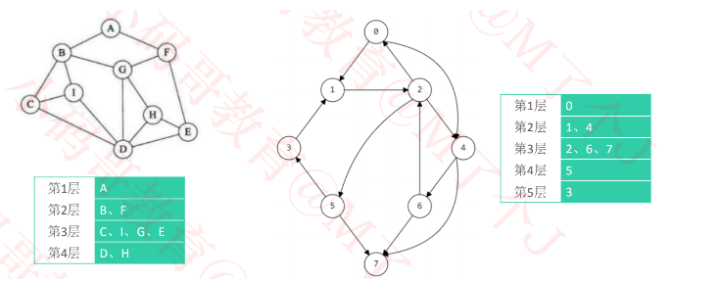

# 字节

## 一面

### 1.逻辑地址和物理地址，操作系统中，比如一个java对象如何通过逻辑地址找到物理地址？

### 2.现在有逻辑地址，但是物理地址没有加载到内存中怎么办


### 3.进程和线程的区别？

**a.最大区别：**

- 进程是系统资源分配的最小单位；
- 线程是cpu操作和调度的最小单位；

**b.从创建成本、切换以及通信成本来说:**

**线程的创建成本远远低于进程：**

- 创建进程需要为进程划分出一块完整的内存空间，有大量的初始化操作，比如要把内存分段(**代码段、数据段、堆区、文件映射区、栈区和内核态**；)
- 创建线程则简单的多，只需要确定**PC指针**和**寄存器**的值，并且给线程分配一个**栈**用于执行程序，同一个进程的多个线程间可以服用**堆栈**；
- 因此，创建进程比创建线程慢，而且进程的内存开销更大。

**上下文切换**

- 进程上下文切换

当一个进程 在执行时，**CPU的所有寄存器中的值、进程的状态以及堆栈中的内容**被称为该进程的上下文。

当内核需要切换到另一个进程时，它就需要保存当前进程的所有状态，即保存当前进程的上下文，以便在再次执行该进程时，能够必得到切换时的状态执行下去。

- 线程上下文切换

当进程只有一个线程时，可以认为进程就等于线程；

当进程拥有多个线程时，这些**线程共享相同的虚拟内存和全局变量等资源**，这些资源在上下文切换时并不需要修改。

那么根据上面的描述，线程的上下文切换就存在两种情况：

- 前后切换的两个线程是属于同一个进程，两个线程的资源基本是共享的，切换上下文共享的资源无需变动，**只有当线程有私有数据时，切换这些不共享的数据即可。**
- 前后切换的两个进程不属于同一个进程，跟切换进程的上下文时是一样的；

所以切换同一进程的线程比切换进程消耗更少的系统资源，这就是多线程比多进程的优势。

### 4.进程和线程上下文切换的时候都保存了哪些信息？

对于进程来说，在执行时，**CPU的所有寄存器中值、进程的状态以及堆栈中的内容**都被称为进程的上下文。进程切换的时候，就会保存当前进程的所有状态；

对于线程来说，前后切换的两个线程属于同一个进程，两个线程的资源基本是共享的，切换上下文共享的资源无需变动，**只有当线程有私有数据时，切换这些不共享的数据即可。** 如果前后切换的两个进程不属于同一个进程，那么就跟切换进程的上下文时是一样的了；

###  5.进程切换何时发生呢？

进程切换一定发生在中断/异常/系统调用处理过程中，常见的有以下情况：

- 时间片**中断**、IO**中断**后 更改优先级进程；（导致被中断进程进入**就绪态**）；
- 阻塞式**系统调用**、**虚拟地址异常**；（导致被中断进程进入**等待态**）
- 终止用**系统调用**、**不能继续执行的异常**；（导致被中断进程进入**终止态**）

举例说明：

- **时钟中断：**操作系统确定当前正在运行的**进程的执行时间是否已经超过了最大允许时间段**，如果超过了，进程必须切换到就绪态，调度另一个进程；
- **I/O中断：** 操作系统确定**是否发生了I/O活动**。如果I/O活动是一个或多个进程正在等待的事件，操作系统就把所有相应的阻塞态转换到就绪态，操作系统必须决定继续执行当前处于运行态的进程，还是让具有高优先级的就绪态进程抢占这个进程。
- **虚拟地址异常（内存失效）**：处理器访问一个虚拟内存地址，且此地址单元不在内存中，操作系统必须从外存中把包含这个引用的 内存块(页或段)调入内存中。在发出调入内存块的I/O请求之后，操作系统可以会执行一个进程切换，以恢复另一个进程的执行，发生内存失效的进程被置为阻塞态，当想要的块调入内存中时，该进程被置为就绪态；
- 对于**陷阱**：操作系统确定错误或异常条件是否是致命的。如果是，当前正在运行的进程被转换到退出态，并发生进程切换；如果不是，操作系统 的动作取决于错误的种类 和操作系统的设计，其行为可以是试图恢复或通知用户，操作系统可能会进行一次进程切换或者继续执行当前正在运行的进程。
- 最后操作系统可能被来自正在执行的程序的系统调用激活。例如，一个用户进程正在运行，并且正在执行一条请求I/O操作的指令，如打开文件，这个调用导致转移到作为曹组哦系统代码一部分的一个例程上进行。通常，使用系统调用会导致把用户 线程置为阻塞态；

### 6.那么什么时候不能进行进程调度呢？

- 在处理中断的过程中；
- 进程在操作系统内核程序临界区中；
- 原子操作的过程中；


### 7.中断/异常一定会引起线程切换吗？

有一些中断/异常不会引起进程转换，只是在处理完成后把控制权交还给了被中断进程。

以下是处理流程：

- a. (中断/异常等触发)正向模式切换 并压入PSW/PC当中；
- b. 保存被中断进程的现场信息；
- c. 处理具体中断、异常；
- d. 恢复被中断进程调度现场信息；
- e. (中断返回指令触发)逆向模式转换并弹出PSW/PC；

### 8.互斥锁和自旋锁

**互斥锁(mutexlock)**

在访问共享资源之前对其进行加锁操作，在访问完成之后进行解锁操作。加锁后，任何其它试图再次加锁的线程都会被阻塞，直到当前线程解锁。

在这种方式下，只有一个线程能够访问被互斥锁保护的资源。

> 一次只能一个线程拥有互斥锁，其它线程只有等待。

**自旋锁(spinlock)**

自旋锁是一种特殊的互斥锁，当资源被加锁后，其它线程想要再次加锁，此时该线程不会被阻塞睡眠而是陷入循环等待状态(CPU不能做其它事情)，循环检查资源持有者是否已经释放了资源，这样做的好处是减少了线程从睡眠到唤醒的资源消耗，但会一直占用CPU的资源。

**锁的区别**

互斥锁的起始开销要高于自旋锁，但是基本上是一劳永逸，临界区持锁时间的大小并不会对互斥锁的开销造成影响，而自旋锁是死循环检测，加锁全程消耗cpu，起始开销虽然低于互斥锁，但是随着持锁时间，加锁的开销是线性增长。

### 9.new object, 在栈上会有什么空间，到底占用几个字节？

**前言：**

Java虚拟机栈是线程私有的，没有数据安全问题，而堆相比较于Java虚拟机栈而言更为复杂，因为堆是所有线程共享的一块内存空间，会出现线程安全性问题，而垃圾回收也主要是回收堆内空间。

**JVM内存空间**


先来回顾一下运行时数据区内的内存空间都有哪些吧。

堆：Java堆是Java虚拟机所管理的内存中最大的一块。Java堆是被所有线程共享的一块内存区域。所有的对象实例以及数组都在堆上分配空间。

方法区：是各个线程共享的内存区域，用于存储被虚拟机加载的类信息、常量、静态变量、即时编译器编译后的代码数据。

虚拟机栈：Java方法执行的内存模型，每个方法在执行的时候会都会创建一个栈帧用于存储局部变量表、操作数栈、动态链接、方法出口等信息。

本地方法栈：与虚拟机栈发挥的作用非常类似，只不过本地方法栈为虚拟机使用到的Native方法服务。

程序计数器PC：可以看成当前线程所执行的字节码的行号指示器。

**对象的指向**

先来看一段代码：

```java
public class HeapMemory {
    private Object obj1 = new Object();

    public static void main(String[] args) {
        Object obj2 = new Object();
    }
}
```

上面的代码中，obj1 和obj2在内存中有什么区别？

我们先来回忆一下，方法区存储每个类的结构，比如：类信息、常量、静态变量等数据。所以我们这个obj1是存在方法区的，而new会创建一个对象实例，对象实例是存储在堆内的，于是就有了下面这幅图(**方法区指向堆**)：


而obj2 是属于方法内的局部变量，存储在Java虚拟机栈内的栈帧中的局部变量表内，这就是经典的**栈指向堆**：


这里我们再来思考一下，我们一个变量指向了堆，而堆内只是存储了一个实例对象，那么堆内的示例对象是如何知道自己属于哪个Class，也就是说这个实例是如何知道自己所对应的类元信息的呢？这就涉及到了一个Java对象在内存中是如何布局的。

**Java内存模型**

对象内存中可以分为三块区域：对象头(Header)，实例数据(Instance Data)和对齐填充(Padding)，**以64位操作系统为例(未开启指针压缩的情况)** Java对象布局如下图所示：


上图中的对齐填充不是一定有的，如果对象头和实例数据加起来刚好是8字节的倍数，那么就不需要对齐填充。

知道了Java内存布局，那么我们来看一个面试问题

**Object obj=new Object()占用字节**

解答：64位操作系统为例，new Object()占用大小分为两种情况：

- 未开启指针压缩
  占用大小为：**8(Mark Word)+8(Class Pointer)=16字节**
- 开启了指针压缩(默认是开启的)
  开启指针压缩后，Class Pointer会被压缩为4字节，最终大小为：
  **8(Mark Word)+4(Class Pointer)+4(对齐填充)=16字节**


**对象的访问**

创建好一个对象之后，当然需要去访问它，那么当我们需要访问一个对象的时候，是如何定位到对象的呢？
目前最主流的访问对象方式有两种：**句柄访问**和**直接指针访问**。

- 句柄访问
  使用句柄访问的话，Java虚拟机会在堆内划分出一块内存来存储句柄池，那么对象当中存储的就是句柄地址，然后句柄池中才会存储对象实例数据和对象类型数据地址。


- 直接指针访问(Hot Spot虚拟机采用的方式)
  直接指针访问的话对象中就会直接存储对象类型数据。


**句柄访问和直接指针访问对比**

上面图形中我们很容易对比，就是如果使用句柄访问的时候，会多了一次指针定位，但是他也有一个好处就是，假如一个对象被移动(地址改变了)，那么只需要改变句柄池的指向就可以了，不需要修改reference对象内的指向，而如果使用直接指针访问，就还需要到局部变量表内修改reference指向。


**堆内存**

上面我们提到，在Java对象头当中的Mark Word存储了对象的分代年龄，那么什么是分代年龄呢？

一个对象的分代年龄可以理解为垃圾回收次数，**当一个对象经过一次垃圾回收之后还存在，那么分代年龄就会加1**，在64位的虚拟机中，分代年龄占了4位，最大值为15。分代年龄默认为0000，随着垃圾回收次数，会逐渐递增。

Java堆内存中**按照分代年龄**来划分，分为**Young区**和**Old区**，对象分配首先会到Young区，达到一定分代年龄(-XX:MaxTenuringThreshold可以设置大小，默认为15)就会进入Old区(**注意：如果一个对象太大，那么就会直接进入Old区**)。


之所以会这么划分是因为**如果整个堆只有一个区的话，那么垃圾回收的时候每次都需要把堆内所有对象都扫描一遍，浪费性能**。而**其实大部分Java对象的生命周期都是很短的，一旦一个对象回收很多次都回收不掉**，可以认为下一次垃圾回收的时候可能也回收不掉，**所以Young区和Old区的垃圾回收可以分开进行**，只有当Young区在进行垃圾回收之后还是没有腾出空间，那么再去触发Old区的垃圾回收。


**Young区**

现在拆分成了Young区，那我们看下面一个场景，下面的Young是经过垃圾回收之后的一个概图：


假如说现在来了一个对象，要占用2个对象的大小，会发现放不下去了，这时候就会触发GC(垃圾回收)，但是一旦触发了GC(垃圾回收)，对用户线程是有影响的，因为GC过程中为了确保对象引用不会不断变化，需要停止所有用户线程，Sun把这个事件称之为：Stop the World(STW)。这些在下一篇讲解垃圾回收的时候会详细介绍，这里先不深入。


所以说一般是越少GC越好，而实际上上图中可以看到至少还可以放入3个对象，只要按照对象都按照顺序放好，那么是可以放得下的，所以这就产生了问题了，**明明有空间，但是因为空间不连续，导致对象申请内存失败，导致触发GC**了，那么如何解决这种问题呢？


解决的思路就是**把Young区的对象按顺序放好**，所以就产生了一个方法，把Young区再次划分一下，分为2个区：**Eden区**和**Survivor区**。


具体操作是：一个对象来了之后，先分配到Eden区，Eden区满了之后，触发GC，经过GC之后，**为了防止空间不连续，把幸存下来的对象复制到Survivor区**，然后Eden区就可以完整清理掉了，当然这么做是有一个前提的，**就是大部分对象都是生命周期极短的，基本一次垃圾回收就可以把Eden区大部分对象回收掉**（这个前提是经过测试总结得到的）。


触发GC的时候Survivor区也会一起回收，并不是说单独只触发Eden区，但是这样问题又来了，**Eden区是保证空间基本连续了**，但是**Survivor区又可能产生空间碎片，导致不连续了**，所以**就又把Survivor区给一分为二了**：


这个时候工作流程又变成这样了：
首先还是在Eden区分配空间，Eden区满了之后触发GC，GC之后把幸存对象 复制到S0区(S1区是空的)，然后继续在Eden区分配对象，再次触发GC之后如果发现S0区放不下了(**产生空间碎片，实际还有空间**)，那么就把S0区对象复制到S1区，并把幸存对象也复制到S1区，这时候S0区是空的了，并依次反复操作，假如说S0区或者S1区空间对象复制移动了之后还是放不下，那就说明这时候是真的满了，那就去老年区借点空间过来（这就是**担保机制**，老年代需要提供这种空间分配担保），假如说老年区空间也不够了，那就会触发Full GC，如果还是不够，那就会抛出OutOfMemeoyError异常了。

注意：为了确保S0和S1两个区域之间每次复制都能顺利进行，S0和S1两个区的大小必须要保持一致，而且同一时间有一个区域一定是空的。虽然说这种做法是会导致了一小部分空间的浪费，但是综合其他性能的提升来说，是值得的。

**Old区**

当Young区的对象达到设置的分代年龄之后，对象会进入Old区，Old区满了之后会触发Full GC，如果还是清理不掉空间，那么就抛出OutOfMemeoyError异常。


### 10.Java中的基本数据类型有8种。

| 整数类型 | 大小  |
| -------- | ----- |
| byte     | 1字节 |
| short    | 2字节 |
| int      | 4字节 |
| long     | 8字节 |

| 浮点类型 | 大小  |
| -------- | ----- |
| float    | 4字节 |
| double   | 8字节 |

| 字符类型 | 大小  |
| -------- | ----- |
| char     | 2字节 |

| 布尔类型 | 大小          |
| -------- | ------------- |
| boolean  | true或者false |


### 11.mysql的sql执行过程

- 客户端发送一条查询给服务器；
- 服务器先检查查询缓存，如果命中了缓存，则立刻返回存储在缓存中结果，否则进入下一阶段；
- 服务器进行SQL解析、预处理，在优化器总生成对应的执行计划；
- mysql根据优化器生成的执行计划，调用存储引擎的API来执行查询；
- 将结果返回给客户端；

### 12.mysql的覆盖索引与回表

在讲述MySQL的覆盖索引与回表之前，先来了解Mysql中的两大类索引。

**Mysql中的两大类索引**

> 使用的存储引擎：MySQL5.7 InnoDB

**聚簇索引**

* 如果表设置了主键，则主键就是聚簇索引
* 如果表没有主键，则会默认第一个NOT NULL，且唯一（UNIQUE）的列作为聚簇索引
* 以上都没有，则会默认创建一个隐藏的row_id作为聚簇索引

> InnoDB的聚簇索引的叶子节点存储的是行记录（其实是页结构，一个页包含多行数据），InnoDB必须要有至少一个聚簇索引。
>
> 由此可见，使用聚簇索引查询会很快，因为可以直接定位到行记录。

**普通索引**

> 普通索引也叫二级索引，除聚簇索引外的索引，即非聚簇索引。
>
> InnoDB的普通索引叶子节点存储的是主键（聚簇索引）的值，而MyISAM的普通索引存储的是记录指针。


**示例**

**建表**

```sql
mysql> create table user(
    -> id int(10) auto_increment,
    -> name varchar(30),
    -> age tinyint(4),
    -> primary key (id),
    -> index idx_age (age)
    -> )engine=innodb charset=utf8mb4;
```

> id 字段是聚簇索引，age 字段是普通索引（二级索引）

**填充数据**

```
insert into user(name,age) values('张三',30);
insert into user(name,age) values('李四',20);
insert into user(name,age) values('王五',40);
insert into user(name,age) values('刘八',10);

mysql> select * from user;
+----+--------+------+
| id | name  | age |
+----+--------+------+
| 1 | 张三  |  30 |
| 2 | 李四  |  20 |
| 3 | 王五  |  40 |
| 4 | 刘八  |  10 |
+----+--------+------+
```

**索引存储结构**

聚簇索引（ClusteredIndex）

> id 是主键，所以是聚簇索引，其叶子节点存储的是对应行记录的数据


普通索引（secondaryIndex）

> age 是普通索引（二级索引），非聚簇索引，其叶子节点存储的是聚簇索引的的值


**查找过程**

聚簇索引查找过程

> 如果查询条件为主键（聚簇索引），则只需扫描一次B+树即可通过聚簇索引定位到要查找的行记录数据。
>
> 如：select * from user where id = 1;


普通索引

> 如果查询条件为普通索引（非聚簇索引），需要扫描两次B+树，第一次扫描通过普通索引定位到聚簇索引的值，然后第二次扫描通过聚簇索引的值定位到要查找的行记录数据。
> 如：select * from user where age = 30;
>
> - 先通过普通索引 age=30 定位到主键值 id=1;
> - 再通过聚集索引 id=1 定位到行记录数据;

查找过程第一步


普通索引查找过程第二步


那么什么是回表查询呢？

**回表查询**

> 先通过**普通索引**的值定位**聚簇索引值**，再通过**聚簇索引的值**定位**行记录数据**，需要扫描两次索引B+树，它的性能较扫一遍索引树更低。

**索引覆盖**

> 只需要在一棵索引树上就能获取SQL所需的所有列数据，无需回表，速度更快。
>
> 例如：select id,age from user where age = 10;

**如何实现覆盖索引？**

常见的方法是：将被查询的字段，建立到联合索引里去。

> 1. 如实现：select id,age from user where age = 10;
>
> explain分析：因为age是普通索引，使用到了age索引，通过一次扫描B+树即可查询到相应的结果，这样就实现了覆盖索引


> 2. 实现：select id,age,name from user where age = 10;
>
> explain分析：age是普通索引，但name列不在索引树上，所以通过age索引在查询到id和age的值后，需要进行回表再查询name的值。此时的Extra列的NULL表示进行了回表查询


> 为了实现索引覆盖，需要建组合索引idx_age_name(age,name)

```sql
drop index idx_age on user;
create index idx_age_name on user(`age`,`name`);
```

> explain分析：此时字段age和name是组合索引idx_age_name，查询的字段id、age、name的值刚刚都在索引树上，只需扫描一次组合索引B+树即可，这就是实现了索引覆盖，此时的Extra字段为Using index表示使用了索引覆盖。


**哪些场景适合使用索引覆盖来优化SQL**

**全表count查询优化**

```sql
mysql> create table user(
    -> id int(10) auto_increment,
    -> name varchar(30),
    -> age tinyint(4),
    -> primary key (id),
    -> )engine=innodb charset=utf8mb4;
```

> 例如：select count(age) from user;


> 使用索引覆盖优化：创建age字段索引

```
create index idx_age on user(age);
```


**列查询回表优化**

> 前文在描述索引覆盖使用的例子就是
>
> 例如：select id,age,name from user where age = 10;
>
> 使用索引覆盖：建组合索引idx_age_name(age,name)即可


**分页查询**

> 例如：select id,age,name from user order by age limit 100,2;
>
> 因为name字段不是索引，所以在分页查询需要进行回表查询，此时Extra为Using filesort文件排序，查询性能低下。


> 使用索引覆盖：建组合索引idx_age_name(age,name)


> 联合索引有关的实验：
>
> 当创建**(a,b,c)联合索引**时，相当于创建了**(a)单列索引**，**(a,b)联合索引**以及**(a,b,c)联合索引**
>
> https://blog.csdn.net/Abysscarry/article/details/80792876


### 13.redis中的rehash的过程

> 背景：redis字典(hash表)当数据越来越多的时候，就会发生扩容，也就是rehash。
>
> 对比：Java中的HashMap，当数据数量达到阈值的时候(0.75),就会发生rehash，hash表长度变为原来的2倍，将原hash表数据全部重新计算hash地址，重新分配地址，达到rehash目的。

**Redis中的hash表采用的是渐进式hash的方式：**

(1) redis字典(hash表)底层有两个数组，还有一个rehashidx用来控制rehash。


(2) 初始默认hash长度为4，当元素个数与hash表长度一致时，就发生扩容，hash长度变为原来的二倍；


(3) redis中的hash则是执行的单步rehash的过程


**每次的增删改查，rehashidx+1，然后执行对应原hash表rehashidx索引位置的rehash**

总结：

在扩容和收缩的时候，如果哈希字典中有很多元素，一次性将这些键全部rehash到`ht[1]`的话，可能 会导致服务器在一段时间内停止服务。所以，采用渐变式rehash的方式，详细步骤如下：

- a. 为`ht[1]`分配空间，让字典同时持有`ht[0]`和`ht[1]`两个哈希表；
- b. 将`rehashindex`的值设置为`0`,表示rehash工作正式开始；
- c. 在rehash期间，每次对字典执行增删改查操作是，程序除了执行指定的操作以外，还会顺带将`ht[0]`哈希表在`rehashindex`索引上的所有键值对rehash到`ht[1]`, 当rehash工作完成以后，`rehashindex`的值`+1`;
- d. 随着字典操作的不断执行，最终会在某一段时间段上`ht[0]`的所有键值对都会被rehash到`ht[1]`,这时将`rehashindex`的值设置为`-1`, 表示rehash操作结束

渐进式rehash采用的是一种分而治之的方式，将rehash的操作分摊在每一个的访问中，避免集中式rehash而带来的庞大计算量。

需要注意的是在渐进式rehash的过程，如果有增删改查操作时，如果`index`大于`rehashindex`,访问`ht[0]`,否则访问`ht[1]`.

### 14.redis中的key过期策略

Redis中的key有3种过期删除策略，具体如下：

**a.定时删除**

- **原理：**在设置键的过期时间的同时，创建一个定时器(timer), 让定时器在键的过期时间来临时，立即执行对键的删除操作；
- **优点：**能够很及时的删除过期的key，能够最大限度的节约内存；
- **缺点：**对CPU时间不友好，如果过期的key比较多时，可能会占用相当一部分CPU时间，对服务器的响应时间和吞吐量造成影响；

**b.惰性删除**

- **原理：** 在取出键的时才对键进行过期检查，如果发现过期了就会被删除；
- **优点：**对CPU友好，能够最大限度的节约CPU时间；
- **缺点：**对内存不友好，过期的key会占用内存，造成浪费；


**c.定期删除**

- **原理：**定期删除策略是定时删除策略和惰性删除策略的一个折中。定期删除策略每个一段时间执行一次删除过期键的操作，并通过限制删除操作执行的**时长**和**频率**来减少删除操作对CPU时间的影响；
- **优点：**对CPU时间和内存空间的一种权衡，可以根据实际使用情况来调整删除操作执行的**时长**和**频率**；
- **缺点：**确定删除操作执行的**时长**和**频率**很难。如果删除操作执行的太频繁，或者执行的时间太长，退化成定时删除策略；如果删除操作执行的太少，或者执行时间太短，退化成惰性删除策略；

Redis服务器实际使用的是**惰性删除**和**定期删除**两种策略：通过配合使用这两种删除策略，服务器可以很好地在合理使用CPU时间和避免浪费内存空间之间取得平衡。Redis默认每隔`100ms`随机抽取一些设置了过期时间的key，检查是否过期，如果过期就删除。

### 14.redis中的内存淘汰策略机制

如果Redis服务器打开了`maxmemory`选项，并且服务器占用的内存数超过了`maxmemory`选项所设置的上限值时，会进行内存淘汰，常见的淘汰策略如下：

- **volatile-lru**: 从已设置过期时间的数据集中 挑选  最近最少使用的数据淘汰；
- **volatile-ttl：**从已设置过期时间的数据集中 挑选 将要过期的数据淘汰；
- **volatile-random：**从已设置过期时间的数据集中 任意  选择数据淘汰；
- **volatile-lfu：**从已设置过期时间的数据集中 挑选使用频率最低的数据淘汰；
- **allkeys-lru：**从数据集中 挑选最近最少使用的数据淘汰；
- **allkeys-lfu**：从数据集中 挑选使用频率最低的数据淘汰；
- **allkeys-random：**从数据集中 任意挑选 数据淘汰；
- **no-enviction：**禁止驱逐数据。意思是当内存不足以容纳新入数据时，新写入操作就会报错，请求可以继续进行，线上任务也不能持续进行。


### 15.http中的请求报文格式，请求

请求行：get/post   /hello/add  http1.0/http1.1

请求头：context-length  context-type cookie   user-agent host

请求数据：


###  16.linux统计一个文件中每个id的出现次数

对第二列进行group，得到每个值出现次数。

123|weixin|314

45|zfb|321

12|weixin|14

先将这些写到一个test.log文件当中。

```shell
cat test.log | awk -F '|' 'print $2' | sort | uniq -c | sort -nr > res.log
```


## 二面

### 1.项目中服务内存泄露排查（重点）

首先明确什么是内存泄露。

在Java中，内存泄露就是存在一些被分配的对象，这些对象有下面两个特点：

- 首先，这些对象是可达的，即在有向图中，存在通路可以与其相连；
- 其次，这些对象是无用的，即程序以后不会在使用这些对象。

如果对象满足这两个 条件，这些对象就可以判定为Java中的内存泄露，这些对象不会被GC所回收，然后它却占用内存。


解决步骤：

- `free -h`命令来查看服务器中内存使用情况是怎么样的；


- `top`命令查看实时的进程数；`top -Hp pid`查看该进程下所有线程数量的内存使用情况


**问题分析：**

要分析是否存在内存泄露的问题，需要分析该Java进程的堆内存的使用情况，GC情况，需要分析该Java进程的堆内存的老年代空间占比大对象的成因，继而避免这些对象无法被回收，从而解决内存溢出问题。

**第一步：查看堆情况**

使用下述命令来查看进程堆内存使用情况

```shell
jhsdb jmap --pid your-java-serverce-pi --heap
```


这个命令只能反映当前堆内存情况，用来查看堆大小、代分配是否合理还行，更多的信息则无法很直观的看出来。


**第二步：查看GC情况**

使用命令查看进程 GC 情况：

```shell
jstat -gcutil your-java-service-pid 1000 100
```


这个命令可以查看进程启动以来 Young GC / Full GC 的次数及时间，并且会间隔很短展示最新数据，主要用于判断系统 GC 频率是否有问题，GC 时间是否过长影响系统正常运行等。

**第三步：查看GC历史**

要查看GC历史，需要打印GC日志，应用启动命令类似如下：

```shell
nohup java -XX:+PrintGCDetails \  -Xloggc:log/gc.log \  -XX:+HeapDumpOnOutOfMemoryError \  -XX:HeapDumpPath=log/dump.log \      -jar ${linkname} > nohup.out 2>&1 &
```

查看服务运行两三天后的GC日志，过滤出其中 Full GC 的信息


可以观察到，经过多次 Full GC，箭头右边的反映 GC 后老年代堆内存大小的数值在增加。这说明有老年对象一直没有被释放，某个对象对这些对象的引用一直维持着。这种趋势下去，OutOfMemory 错误的出现不可避免，完全实锤了该服务的内存泄漏问题。

**第四步：查看堆实例对象分别**

查看进程堆中当前实例数前 20 类排名：

```shell
jmap -histo:live your-java-service-pid | head -n 20
```


查看进程堆中当前实例数前 20 且为该项目包路径下类排名：

```shell
jmap -histo:live your-java-service-pid | grep your-project-package-typical-word | head -n 20
```

这里笔者犯了一个严重错误，认为只有项目包路径下的对象个数异常才说明有内存泄漏，但是忽略了写一个项目本身就使用了很多第三方类库的事实，所以上述两个查询中展示的对象都可以用于排查内存泄漏问题。

从查询一可以看出，堆内存中 HashMap$Node 这一 HashMap 的静态内部类实例数量非常多，引起了笔者同事的怀疑。查遍项目代码中，并没有直接使用 HashMap 的地方，笔者同事再显神威，指出项目中使用的 LinkedMultiValueMap 内部正是套了一个 HashMap 来实现的。


**常见的内存泄露的原因：**

- 循环过多或死循环，产生大量对象；
- 静态集合对象引起内存泄露，因为静态集合的生命周期和JVM周期一一致；
- 单例模式下如果单例对象持有外部对象的引用，那么这个外部对象也不会被回收，那么就会造成内存泄露；
- 数据库连接、IO、Socket连接，必须显示释放，否则不会被GC回收；
- 内部类的对象被长期持有；

**避免Java的内存泄露**

- **特别注意使用static**，把它的生命周期跟JVM本身的生命周期绑定在一起，这使得对象本身无法被回收；

- 未关闭流**，java7中引入了try-with-resource语句**

- 对要放入hashset或者hashmap中作为key存在的对象添加hashcode()andequals()方法。还有一种非常普遍的内存泄露场景就是对要放入*HashSet*中的对象，缺少*hashCode*或者equals方法

  具体的，当我们将重复的对象放入集合中的时候--这将导致集合增长，而不是忽略重复对象。这也将导致内存泄露。


### 2.Java锁的理解

目前主流操作系统为了保证安全，每个进程只能访问分配给自己的内存空间，而不能访问别的进程的，而在每个进程的内存空间中都有一块特殊的公共区域，通常被称为堆(内存)。而进程内的所有线程都可以访问这块公共区域，而这就是造成问题的潜在原因。

如果多个进程只是读这块 公共区域，那么没什么问题。

但是如果有一个进程，处理数据到一半，突然切换处理别的任务；而此时另一个线程将这个数据更改了，当第一个线程切换回来的时候发现数据已经不是刚才的样子，已经被修改了，存在意外修改的风险了。

**所谓线程安全指的就是，在堆内存中的数据由于可以被任何线程访问到，在没有限制的情况下存在被意外修改的风险。**


### 3.lock中的方法

`isFair():` 判断是否是公平锁；

`getHoldCount():`查询当前线程保持锁定的个数，也就是调用lock()方法的 次数；


假如线程`A`和线程`B`使用同一个锁`LOCK`，此时线程A首先获取到锁`LOCK.lock()`，并且始终持有不释放。如果此时B要去获取锁，有四种方式：

- `LOCK.lock()`: 此方式会始终处于等待中，即使调用`B.interrupt()`也不能中断，除非线程A调用`LOCK.unlock()`释放锁。
- `LOCK.lockInterruptibly()`: 此方式会等待，但当调用`B.interrupt()`会被中断等待，并抛出`InterruptedException`异常，否则会与`lock()`一样始终处于等待中，直到线程A释放锁。
- `LOCK.tryLock()`: 该处不会等待，获取不到锁并直接返回false，去执行下面的逻辑。
- `LOCK.tryLock(10, TimeUnit.SECONDS)`：该处会在10秒时间内处于等待中，但当调用`B.interrupt()`会被中断等待，并抛出`InterruptedException`。10秒时间内如果线程A释放锁，会获取到锁并返回true，否则10秒过后会获取不到锁并返回false，去执行下面的逻辑。

### 4.线程池

##### 4.0 创建线程池的方式有哪几种？

线程池首先有几个接口先了解一下：第一个是Executor；第二个是ExecutorService; 第三个是ThreadPoolExecutor。

第一种通过：ThreadPoolExecutor的方式。

```java
		ExecutorService pool =new ThreadPoolExecutor(corePoolSize, maximumPoolSize, keepAliveTime, unit, workQueue);

```

第二种通过：Executors来获得

**a.SingleThreadPool**

**线程池里面只有一个线程**，这一个线程的线程池可以保证我们扔进去的任务是顺序执行的。

```java
ExecutorService pool = Executors.newSingleThreadExecutor();
```

 **b.FixedThreadPool**

**核心线程数和最大线程数都是固定的。线程池里面是固定的线程数**。解决并行的场景。比如一大串的数，计算哪个是质数，就可以交给多个线程并行 去处理这个任务。

```java
ExecutorService pool = Executors.newFixedThreadPool(nThreads);
```

**c.CachedThreadPool**

**没有核心线程，其最大线程可以有好多线程**。其场景是有任务来就必须马上执行，没有线程空着执行不过来就立马new一个线程。这种情况下，线程会启动的特别多，基本接近没有上线。

```java
		ExecutorService pool = Executors.newCachedThreadPool();

```

**d.ScheduledThreadPool**

**ScheduledThreadPool定时任务线程池**。核心线程数4.第一个参数是第一个任务执行之前需要往后面推多长时间；第二个是间隔多长时间；第三个参数是时间单位；

> 假如提供一个闹钟服务，订阅这个服务的人特别多，10亿人，就意味着每天早上7点钟 会有10亿的并发量涌向你这的服务器，如何优化呢？
>
> 思路：把这个定时任务分发到很多的边缘服务器上，一台服务器不够，在一台服务器上有一个队列存放这些任务，然后线程去消费，也是用到线程池的。
>
> 大的结构上用分而治之的思想，主服务器把这些同步到边缘服务器上，在每台服务器上用线程池加任务队列。


**总结：**

- SingleThreadPool只有一个线程的线程池；
- FixedThreadPool固定多少个线程的线程池；
- CachedPool有弹性的线程池，来一个启动一个，只要没闲着就启动新的来执行；
- ScheduledPool定时任务来执行线程池；


##### 4.1 线程池的工作原理大体说一下？

工作流程：先围绕核心线程数、工作队列以及核心线程数。

创建的工厂是threadFactory参数：executor 创建新线程的时候会用到。有ThreadPoolExecutor的方式和通过Executor框架的工具类Executors来创建；

**核心线程数：**定义了最小可以同时运行的线程数量；

**最大线程数：**当队列中存放的任务达到队列容量时，当前可以同时运行的线程数变为最大线程数；

**工作队列：**当新任务来的时候会先判断当前运行的线程数量是否到达核心线程数，如果达到的话，新任务就会被存放在队列中了。


当工作队列和最大线程数都达到了，这时候就需要一个**饱和策略了handle**r：（拒绝或者丢弃）

- ThreadPoolExecutor.AbortPolicy: 抛出rejectexecutionexception来**拒绝**新任务的处理；
- ThreadPoolExecutor.CallerRunsPolicy:调用执行自己的线程运行任务，直接在调用execute方法的线程中**运行**run被拒绝的任务，如果执行程序已关闭，则会丢弃该任务。该策略会降低对于新任务提交速度。
- ThreadPoolExecutor.DiscardPolicy:不处理该任务，直接**丢弃**掉；
- ThreadPoolExecutor.DiscardPolicy：将**丢弃**最早的未处理的任务请求；


那任务减少了，不需要那么多最大线程了，就需要一个**keepAliveTime**参数：当线程池中的数量大于corePoolSize的时候，如果这时候没有新的任务提交，核心线程外的线程不会立即销毁，而是**会等待的时间超过了keepAliveTime才会被回收销毁**。


##### 4.2 线程池获取返回值？

execute()：只能执行**runnable**类型的任务，而runnable任务中执行无返回值；

submit()：可以执行**runnable**和**callable**类型的任务，其中runnable任务执行有返回值。

为了获得返回值，用一个**FutureTask对象对Callable和Runnable对象进行包装**，由于FutureRask是Runnable接口的实现类，所以FutureTask也可以放入线程池中。

##### 4.3 线程池如何保证线程安全的？

ThreadPoolExecutor有**一个ctl的原子整型变量**。该ctl是一个AtomicInteger的类，让保存的int变量都是原子操作，从而保证线程安全的。其将int变量拆分为2部分使用，**高3位记录线程池的生命状态**，而**29位记录当前工作线程数**。

### 5.线程和协程的区别是什么？


**协程是一种用户态的轻量级线程。**协程的调度完全由用户控制，协程拥有自己的寄存器上下文和栈。协程调度切换时，将寄存器上下文和栈保存到其它地方，在切回来的时候，恢复先前保存的寄存器上下文和栈，直接操作栈则基本没有内核切换的开销，可以不加锁的访问全局变量，所以上下文的切换非常快。


**进程与协程的比较**

- 一个线程可以有多个协程，一个进程也可以单独拥有多个协程；
- 线程进程都是同步机制，而协程则是异步机制；
- 协程能保留上一次调用的状态，每次重入时，就相当于进入上一次调用的状态；


### 6.linux中多个文件中查找字符串

```shell
find <directory> -type f -name "*.c" | xargs grep "<strings>"
```

- <directory> 是你要查找的文件夹；如果是当前文件夹可以忽略；
- -type f 是只找文件；
- -name "*.c" 表示只找后缀名为.c的文件；也可以不写，表示找所有文件；
- xargs是一个强有力的命令，能够捕获一个命令的输出，然后传递给另外一个命令，之所以能用到这个命令，关键是由于很多命令不支持|管道来传递参数
- <strings>是你要找的某个字符串

**从根目录开始查找所有扩展名为.log的文本文件，并找出包含”ERROR”的行**
find / -type f -name "\*.log" | xargs grep "ERROR"

**例子：从当前目录开始查找所有扩展名为.in的文本文件，并找出包含”thermcontact”的行**
find . -name "\*.in" | xargs grep "thermcontact"


### 7.linux中查看磁盘使用情况的命令

**a.统计磁盘整体情况，包括磁盘大小，已使用，可使用。命令的话df**

命令"df -lh"使用这个命令会更清楚磁盘使用情况


**b.具体查看文件夹的占用情况**

du -sh directory

查看当前目录下的directory的目录的容量


### 8.用一条SQL语句查询出每门课都大于80分的学生姓名

第一题数据如下：


> 解题思路：每门课都大于80分，就是说学生最低分数要大于80分。

第一步：根据用户名分组，查询出每个人的最低分数

```sql
select name,min(score) from student group by name;
```

第二步：查询出每个人的最低分数之和，我们只需要得到最低分数大于80的学生，通过having语句来筛选

```sql
select name,min(score) from student group by name having min(score)>80;
```

第三步：最终的需求是得到每门课大于80分的学生姓名

```sql
select name from(
	select name,min(score) from student group by name having min(score)>80
)stu;
```

或者

```sql
select name from student_score group by name having min(scoore)>80;
```


### 8.用sql语句删除除了自动编号不同，其它都相同的学生冗余信息


> 解题思路：直接找冗余的学生信息，这是不可能的，需要改变思路，找到学生唯一信息，这样剩下的就是学生冗余信息，需要用到not in。关键在于如何找到学生唯一信息。

第一步：通过group by分组，得到唯一信息，即对除了id编号之外，所有的字段分组；

```sql
select id from student group by no,name,courseno,coursename,score;
```


第二步：通过where id not in条件语句就能删除冗余学生信息

```sql
delete from student2 where id not in (
	select id from student2 group by no,name,coursename,courseno,score
)
```

### 9.设计一个分布式系统快速查找文件

**分布式文件系统简述：**

随着传输技术发展，操作系统读写数据的方式，不止局限于本地I/O技术，也可以同时支持远距离的TCP/IP方式获取数据。

即新增一种可以远距离传输的I/O技术，使得分散的存储设备和用户操作系统可以通过网络方式接入联合在一起，形成更大容量、更易于扩展伸缩的存储系统，因此人们引入了分布式文件系统的概念。


比如HDFS(Hadoop Distributed File System)

HDFS是Hadoop项目的一个子项目，是Hadoop的核心组件之一，Hadoop非常适用于存储大型数据库（比如TB和PB），HDFS使用多台计算机存储文件，并且提供统一的访问接口，像是访问一个普通文件系统一样使用 分布式文件系统。


### 10.已知一天内用户登录登出的日志(数据量较大)，求这一天用户在线的最大峰值和持续时间段 

- 日志包含字段(userid,login_time,logoutt_time)
- 登录登出时间精确到秒

> 算法解题思路：
>
> 计算出一天的时间24 * 60 * 60 = 86400秒。

建立一个86400的这样的数组，把日志数据都统计一遍，登录的那一秒的索引里面的元素+1，登出的元素-1。最后遍历这个数组，将其转换为了求最大子序和的问题了。


### 11. 归并排序(nlogn 稳定)

```java
// 归并排序
	public static void mergeSort(int[] nums,int left,int right) {
		// 归并截止条件
		if(left>=right) {
			return;
		}
		int  mid = left + ((right-left)>>1);
		mergeSort(nums,left,mid);
		mergeSort(nums,mid+1,right);
		// 最终的合并的这三个一起上
		merge(nums,left,mid,right);
	}
	// 合并
	public static void merge(int[] nums,int left,int mid,int right) {
		// 一个新数组
		int[] temp = new int[right-left+1];
		// 记录新数组的索引
		int index = 0;
		// 记录开始
		int p1 = left;
		int p2 = mid+1;
		// 开始
		while(p1<=mid&&p2<=right) {
			temp[index++] = nums[p1]<nums[p2]?nums[p1++]:nums[p2++];
		}
		while(p1<=mid) {
			temp[index++] = nums[p1++];
		}
		while(p2<=right) {
			temp[index++] = nums[p2++];
		}
		// 最后复制完原数组
		for(int i=0;i<temp.length;i++) {
			nums[left+i] = temp[i]; 
		}
		
	}
	
	
```

#### 链表排序-归并排序O(nlogn)(高频)

给你链表的头结点 head ，请将其按 升序 排列并返回 排序后的链表 。

进阶：

你可以在 O(n log n) 时间复杂度和常数级空间复杂度下，对链表进行排序吗？


> 归并排序的重点是：先找到中间的点，递归 递归 合并。
>
> 重点就是合并两个有序链表即可

```java
/**
 * Definition for singly-linked list.
 * public class ListNode {
 *     int val;
 *     ListNode next;
 *     ListNode() {}
 *     ListNode(int val) { this.val = val; }
 *     ListNode(int val, ListNode next) { this.val = val; this.next = next; }
 * }
 */
class Solution {
    public ListNode sortList(ListNode head) {
        if(head==null || head.next==null){
            return head;
        }
        return mergeSort(head,null);
    }

    public ListNode mergeSort(ListNode head,ListNode tail){
        if(head.next==tail){
            // 分隔数组
            head.next = null;
            return head;
        }
        //求中间的点
        ListNode slow = head;
        ListNode fast = head;
        while(fast!=tail&&fast.next!=tail){
            slow = slow.next;
            fast = fast.next.next;
        }
        ListNode mid = slow;

        ListNode left = mergeSort(head,mid);
        ListNode right = mergeSort(mid,tail);
        ListNode sorted = merge(left,right);
        return sorted;
    }

    // 归并
    public ListNode merge(ListNode l1,ListNode l2){
        ListNode dummy = new ListNode(-1);
        ListNode l = dummy;
        while(l1!=null&&l2!=null){
            if(l1.val>=l2.val){
                l.next  = l2;
                l = l.next;
                l2 = l2.next;
            }else{
                l.next = l1;
                l = l.next;
                l1 = l1.next;
            }
        }
        if(l1!=null){
            l.next = l1;
        }
        if(l2!=null){
            l.next = l2;
        }
        return dummy.next;


    }
}
```

#### 

### 12.dfs和bfs及其使用场景

**首先图的实现两种表示方式：**

**a.邻接矩阵**

邻接矩阵的存放方式：

- 一维数组存放顶点信息；
- 二维数组存放边信息；


**b.邻接表**


**之后对其遍历**

**a.广度优先搜索**




**b.深度优先搜索**


**DFS和BFS的区别是什么**

- BFS是围绕某个点一层一层的进行遍历，借助队列的数据结构实现；DFS是从一个点出发一直往深度遍历，条件不符合就折返，通过栈的数据结构实现；
- 如果你已经知道解离根节点比较近，那么BFS更好；
- 如果一棵树很深而解很少，那么DFS可能会很慢（相反如果解很多并且比较深的话，那么BFS就会很慢）


**那么如何求解最小生成树呢？**

> 最小生成树是用最小代价来遍历整张图中所有顶点，所有的权值和最小；

- Prim(普利姆算法)

  从单一顶点开始，普利姆算法按照如下步骤逐步扩大树中所包含的顶点的数目，直到遍及连通图中的所有顶点

  - 输入：一个加权连通图，其中顶点集合为V，边集合为E；
  - 初始化：Vnew={x}， 其中x为集合V中的任一节点(起始点)，Enew={}；
  - 重复以下操作，直到Vnew=V;
    - 在集合E中选取权值最小的边(u,v),其中u为集合Vnew中的元素，而v不是；
    - 将v加入集合Vnew中 ，将(u,v)加入集合Enew中
  - 输出：使用集合Vnew和Enew来描述所得到的最小生成树；


- Kruskal(克鲁斯卡尔算法)

Prim算法是以某顶点为起点，逐步找各顶点上最小权值的边来构建最小生成树。同样的思路，也可以直接就以边来构建生成树也是很自然的想法，只不过 构建的时候要考虑是否会形成环路而已。


**最后的话就是求解最短路径的算法了**

> 最短路径只是保证出发点到终点的路径和最小，不一定要经过所有顶点。

- Dijkstra算法
  - 初始化时，S中只含有源节点；U为其他结点；计算S中的源节点到U中其他结点的路径；
  - 之后从U中挑选一个距离最小的顶点k加入到S中；(该选定的距离就是v到k的最短路径长度)；
  - 以k为新考虑的中间点，更新源节点v到顶点u的距离，若短则更新
  - 重复步骤，直到所有顶点都包含在S中了。


- Floyd(弗洛伊德算法)

Floyd属于多源最短路径算法，能够求出任意两个顶点之间的最短路径


### 14.两个栈实现一个队列

```java
class MyQueue {
    // 两个模拟队列
    Stack<Integer> s1;
    Stack<Integer> s2;
    /** Initialize your data structure here. */
    public MyQueue() {
        s1 = new Stack<>();
        s2 = new Stack<>();
    }
    
    // 入队列
    /** Push element x to the back of queue. */
    public void push(int x) {
        s1.push(x);
    }
    
    // cj
    /** Removes the element from in front of queue and returns that element. */
    public int pop() {
        if(s2.isEmpty()){
            while(!s1.isEmpty()){
                s2.push(s1.pop());
            }
        }
        return s2.pop();
    }
    
    /** Get the front element. */
    public int peek() {
        if(s2.isEmpty()){
            while(!s1.isEmpty()){
                s2.push(s1.pop());
            }
        }
        int n = s2.peek();
        return n;
    }
    
    /** Returns whether the queue is empty. */
    public boolean empty() {
        return s1.isEmpty()&&s2.isEmpty();
    }   
}

/**
 * Your MyQueue object will be instantiated and called as such:
 * MyQueue obj = new MyQueue();
 * obj.push(x);
 * int param_2 = obj.pop();
 * int param_3 = obj.peek();
 * boolean param_4 = obj.empty();
 */
```


## 三面

### 1.内存泄露的排查

同上

### 2.Object类中有哪些方法

equals和hashcode的方法；

wait和notify以及notifyAll方法

以及toString()方法


### 3.equals和hashcode经典问题(==) 、equals和hashcode相等问题

#### 3.1 ==和equals()方法的区别是什么？

**==** : 它的作用是判断两个对象的地址是不是相等。即，判断两个对象是不是同一个对象。(**基本数据类型 == 比较的是值**，**引用数据类型 == 比较的是内存地址**)

**equals()** : 它的作用也是判断两个对象是否相等。但它一般有两种使用情况：

情况1：类没有覆盖 equals() 方法。则通过 equals() 比较该类的两个对象时，**等价于通过“==”比较这两个对象**。

情况2：类覆盖了 equals() 方法。一般，我们都覆盖 equals() 方法来两个对象的内容相等；若它们的内容相等，则返回 true (即，认为这两个对象相等)。

**注意：**string类中对equals()方法重写了。

#### 3.2 equals方法重写后也要对hashcode方法重写

当你把对象加入 HashSet 时，HashSet 会先计算对象的 **hashcode** 值来判断对象加入的位置，同时也会与其他已经加入的对象的 **hashcode** 值作比较，如果没有相符的**hashcode**，HashSet会假设对象没有重复出现。但是如果发现有相同 hashcode 值的对象，这时会调用 **equals()**方法来检查 hashcode 相等的对象是否真的相同。如果两者相同，HashSet 就不会让其加入操作成功。如果不同的话，就会重新散列到其他位置。这样我们就大大减少了 **equals 的次数**，相应就大大提高了执行速度。

**我们知道判断的时候先根据hashcode进行的判断，相同的情况下再根据equals()方法进行判断。如果只重写了equals方法，而不重写hashcode的方法，会造成hashcode的值不同，而equals()方法判断出来的结果为true。**

### 4.final、finally和finalized方法的区别

- **final可以修饰类、变量、方法**，**修饰类**表示该类**不能被继承**、**修饰方法**表示该方法**不能被重写**、**修饰变量**表
  示该变量是**一个常量不能被重新赋值**。
- **finally一般作用在try-catch代码块中**，在处理异常的时候，通常**我们将一定要执行的代码方法finally代码块**
  **中，表示不管是否出现异常，该代码块都会执行，一般用来存放一些关闭资源的代码**。
- **finalize是一个方法，属于Object类的一个方法**，而Object类是所有类的父类，该**方法一般由垃圾回收器来调用，当我们调用System.gc() 方法的时候，由垃圾回收器调用finalize()，回收垃圾**，一个对象是否可回收的
  最后判断。

### 5.map中哪些类是线程安全的？底层实现？

HashTable：synchronized方法，同一时刻只能有一个线程访问；

ConcurrentHashMap：双segment数组  synchronized和cas方法

### 6.threadlocal，能够替换concurrenthashmap

ThreadLocal为何不用HashMap或者ConcurrentHashMap来实现呢？

因为无论使用HashMap或者ConcurrentHashMap，在底层上都会造成多个线程在一个对象上进行竞争的情况，并没有真正意义上满足一个线程持有一个变量的本地副本这种设计思想，ThreadLocal在实现上，是让每个线程在自己内部单独持有一个变量，这样的话，线程之间就不会有竞争了。


### 7.synchronized和reentrantlock的区别，reentrantlock的底层实现是什么？

**synchronized和ReentrantLock区别：**

| ReentrantLock                                                | synchronized                               |
| ------------------------------------------------------------ | ------------------------------------------ |
| ReentrantLock是类，jdk层面实现                               | synchronized是关键字，JVM层面实现          |
| 手动显示加锁解锁,lock(),unlock()方法                         | 自动加锁解锁                               |
| 可中断                                                       | 不可中断                                   |
| 可实现公平锁或非公平锁                                       | 只能是非公平锁                             |
| 通过 Condition 可以绑定多个条件                              | 不可以绑定多个条件                         |
| 发生异常时，如果没有主动通过 unLock()去释放锁，会死锁，需要在 finally 块中释放锁 | 发生异常时，自动释放线程占有的锁，不会死锁 |
| 可以知道有没有成功获取锁                                     | 不可以知道有没有成功获取锁                 |

**synchronized底层实现原理:**

方法级：ACC_SYNCHRONIZED
代码块：monitorenter、monitorexit

对象的对象头中Mark Word 会存储锁信息


ReentrantLock主要利用**CAS+AQS队列**来实现。

CAS：Compare and Swap，比较并交换。CAS有3个操作数：内存值V、预期值A、要修改的新值B。当且仅当预期值A和内存值V相同时，将内存值V修改为B，否则什么都不做。

AbstractQueuedSynchronizer(队列同步器) 简称AQS

**AQS维护了一个volatile的state(共享资源)和一个FIFO(双向队列)线程等待队列(多线程争用资源被阻塞时会进入此队列)**

java.util.concurrent(J.U.C)大大提高了并发性能，AQS被认为是J.U.C的核心。AQS相当于模板方法，将锁实现的模板抽离出来，解决了锁实现中大量的细节问题。其主要通过维护了一个volatile的state共享资源和一个FIFO的双向队列。


### 9.AOP的介绍，哪些部分可以用AOP？

**AOP：面向切面编程能够将那些与业务无关，却为业务模块所共同调用的逻辑或责任(权限控制、日志管理、事务处理)封装起来，从而减少系统重复代码，降低模块间的耦合度。**

那么spring aop是如何实现的？**aop实现的关键在于代理模式。aop代理模式分为静态代理和动态代理**。**静态代理的代理为aspectj，动态代理是以spring aop的。静态代理，会在编译阶段生成aop代理类，编译阶段将切面aspectj织入到Java字节码文件中**；spring aop的动态代理有jdk动态代理和cglib动态代理。(**JDK动态代理只能对实现了接口的类进行代理**，其本质上是用反射机制生成一个实现代理接口的匿名类，在调用具体方法前调用innokehandler来处理；而cglib动态代理是利用asm开源包，将代理对象的class文件加载进来，通过修改其字节码文件生成**子类**来处理。)


> 应用：
>
> - 日志记录
> - 性能统计
> - 异常处理


### 10.Redis的数据结构

`Redis`是一个基于内存中的数据结构存储系统，可以用作数据库、缓存和消息中间件。

`Redis`支持五种常见对象类型：字符串(`String`)、列表(`List`)、集合(`Set`)、有序集合(`ZSet`)和哈希(`Hash`).

#### 10.1 对象类型和编码

**`Redis`使用对象来存储键和值的，在`Redis`中，每个对象都由`redisObject`结构表示**。`redisObject`结构主要包含三个属性：`type`、`encoding`和`ptr`。

```c
typedef struct redisObject {
    // 类型
    unsigned type:4;
    // 编码
    unsigned encoding:4;
    // 底层数据结构的指针
    void *ptr;
} robj;
```

**其中`type`属性记录了对象的类型，对于`Redis`来说，键对象总是字符串类型，值对象可以是任意支持的类型**。因此，当我们说`Redis`键采用哪种对象类型的时候，指的是对应的值采用哪种对象类型。

| 类型常量     | 对象类型名称 |
| ------------ | ------------ |
| REDIS_STRING | 字符串对象   |
| REDIS_LIST   | 列表对象     |
| REDIS_HASH   | 哈希对象     |
| REDIS_SET    | 集合对象     |
| REDIS_ZSET   | 有序集合对象 |

**`\*ptr`属性指向了对象的底层数据结构，而这些数据结构由`encoding`属性决定**。

| 编码常量                  | 编码对应的底层数据结构    |
| ------------------------- | ------------------------- |
| REDIS_ENCODING_INT        | long类型的整数            |
| REDIS_ENCODING_EMBSTR     | emstr编码的简单动态字符串 |
| REDIS_ENCODING_RAW        | 简单动态字符串            |
| REDIS_ENCODING_HT         | 字典                      |
| REDIS_ENCODING_LINKEDLIST | 双端链表                  |
| REDIS_ENCODING_ZIPLIST    | 压缩列表                  |
| REDIS_ENCODING_INTSET     | 整数集合                  |
| REDIS_ENCODING_SKIPLIST   | 跳跃表和字典              |

**之所以由`encoding`属性来决定对象的底层数据结构，是为了实现同一对象类型，支持不同的底层实现**。这样就能在不同场景下，使用不同的底层数据结构，进而极大提升`Redis`的灵活性和效率。

#### 10.2 String的底层结构

如果一个字符串对象保存的是不超过`long`类型的整数值，此时编码类型即为`int`，其底层数据结构直接就是`long`类型。例如执行`set number 10086`，就会创建`int`编码的字符串对象作为`number`键的值。


如果字符串对象保存的是一个长度大于39字节的字符串，此时编码类型即为`raw`，其底层数据结构是简单动态字符串(`SDS`)；如果长度小于等于39个字节，编码类型则为`embstr`，底层数据结构就是`embstr`编码`SDS`。下面，我们详细理解下什么是简单动态字符串。

**简单动态字符串**

**SDS定义**

在`Redis`中，使用`sdshdr`数据结构表示`SDS`：

```c
struct sdshdr {
    // 字符串长度
    int len;
    // buf数组中未使用的字节数
    int free;
    // 字节数组，用于保存字符串
    char buf[];
};
```

**`SDS`遵循了C字符串以空字符结尾的惯例，保存空字符的1字节不会计算在`len`属性里面**。例如，`Redis`这个字符串在`SDS`里面的数据可能是如下形式：


**SDS与C字符串的区别**

C语言使用长度为`N+1`的字符数组来表示长度为`N`的字符串，并且字符串的最后一个元素是空字符`\0`。`Redis`采用`SDS`相对于C字符串有如下几个优势：

1. 常数复杂度获取字符串长度
2. 杜绝缓冲区溢出
3. 减少修改字符串时带来的内存重分配次数
4. 二进制安全


#### 10.3 list列表的底层数据结构

**列表对象的编码可以是`linkedlist`或者`ziplist`，对应的底层数据结构是链表和压缩列表**。

默认情况下，当列表对象保存的所有字符串元素的长度都小于64字节，且元素个数小于512个时，列表对象采用的是`ziplist`编码，否则使用`linkedlist`编码。

##### 10.3.1 linkedlist链表

链表是一种非常常见的数据结构，提供了高效的节点重排能力以及顺序性的节点访问方式。在`Redis`中，每个链表节点使用`listNode`结构表示：

```c
typedef struct listNode {
    // 前置节点
    struct listNode *prev;
    // 后置节点
    struct listNode *next;
    // 节点值
    void *value;
} listNode
```

多个`listNode`通过`prev`和`next`指针组成双端链表，如下图所示：


为了操作起来比较方便，`Redis`使用了`list`结构持有链表。

```c
typedef struct list {
    // 表头节点
    listNode *head;
    // 表尾节点
    listNode *tail;
    // 链表包含的节点数量
    unsigned long len;
    // 节点复制函数
    void *(*dup)(void *ptr);
    // 节点释放函数
    void (*free)(void *ptr);
    // 节点对比函数
    int (*match)(void *ptr, void *key);
} list;
```

list结构为链表提供了表头指针`head`、表尾指针`tail`，以及链表长度计数器`len`，而`dup`、`free`和`match`成员则是实现多态链表所需类型的特定函数。


`Redis`链表实现的特征总结如下：

1. **双端**：链表节点带有`prev`和`next`指针，获取某个节点的前置节点和后置节点的复杂度都是`O(n)`。
2. **无环**：表头节点的`prev`指针和表尾节点的`next`指针都指向`NULL`，对链表的访问以`NULL`为终点。
3. **带表头指针和表尾指针**：通过`list`结构的`head`指针和`tail`指针，程序获取链表的表头节点和表尾节点的复杂度为`O(1)`。
4. **带链表长度计数器**：程序使用`list`结构的`len`属性来对`list`持有的节点进行计数，程序获取链表中节点数量的复杂度为`O(1)`。
5. **多态**：链表节点使用`void*`指针来保存节点值，可以保存各种不同类型的值。

##### 10.3.2 ziplist压缩列表

压缩列表(`ziplist`)是列表键和哈希键的底层实现之一。压缩列表主要目的是为了节约内存，是由一系列特殊编码的连续内存块组成的顺序型数据结构。一个压缩列表可以包含任意多个节点，每个节点可以保存一个字节数组或者一个整数值。

如上图所示，压缩列表记录了各组成部分的类型、长度以及用途。

| 属性    | 类型      | 长度  | 用途                                                         |
| ------- | --------- | ----- | ------------------------------------------------------------ |
| zlbytes | uint_32_t | 4字节 | 记录整个压缩列表占用的内存字节数                             |
| zltail  | uint_32_t | 4字节 | 记录压缩列表表尾节点距离起始地址有多少字节，通过这个偏移量，程序无需遍历整个压缩列表就能确定表尾节点地址 |
| zlen    | uint_16_t | 2字节 | 记录压缩列表包含的节点数量                                   |
| entryX  | 列表节点  | 不定  | 压缩列表的各个节点，节点长度由保存的内容决定                 |
| zlend   | uint_8_t  | 1字节 | 特殊值(`0xFFF`)，用于标记压缩列表末端                        |

#### 10.4 hash对象

哈希对象的编码可以是`ziplist`或者`hashtable`。

##### 10.4.1 hash-ziplist(压缩列表)

`ziplist`底层使用的是压缩列表实现，上文已经详细介绍了压缩列表的实现原理。每当有新的键值对要加入哈希对象时，先把保存了键的节点推入压缩列表表尾，然后再将保存了值的节点推入压缩列表表尾。比如，我们执行如下三条`HSET`命令：

```shell
HSET profile name "tom"
HSET profile age 25
HSET profile career "Programmer"
```

如果此时使用`ziplist`编码，那么该`Hash`对象在内存中的结构如下：


##### 10.4.2 hash-hashtable(字典)

`hashtable`编码的哈希对象使用**字典**作为底层实现。字典是一种用于保存键值对的数据结构，`Redis`的字典使用哈希表作为底层实现，一个哈希表里面可以有多个哈希表节点，每个哈希表节点保存的就是一个键值对。

###### a. 哈希表

`Redis`使用的哈希表由`dictht`结构定义：

```c
typedef struct dictht{
    // 哈希表数组
    dictEntry **table;

    // 哈希表大小
    unsigned long size;

    // 哈希表大小掩码，用于计算索引值
    // 总是等于 size-1
    unsigned long sizemask;

    // 该哈希表已有节点数量
    unsigned long used;
} dictht
```

`table`属性是一个数组，数组中的每个元素都是一个指向`dictEntry`结构的指针，每个`dictEntry`结构保存着一个键值对。`size`属性记录了哈希表的大小，即`table`数组的大小。`used`属性记录了哈希表目前已有节点数量。`sizemask`总是等于`size-1`，这个值主要用于数组索引。比如下图展示了一个大小为4的空哈希表。


###### b.哈希表结点

哈希表节点使用`dictEntry`结构表示，每个`dictEntry`结构都保存着一个键值对：

```c
typedef struct dictEntry {
    // 键
    void *key;

    // 值
    union {
        void *val;
        unit64_t u64;
        nit64_t s64;
    } v;

    // 指向下一个哈希表节点，形成链表
    struct dictEntry *next;
} dictEntry;
```

`key`属性保存着键值对中的键，而`v`属性则保存了键值对中的值。值可以是一个指针，一个`uint64_t`整数或者是`int64_t`整数。`next`属性指向了另一个`dictEntry`节点，在数组桶位相同的情况下，将多个`dictEntry`节点串联成一个链表，以此来解决键冲突问题。(链地址法)


###### c.字典

`Redis`字典由`dict`结构表示：

```c
typedef struct dict {

    // 类型特定函数
    dictType *type;

    // 私有数据
    void *privdata;

    // 哈希表
    dictht ht[2];

    //rehash索引
    // 当rehash不在进行时，值为-1
    int rehashidx;
}
```

`ht`是大小为2，且每个元素都指向`dictht`哈希表。一般情况下，字典只会使用`ht[0]`哈希表，`ht[1]`哈希表只会在对`ht[0]`哈希表进行`rehash`时使用。`rehashidx`记录了`rehash`的进度，如果目前没有进行rehash，值为-1。


###### d.rehash

为了使hash表的负载因子(`ht[0]).used`/`ht[0]).size`)维持在一个合理范围，当哈希表保存的元素过多或者过少时，程序需要对hash表进行相应的扩展和收缩。`rehash`（重新散列）操作就是用来完成hash表的扩展和收缩的。rehash的步骤如下：

1. 为`ht[1]`哈希表分配空间
   1. 如果是扩展操作，那么`ht[1]`的大小为第一个大于`ht[0].used*2`的2n。比如`ht[0].used=5`，那么此时`ht[1]`的大小就为16。(大于10的第一个2n的值是16)
   2. 如果是收缩操作，那么`ht[1]`的大小为第一个大于`ht[0].used`的2n。比如`ht[0].used=5`，那么此时`ht[1]`的大小就为8。(大于5的第一个2n的值是8)
2. 将保存在`ht[0]`中的所有键值对rehash到`ht[1]`中。
3. 迁移完成之后，释放掉`ht[0]`，并将现在的`ht[1]`设置为`ht[0]`，在`ht[1]`新创建一个空白哈希表，为下一次rehash做准备。

**哈希表的扩展和收缩时机**：

1. 当服务器没有执行`BGSAVE`或者`BGREWRITEAOF`命令时，负载因子大于等于1触发哈希表的扩展操作。
2. 当服务器在执行`BGSAVE`或者`BGREWRITEAOF`命令，负载因子大于等于5触发哈希表的扩展操作。
3. 当哈希表负载因子小于0.1，触发哈希表的收缩操作。

###### e.渐进式rehash

前面讲过，扩展或者收缩需要将`ht[0]`里面的元素全部rehash到`ht[1]`中，如果`ht[0]`元素很多，显然一次性rehash成本会很大，从影响到`Redis`性能。为了解决上述问题，`Redis`使用了**渐进式rehash**技术，具体来说就是**分多次，渐进式地将`ht[0]`里面的元素慢慢地rehash到`ht[1]`中**。下面是**渐进式rehash**的详细步骤：

1. 为`ht[1]`分配空间。
2. 在字典中维持一个索引计数器变量`rehashidx`，并将它的值设置为0，表示rehash正式开始。
3. 在rehash进行期间，每次对字典执行添加、删除、查找或者更新时，除了会执行相应的操作之外，还会顺带将`ht[0]`在`rehashidx`索引位上的所有键值对rehash到`ht[1]`中，rehash完成之后，`rehashidx`值加1。
4. 随着字典操作的不断进行，最终会在啊某个时刻迁移完成，此时将`rehashidx`值置为-1，表示rehash结束。

**渐进式rehash一次迁移一个桶上所有的数据，设计上采用分而治之的思想，将原本集中式的操作分散到每个添加、删除、查找和更新操作上**，从而避免集中式rehash带来的庞大计算。

因为在渐进式rehash时，字典会同时使用`ht[0]`和`ht[1]`两张表，所以此时对字典的删除、查找和更新操作都可能会在两个哈希表进行。比如，如果要查找某个键时，先在`ht[0]`中查找，如果没找到，则继续到`ht[1]`中查找。

**hash对象中的hashtable**

```shell
HSET profile name "tom"
HSET profile age 25
HSET profile career "Programmer"
```

还是上述三条命令，保存数据到`Redis`的哈希对象中，如果采用`hashtable`编码保存的话，那么该`Hash`对象在内存中的结构如下：


当哈希对象保存的所有键值对的键和值的字符串长度都小于64个字节，并且数量小于512个时，使用`ziplist`编码，否则使用`hashtable`编码。

#### 10.5 set集合对象

集合对象的编码可以是`intset`或者`hashtable`。当集合对象保存的元素都是整数，并且个数不超过512个时，使用`intset`编码，否则使用`hashtable`编码。

##### 10.5.1 set-intset

`intset`编码的集合对象底层使用整数集合实现。

整数集合(intset)是`Redis`用于保存整数值的集合抽象数据结构，它可以保存类型为`int16_t`、`int32_t`或者`int64_t`的整数值，并且保证集合中的数据不会重复。`Redis`使用`intset`结构表示一个整数集合。

```c
typedef struct intset {
    // 编码方式
    uint32_t encoding;
    // 集合包含的元素数量
    uint32_t length;
    // 保存元素的数组
    int8_t contents[];
} intset;
```

`contents`数组是整数集合的底层实现：整数集合的每个元素都是contents数组的一个数组项，各个项在数组中按值大小从小到大有序排列，并且数组中不包含重复项。虽然`contents`属性声明为`int8_t`类型的数组，但实际上，`contents`数组不保存任何`int8_t`类型的值，数组中真正保存的值类型取决于`encoding`。如果`encoding`属性值为`INTSET_ENC_INT16`，那么`contents`数组就是`int16_t`类型的数组，以此类推。

当新插入元素的类型比整数集合现有类型元素的类型大时，整数集合必须先升级，然后才能将新元素添加进来。这个过程分以下三步进行。

1. 根据新元素类型，扩展整数集合底层数组空间大小。
2. 将底层数组现有所有元素都转换为与新元素相同的类型，并且维持底层数组的有序性。
3. 将新元素添加到底层数组里面。

还有一点需要注意的是，整数集合不支持降级，一旦对数组进行了升级，编码就会一直保持升级后的状态。

举个栗子，当我们执行`SADD numbers 1 3 5`向集合对象插入数据时，该集合对象在内存的结构如下：


##### 10.5.2 set-hashtable(字典)

`hashtable`编码的集合对象使用字典作为底层实现，字典的每个键都是一个字符串对象，每个字符串对象对应一个集合元素，字典的值都是`NULL`。当我们执行`SADD fruits "apple" "banana" "cherry"`向集合对象插入数据时，该集合对象在内存的结构如下：


#### 10.6 zset有序集合对象

有序集合的编码可以是`ziplist`或者`skiplist`。当有序集合保存的元素个数小于128个，且所有元素成员长度都小于64字节时，使用`ziplist`编码，否则，使用`skiplist`编码。

##### 10.6.1 zset-ziplist

**`ziplist`编码的有序集合使用压缩列表作为底层实现，每个集合元素使用两个紧挨着一起的两个压缩列表节点表示，第一个节点保存元素的成员(member)，第二个节点保存元素的分值(score)**。

**压缩列表内的集合元素按照分值从小到大排列**。如果我们执行`ZADD price 8.5 apple 5.0 banana 6.0 cherry`命令，向有序集合插入元素，该有序集合在内存中的结构如下：


##### 10.6.2 zset-skiplist

`skiplist`编码的有序集合对象使用`zset`结构作为底层实现，一个`zset`结构同时包含一个字典和一个跳跃表。

```c
typedef struct zset {
    zskiplist *zs1;
    dict *dict;
}
```

继续介绍之前，我们先了解一下什么是跳跃表。

###### a.跳跃表

跳跃表(skiplist)是一种有序的数据结构，它通过在每个节点中维持多个指向其他节点的指针，从而达到快速访问节点的目的。`Redis`的跳跃表由`zskiplistNode`和`zskiplist`两个结构定义，`zskiplistNode`结构表示跳跃表节点，`zskiplist`保存跳跃表节点相关信息，比如节点的数量，以及指向表头和表尾节点的指针等。

**跳跃表节点 zskiplistNode**

跳跃表节点`zskiplistNode`结构定义如下：

```c
typedef struct zskiplistNode {
    // 后退指针
    struct zskiplistNode *backward;
    // 分值
    double score;
    // 成员对象
    robj *obj;
    // 层
    struct zskiplistLevel {
        // 前进指针
        struct zskiplistNode *forward;
        // 跨度
        unsigned int span;
    } level[];
} zskiplistNode;
```

下图是一个层高为5，包含4个跳跃表节点(1个表头节点和3个数据节点)组成的跳跃表：


**每次创建一个新的跳跃表节点的时候，会根据幂次定律(越大的数出现的概率越低)随机生成一个`1-32`之间的值作为当前节点的"层高"**。每层元素都包含2个数据，前进指针和跨度。

1. 前进指针
每层都有一个指向表尾方向的前进指针，用于从表头向表尾方向访问节点。
\2. 跨度
层的跨度用于记录两个节点之间的距离。
\2. 后退指针(BW)
节点的后退指针用于从表尾向表头方向访问节点，每个节点只有一个后退指针，所以每次只能后退一个节点。
\3. 分值和成员
节点的分值(score)是一个`double`类型的浮点数，跳跃表中所有节点都按分值从小到大排列。节点的成员(obj)是一个指针，指向一个字符串对象。在跳跃表中，各个节点保存的成员对象必须是唯一的，但是多个节点的分值确实可以相同。

**需要注意的是，表头节点不存储真实数据，并且层高固定为32，从表头节点第一个不为`NULL`最高层开始，就能实现快速查找**。

图是一个完整的跳跃表结构示例：


**总的来说，`Redis`底层数据结构主要包括简单动态字符串(SDS)、链表、字典、跳跃表、整数集合和压缩列表六种类型，并且基于这些基础数据结构实现了字符串对象、列表对象、哈希对象、集合对象以及有序集合对象五种常见的对象类型**。每一种对象类型都至少采用了2种数据编码，不同的编码使用的底层数据结构也不同。

###### b.有序集合对象的skiplist实现

**前面讲过，`skiplist`编码的有序集合对象使用`zset`结构作为底层实现，一个`zset`结构同时包含一个字典和一个跳跃表**。

```c
typedef struct zset {
    zskiplist *zs1;
    dict *dict;
}
```

`zset`结构中的`zs1`跳跃表按分值从小到大保存了所有集合元素，每个跳跃表节点都保存了一个集合元素。通过跳跃表，可以对有序集合进行基于`score`的快速范围查找。`zset`结构中的`dict`字典为有序集合创建了从成员到分值的映射，字典的键保存了成员，字典的值保存了分值。通过字典，可以用`O(1)`复杂度查找给定成员的分值。

假如还是执行`ZADD price 8.5 apple 5.0 banana 6.0 cherry`命令向`zset`保存数据，如果采用`skiplist`编码方式的话，该有序集合在内存中的结构如下：


### 11.zset的底层数据，如何实现呢？

有序集合的编码可以是`ziplist`或者`skiplist`。当有序集合保存的元素个数小于128个，且所有元素成员长度都小于64字节时，使用`ziplist`编码，否则，使用`skiplist`编码。


**zset-ziplist**

**`ziplist`编码的有序集合使用压缩列表作为底层实现，每个集合元素使用两个紧挨着一起的两个压缩列表节点表示，第一个节点保存元素的成员(member)，第二个节点保存元素的分值(score)**。

**压缩列表内的集合元素按照分值从小到大排列**。如果我们执行`ZADD price 8.5 apple 5.0 banana 6.0 cherry`命令，向有序集合插入元素，该有序集合在内存中的结构如下：


**zset-skiplist**

`skiplist`编码的有序集合对象使用`zset`结构作为底层实现，一个`zset`结构同时包含一个字典和一个跳跃表。

```c
typedef struct zset {
    zskiplist *zs1;
    dict *dict;
}
```

`zset`结构中的`zs1`跳跃表按分值从小到大保存了所有集合元素，每个跳跃表节点都保存了一个集合元素。通过跳跃表，可以对有序集合进行基于`score`的快速范围查找。`zset`结构中的`dict`字典为有序集合创建了从成员到分值的映射，字典的键保存了成员，字典的值保存了分值。通过字典，可以用`O(1)`复杂度查找给定成员的分值。


### 12.口述：如何判断链表有环？

快慢指针。

### 13.orm框架

ORM是通过使用描述对象和数据库之间映射的元数据,在我们想到描述的时候自然就想到了xml和特性(Attribute).目前的ORM框架中,Hibernate就是典型的使用[xml文件](https://baike.baidu.com/item/xml文件/1994443)作为描述实体对象的映射框架,而大名鼎鼎的[Linq](https://baike.baidu.com/item/Linq/4462670)则是使用特性(Attribute)来描述的。

只要提供了持久化类与表的映射关系，ORM框架在运行时就能参照映射文件的信息，把对象持久化到数据库中。当前ORM框架主要有五种：[Hibernate](https://baike.baidu.com/item/Hibernate/206989)([Nhibernate](https://baike.baidu.com/item/Nhibernate/4287713))，[iBATIS](https://baike.baidu.com/item/iBATIS/10787592)，[mybatis](https://baike.baidu.com/item/mybatis/2824918)，EclipseLink，[JFinal](https://baike.baidu.com/item/JFinal/9383157)。

### 14.连续子数组和>=sum解的个数

#### a.连续数组最大子序和

给定一个整数数组 nums ，找到一个具有最大和的连续子数组（子数组最少包含一个元素），返回其最大和。

 

示例 1：

输入：nums = [-2,1,-3,4,-1,2,1,-5,4]
输出：6
解释：连续子数组 [4,-1,2,1] 的和最大，为 6 。

```java
class Solution {
    public int maxSubArray(int[] nums) {
        int max = nums[0];
        for(int i=1;i<nums.length;i++){
            nums[i] = Math.max(nums[i-1]+nums[i],nums[i]);
            max     = Math.max(max,nums[i]);
        }
        return max;
    }
}
```

#### b.连续的子数组之和

给定一个包含 非负数 的数组和一个目标 整数 k ，编写一个函数来判断该数组是否含有连续的子数组，其大小至少为 2，且总和为 k 的倍数，即总和为 n * k ，其中 n 也是一个整数。

 

示例 1：

输入：[23,2,4,6,7], k = 6
输出：True
解释：[2,4] 是一个大小为 2 的子数组，并且和为 6。

> 暴力求和

```java
class Solution {
    public boolean checkSubarraySum(int[] nums, int k) {
        // 暴力破解
        int count = 0;
        for(int left=0;left<nums.length;left++){
            for(int right=left+1;right<nums.length;right++){
                int sum = 0;
                // 计算
                for(int i=left;i<=right;i++){
                    sum+=nums[i];
                }
                // 
                if(sum==k || k!=0&&sum%k==0){
                   return true;
                }
            }
        }
        return false;
    }
}
```


> 前缀和

```java
class Solution {
    public boolean checkSubarraySum(int[] nums, int k) {
        // 计算
        int len = nums.length;
        int[] preSum = new int[len+1];
        for(int i=0;i<len;i++){
            preSum[i+1] = preSum[i] + nums[i];
        }
        for(int left=0;left<len;left++){
            for(int right=left+1;right<len;right++){
                // 得到left-right之间的值
                int sum = preSum[right+1]-preSum[left];
                if(sum==k || (k!=0&&sum%k==0)){
                    return true;
                }
            }
        }
        return false;
    }
}
```

> hashmap+前缀和

```java
class Solution {
    public boolean checkSubarraySum(int[] nums, int k) {
        int sum = 0;

        // key：区间 [0..i] 里所有元素的和 % k
        // value：下标 i
        Map<Integer, Integer> map = new HashMap<>();
        // 理解初始化的意义
        map.put(0, -1);
        int len = nums.length;
        for (int i = 0; i < len; i++) {
            sum += nums[i];
            if (k != 0) {
                sum = sum % k;
            }
            
            if (map.containsKey(sum)) {
                if (i - map.get(sum) > 1) {
                    return true;
                }
            } else {
                map.put(sum, i);
            }

        }
        return false;

    }
}
```

### 15.跳跃游戏

####  a.跳跃游戏(Leetcode55)

给定一个非负整数数组 nums ，你最初位于数组的 第一个下标 。

数组中的每个元素代表你在该位置可以跳跃的最大长度。

判断你是否能够到达最后一个下标。

 

示例 1：

输入：nums = [2,3,1,1,4]
输出：true
解释：可以先跳 1 步，从下标 0 到达下标 1, 然后再从下标 1 跳 3 步到达最后一个下标。

示例 2：

输入：nums = [3,2,1,0,4]
输出：false
解释：无论怎样，总会到达下标为 3 的位置。但该下标的最大跳跃长度是 0 ， 所以永远不可能到达最后一个下标。

> 解题思路：跳跃游戏-贪心思想
>
> 重点在于走到最后一个，判断的话走到倒数第二个即可； 

```java
class Solution {
    public boolean canJump(int[] nums) {
        // 判断是否到最后，注意下标问题
        int long_path = 0;
        int n = nums.length-1;
        for(int i=0;i<n;i++){
            long_path = Math.max(long_path,i+nums[i]);
            // 走不到
            if(i>=long_path){
                return false;
            }
        }
        // 最后判断long_path是否到达最后一个了
        return true;
    }
}
```


#### b.跳跃游戏II(Leetcode45)

给定一个非负整数数组，你最初位于数组的第一个位置。

数组中的每个元素代表你在该位置可以跳跃的最大长度。

你的目标是使用最少的跳跃次数到达数组的最后一个位置。

假设你总是可以到达数组的最后一个位置。

 

示例 1:

输入: [2,3,1,1,4]
输出: 2
解释: 跳到最后一个位置的最小跳跃数是 2。
     从下标为 0 跳到下标为 1 的位置，跳 1 步，然后跳 3 步到达数组的最后一个位置。

```java
class Solution {
    public int jump(int[] nums) {
        int n = nums.length-1;
        // 最长能到达的长度
        int long_path = 0;
        // 统计次数
        int count = 0;
        // 记录end的长度
        int end = 0;
        // 开始跑
        for(int i=0;i<n;i++){
            long_path = Math.max(long_path,i+nums[i]);
            // 判断到达了吗 end和i比较
            if(end==i){
                count++;
                end = long_path;
            }
        }
        return count;
    }
}
```

> 不同点在于if比较的地方


## 美团

### 一面

#### 1.map的使用场景

Map集合最常见的子类有：HashMap LinkedHashMap TreeMap以及ConcurrentHashMap。

ConcurrentHashMap在实际开发中也用得挺多，我们很多时候把ConcurrentHashMap用于**本地缓存**，不想每次都网络请求数据，在本地做本地缓存。监听数据的变化，如果数据有变动了，就把ConcurrentHashMap对应的值给更新了。

> Map使用场景主要是key-value结构，一般用HashMap。而ConcurrentHashMap常用来做本地缓存。

#### 2. **HashMap和linkedhashmap的区别**

HashMap和双向链表合二为一即是LinkedHashMap。所谓LinkedHashMap。

**保持插入顺序的LinkedHashMap** 和 **保持访问顺序的LinkedHashMap**

#### 3.**spring-aop**

AOP：Aspect oriented programming面向切面编程，AOP是OOP面向对象编程的一种延续。


这部分重复的代码，一般统称为**横切逻辑代码**。

横切逻辑代码存在的问题：

- 代码重复问题；
- 横切逻辑代码和业务代码混杂在一起，代码臃肿，不易维护；

总之：AOP主要用来解决：在不改变原有业务逻辑的情况下， 增强横切逻辑代码，根本上解耦合，避免横切逻辑代码重复。

**AOP就是用来解决这些问题的**

AOP提出横向抽取机制，将横切代码和业务逻辑代码分离。

#### 4.**代理如何实现**

代理有静态代理和动态代理。

**静态代理**

静态代理：由程序员创建或特定工具自动生成源代码，也就是在编译时就已经将接口，被代理类，代理类等确定下来。在程序运行之前，代理类的**.class**文件就已经生成。

例子：代理模式最主要的就是有一个公共接口（Person），一个具体的类（Student），一个代理类（StudentsProxy）,代理类持有具体类的实例，代为执行具体类实例方法。

**动态代理**

代理类在程序运行时创建代理的方式被成为动态代理。 我们上面静态代理的例子中，代理类(StudentsProxy)是自己定义好的，在程序运行之前就已经编译完成。然而动态代理，代理类并不是在Java代码中定义的，而是在运行时根据我们在Java代码中的“指示”动态生成的。

相比于静态代理，动态代理的优势在于可以很方便的对代理类的函数进行统一的处理，而不用修改每个代理类中的方法。 比如说，想要在每个代理的方法前都加上一个处理方法：

```java
	public void giveMoney() {
		// 调用被代理方法前加入处理方法
		beforeMethod();
		stu.giveMoney();
	}
```

这里只有一个giveMoney方法，就写一次beforeMethod方法，但是如果除了giveMonney还有很多其他的方法，那就需要写很多次beforeMethod方法，麻烦。那看看下面动态代理如何实现。

在java的java.lang.reflect包下提供了一个Proxy类和一个InvocationHandler接口，通过这个类和这个接口可以生成JDK动态代理类和动态代理对象。


经测试，jdk创建对象的速度远大于cglib，这是由于cglib创建对象时需要操作字节码。cglib执行速度略大于jdk，所以比较适合单例模式。另外由于**CGLIB的大部分类是直接对Java字节码进行操作，这样生成的类会在Java的永久堆中**。如果动态代理操作过多，容易造成永久堆满，触发OutOfMemory异常。**spring默认使用jdk动态代理，如果类没有接口，则使用cglib。**

> 　JDK的动态代理是基于接口的,需要**代理类**和**目标类**都实现**同一个接口**,
>
> 　cglib的动态代理是基于类继承的,针对类实现代理，主要是对指定的类生成一个子类，覆盖其中的方法 ,所以被代理的类不能声明为final类型.

#### 5.**.innodb的索引介绍**

B+树的结构，聚集性索引。

#### 6.**mysql中走了辅助索引是否还要用主索引**

若对Name列进行条件搜索，则需要两个步骤：第一步在辅助索引B+树中检索Name，到达其叶子节点获取对应的主键。第二步使用主键在主索引B+树种再执行一次B+树检索操作，最终到达叶子节点即可获取整行数据。（重点在于通过其他键需要建立辅助索引）

聚簇索引中访问数据要经过二次查找，就是先找到辅助键的叶子结点，得到主键对应的结点后再用主键索引查询数据，这样还是比较慢的，其实，如果我们所需的字段第一次查找就能获取到的话，就不用再二次查找主键了，也就是不用“回表”。

#### 7. **java中线程的状态**

Java线程在运行的生命周期中的指定时刻只可能处于以下6种不同状态中的其中一个状态。

| 状态名称    | 说明                                                         |
| ----------- | ------------------------------------------------------------ |
| NEW         | 初始状态，线程被构建，但是还没有调用start()方法              |
| RUNNABLE    | 运行状态，Java线程将操作系统中的就绪和运行两种状态笼统称作“运行中”。 |
| BLOCKED     | 阻塞状态，表示线程阻塞与锁(如synchronized)                   |
| WAITING     | 等待状态，表示线程进入等待状态(wait())，进入该状态表示当前线程需要等待其它线程做出一些特定动作（notity()或者notify()） |
| TIMEWAITING | 超时等待状态，该状态不同于WAITING，它是可以在指定的时间内自行返回的(sleep()) |
| TERMINATED  | 终止状态，表示当前线程已经执行完毕。                         |


#### 8.消息队列的用处？怎么做到削峰的？

**异步处理：**

发送者将消息发送给消息队列之后，不需要同步等待消息接受者处理完毕，而是立即返回进行其它操作。消息接收者从消息队列中订阅消息之后开始异步处理。

例子：在注册流程中通过需要发送验证邮件来确保注册用户身份的合法性，就可以使用消息队列来使得发送验证邮件的操作异步处理，用户在填写完注册消息之后就可以完成注册，而将发送邮件验证这一消息发送到消息队列中。

**流量削峰：**

在高并发的场景下，如果短时间内有大量的请求到达会压垮服务器。

可以将请求发送到消息队列中，服**务器按照其处理能力从消息队列中订阅消息进行处理。**

**应用解耦：**

使用消息队列，一个模型只需要向消息队列中发送消息，其它模块可以选择性地从消息队列中订阅消息从而完成调用。

#### 9.Redis的过期策略key

定时删除；

惰性删除；

定期删除；

Redis服务器实际上使用的是惰性删除和定期删除这两个策略，服务器可以合理使用CPU时间和避免浪费内空间之间取得平衡。

Redis默认每隔`100ms`随机抽取一些设置了过期时间的key，检查是否过期，如果过期就删除。

#### 10.redis雪崩如何解决，服务降级常用的框架，怎么做到限流

**缓存雪崩：**

数据未加载到缓存中，或者缓存同一时间大面积的失效，从而导致所有请求都去查数据库，导致数据CPU和内存负载过高，深圳宕机；

**缓存雪崩的过程：**

- a. Redis集群大面积故障；
- b.缓存失效，但依然大量请求访问缓存服务Redis；
- c.Redis大量失效后，大量请求会转向到Mysql数据库；
- d.Mysql数据库的调用量暴增，很快扛不住宕机；
- e.由于大量的应用服务依赖Mysql和Redis服务，很快各服务器集群的雪崩；

**如何预防缓存雪崩？**

**a.缓存的高可用性；**

缓存层涉及成高可用，防止缓存大面积故障。即使个别结点、个别机器、甚至是机房宕掉，依然可以提供服务。例如Redis Sentinel和Redis Cluster都实现了高可用。

**b.缓存降级**

可以利用ehcache等本地缓存，但主要还是对源服务访问进行限流、资源隔离(熔断)、降级等。

当访问量剧增、服务出现问题仍然需要保证服务还是可用的。系统可以根据一些关键数据进行自动降级。

**c.Redis备份和快速预热**


**限流**

限流可以认为是服务降级的一种，限流就是限制系统的输入和输出流量已达到保护系统的目的。

一般来说系统的吞吐量是可以被测算对的，为了保证系统的稳定运行，一旦达到需要限制的阈值，就需要限制流量并采取一些措施以完成限制流量的目的。

比如：延迟处理、拒绝处理或者部分拒绝处理等等。

**限流的算法**

常见的限流算法有：计数器、漏桶和令牌桶算法。

**计数器算法：**

计算器是最简单粗暴的算法。比如某个服务最多只能每秒钟处理100个请求。我们可以设置一个一秒钟的滑动窗口，窗口有10个鸽子，每个格子100毫秒，每100毫秒移动 一次，每次移动都需要记录当前服务请求的次数。

内存中需要保存10次的次数，可以用数据结构LinkedList来实现，格子每次移动的时候判断一次，当前访问次数和LinkedList中最后一个相差是否超过100，如果超过就需要限流。


**漏桶算法**

漏桶算法及leaky bucket是一种非常常用的限流算法，可以用来实现流量整形(Traffic Shaping)和流量控制(Traffic Pollcing).


漏桶算法的主要设计思想如下：

- 一个固定容量的漏桶，按照常量固定速率流出水滴；
- 如果桶是空的，则不需流出水滴；
- 可以以任意速率流入水滴到漏桶；
- 如果流入水滴超出了桶的容量，则流入的水滴溢出了(被丢弃)，而漏桶容量达到不变的。


**令牌桶算法**

令牌桶 算法是一个存放固定容量令牌(token)的桶，按照固定 速率往桶里添加令牌。令牌桶算法基本可以用以下几个步骤来描述：

> - a. 令牌将按照固定的速率被放入令牌桶中。比如每秒放10个；
> - b. 桶中最多存放b个令牌，当桶满时，新添加的令牌被丢弃或拒绝；
> - c.当一个n个字节大小的数据包到达，将从 桶中删除n个令牌，接着数据包被发送到网络上；
> - d.如果桶中的令牌不足n个，则不会删除令牌，且该数据包将会被限流(要么丢弃，要么缓冲区等待)。


令牌算法是根据放令牌的速率去控制输出的速率的，也就是to network的速率。to network可以理解为消息的处理程序，执行某段业务或者调用某个RPC。


**漏桶算法和令牌桶算法的比较**

令牌桶可以在运行时控制和调整数据处理的速率，处理某时的突发流量。放令牌的频率增加可以提升整体数据处理的速度，而通过每次获取领票的个数增加或放慢令牌的发送速度和降低整体数据处理速度。

而漏桶不行，因为它的流出速率是固定的，程序处理速度也是固定的。

#### 11.如果只是Redis大批量key过期，也会雪崩，怎么解决？

首先过期的话，可以不设置固定的时间，随机时间；

此外如果是经常访问的时间，可以在快过期的时候延长时间；

#### 12. 制约数据库tps的硬件条件是什么

**QPS：**Queries Per Second 意思是“每秒查询率”，是**一台服务器每秒能够相应的查询次数**，是对一个特定的查询服务器在规定时间内所处理流量多少的衡量标准。

**TPS：**是TransactionsPerSecond的缩写，也就是事务数/秒。它是软件测试结果的测量单位。**客户机在发送请求时开始计时，收到服务器响应后结束计时，以此来计算使用的时间和完成的事务个数**。


硬件条件应该是：磁盘IO的影响，寻道时间的影响；

读写一个磁盘块的时间影响因素有：

- 旋转时间（主轴转动盘面，使得磁头移动到扇区位置）；
- 寻道时间（制动手臂移动，使得磁头移动到适当的磁道上）；
- 实际的数据传输时间；

而在其中，寻道时间最长，因此磁盘调度的主要目的是使磁盘的平均寻道时间最短；

#### 13.代码题：Java实现bitmap，判断元素是否存在？

```java
class BitSet{
	// 常数表示存多大的数
	static final int N = 10000000;
	// 数组存储
	int[] bitMap;
	// 初始化
	public BitSet() {
		bitMap = new int[N/32+1];
	}
	//添加一个数字
	public void add(int value) {
		int index = value/32; // 位于数组bitmap中的index位置
		int offset = value%32-1; //这个int中的bit位置，offset是1移动多少位置
		// 放入
		bitMap[index] = bitMap[index] | 1<<offset;
	}
	// 判断一个数字是否存在
	public boolean isExist(int value) {
		int index = value/32;
		int offset = value%32-1;;
		boolean flag = ((bitMap[index]>>offset)&0x01)==0x01?true:false;
		return flag;
	}
	
	// 如何根据bitMap恢复原始数据
	public void reverseDigit() {
		for(int i=0;i<bitMap.length;i++) {
			int temp = bitMap[i];
			for(int j=0;j<32;j++) {
				boolean flag = ((temp>>j)&0x01)==0x01?true:false;
				if(flag) {
					int data = i*32+j+1;
				}
			}
		}
	}
}
```

#### 14.实现一个阻塞队列

阻塞队列：poll出队 put入队；要求put和poll都是线程安全的，并且队列满的时候put操作阻塞，队列空的时候poll阻塞

```java
class BlockingQueue{
	// 阻塞队列
	Queue<Integer> list;
	int size;
	public BlockingQueue(int n) {
		list = new LinkedList<>();
		size = n;
	}
	// 入队
	public void put(int data) throws InterruptedException {
		// 防止多个
		synchronized (list) {
			// 判断
			while(list.size()==size) {
				list.wait();
			}
			// 放入元素
			list.offer(data);
			// 通知其他
			list.notifyAll();
		}
	}
	// 出队
	public int poll() throws InterruptedException {
		synchronized (list) {
			// 判断
			if(list.size()==0) {
				list.wait();
			}
			int res = list.poll();
			//通知其他
			list.notifyAll();
			return res;
		}
	}
}
```

### 二面

#### 1.java中long的范围，为什么正数相比于负数-1？

long的字节是8个字节，就是64位，取值范围就是

-2^64 到2^64 -1

**为什么正值比负值少1**
ava的数值型有byte，short，int，long。


**为什么负数比正数多一位？**

原码：数值的二进制表示。

反码：除符号位外，其他位都取反。

补码：整数的补码是他本身，负数的补码是他的反码+1。

在计算机内，这些数值都是用二进制的补码保存的，我们用byte来演示，00000000~01111111表示0~127，10000000~11111111表示-0~-127。但在我们眼里-0和0是同一个概念，所以计算机就规定了，10000000表示最小值-128。

#### 2.**threadlocal的使用场景，底层实现**

在通用的业务开发中，ThreadLocal通常有两种典型的场景：

**场景1：** ThreadLocal用作保存每个线程独享的对象，为每个线程都创建一个副本，这样每个线程都可以修改字节所拥有的副本，而不会影响其它线程的副本，确保了线程安全。

**场景2：**ThreadLocal用作每个线程内需要独立保存信息，以便其它方法更方便地获取该信息的场景。每个线程获取到信息可能是不一样的，前面执行的方法保存了信息后，后续方法可以通过ThreadLoal直接获取到，避免了传参。类似于全局变量的概念。

比如: 用TheadLocal保存一些业务信息(用户权限，从用户系统系统获取到的用户名、用户ID等)，这些信息在同一个线程内相同，但是不同的线程使用的业务任务是不相同的；那么在线程生命周期内，都通过这个静态ThreadLocal实例的get()方法取得自己set过的那个对象，避免将这个对象作为参数传递的麻烦。


**实现过程：**

实现的过程中：ThreadLocalMap是一个定制化的HashMap。

使用ThreadLocalMap时，**每个线程维护了一个ThreadLocalMap映射表**，**映射表的key是ThreadLocal实例**，弱引用，**value是具体需要存储的Object**。

key是弱引用，value是强引用，所以每次使用完**ThreadLocal时需要调用它的remove()方法清除数据**。或者按照JDK的建议将**ThreadLocal变量定义成private static**, 这样就一直存在ThreadLocal的强引用。


#### 3.java线程池怎么做到复用的

**首先来看下线程池的执行线程的流程：**


- 首先会先判断线程池的状态，即是否在运行状态，若线程为非运行状态 ，则会拒绝；
- 接下来会去判断线程数是否小于核心线程数，若小于核心线程数，则会新建工作线程并执行任务，随着任务的增多，线程数会慢慢增加至核心线程数；
- 如果此时还有任务提交，就会判断阻塞队列`workQueue`是否已满，若没满，则会将任务放入阻塞队列中，等待工作工作线程获得并执行，如果任务提交非常多，会使得阻塞队列达到上限，会去判断线程数是否小于最大线程数`maximumPoolSize`, 若小于最大线程数，线程池会添加工作线程并执行任务；
- 如果仍然有大量任务提交，使得线程数等于最大线程数，如果此时还有任务提交，那么就会被拒绝。


**题目：execute和submit的区别是什么？**

- a. execute()方法用于提交不需要返回值的任务，所以无法判断任务是否被线程池执行成功。(从源码可知execute()方法输入的任务是一个Runnable类的实例)。
- b.submit()方法用于提交需要返回值的任务。线程池会返回一个future类型的对象，通过这个future对象可以判断任务是否执行成功，并且可以通过future的get()方法来获取返回值，get()方法会阻塞当前线程直到任务完成，而使用get(long timeout,TimeUnit unit)方法则会阻塞当前线程一段时间后立即返回，这时候有可能任务还没有执行完成。


**题目：handler的拒绝策略有哪些呢？**

一共有四种拒绝策略。

第一种AbortPolicy: 不执行新任务，直接抛出异常，提示线程池已满；

第二种DisCardPolicy：不执行新任务，也不抛出异常，就直接丢弃该任务；

第三种DisCardOldSetPolicy：将消息队列中一直未执行的任务置换为当前新进来的任务执行；

第四种CallerRunsPolicy：直接调用execute来执行当前任务；


**题目：线程池中的工作线程是如何实现线程复用的呢？**

一个线程一般在执行完任务之后就结束了，怎么再让它执行下一个任务呢？

线程重用的核心是：`Thread.start()只能调用一次，一旦这个调用结束，则该线程就到了stop状态，不能再次调用start方法`

因此，要想达到复用的目的，则必须从Runnable接口的run()方法上入手，可以这样设计这个Runnable.run()方法（外面的run()方法）：

`它本质上是个无限循环`，跑的过程中不断检查我们是否有新加入的子Runnable对象(内部的runnable:run(),用来实现我们自己的任务)，有就调用我们的run()，其实就一个大run()把其它小run()#1,run()#2,...个串联起来。不停地处理提交的Runnable任务。


#### 4.**object中的方法**

equals和hashcode方法

wait和notify notifyAll的方法

toString()方法

#### 5.**为什么重写了equal要重写hashcode方法**


当你把对象加入 HashSet 时，HashSet 会先计算对象的 **hashcode** 值来判断对象加入的位置，同时也会与其他已经加入的对象的 **hashcode** 值作比较，如果没有相符的**hashcode**，HashSet会假设对象没有重复出现。但是如果发现有相同 hashcode 值的对象，这时会调用 **equals()**方法来检查 hashcode 相等的对象是否真的相同。如果两者相同，HashSet 就不会让其加入操作成功。如果不同的话，就会重新散列到其他位置。这样我们就大大减少了 **equals 的次数**，相应就大大提高了执行速度。

**我们知道判断的时候先根据hashcode进行的判断，相同的情况下再根据equals()方法进行判断。如果只重写了equals方法，而不重写hashcode的方法，会造成hashcode的值不同，而equals()方法判断出来的结果为true。**

#### 6.**java中的线程状态（6种）**

Java线程在运行的生命周期中的指定时刻只可能处于以下6种不同状态中的其中一个状态。

| 状态名称    | 说明                                                         |
| ----------- | ------------------------------------------------------------ |
| NEW         | 初始状态，线程被构建，但是还没有调用start()方法              |
| RUNNABLE    | 运行状态，Java线程将操作系统中的就绪和运行两种状态笼统称作“运行中”。 |
| BLOCKED     | 阻塞状态，表示线程阻塞与锁(如synchronized)                   |
| WAITING     | 等待状态，表示线程进入等待状态(wait())，进入该状态表示当前线程需要等待其它线程做出一些特定动作（notity()或者notify()） |
| TIMEWAITING | 超时等待状态，该状态不同于WAITING，它是可以在指定的时间内自行返回的(sleep()) |
| TERMINATED  | 终止状态，表示当前线程已经执行完毕。                         |


#### 7.**java的enum（枚举）和普通类有什么区别，能否实现接口**


**枚举类和普通类的区别是什么：**

- a. 使用enum定义的枚举类默认继承了java.lang.Enum类；
- b. 枚举类的构造器只能使用`private访问控制符`；
- c. 枚举类的`所有实例必须在枚举类中显式列出(, 分隔 ;结尾)`。列出的实例系统会自动添加`public static final修饰`；

```java
interface info{
 void show();
}
//枚举类
enum Season1 implements info{
 SPRING("春天", "春暖花开"){
     public void show() {
        System.out.println("春天在哪里？");
     }
 },
 SUMMER("夏天", "夏日炎炎"){
     public void show() {
      System.out.println("生如夏花");
     }
 } ,
 AUTUTO("秋天", "硕果累累"){
     public void show() {
      System.out.println("秋天是用来分手的季节");
     }
 },
 WINTER("冬天", "白雪皑皑"){
     public void show() {
      System.out.println("冬天里的一把火");
     }
 };
 
 //1.提供类的属性，声明为private final
 private final String seasonName;
 private final String seasonDesc;
 //2.声明为final的属性，在构造器中初始化
 private Season1(String seasonName,String seasonDesc) {
     this.seasonName = seasonName;
     this.seasonDesc = seasonDesc;
 }
 //3.通过公共的方法来调用属性
 public final String getSeasonName() {
 	return seasonName;
 }
 public final String getSeasonDesc() {
 	return seasonDesc;
 }
 
 @Override
 public String toString() {
     return "Season [seasonName=" + seasonName + ", seasonDesc=" + seasonDesc + "]";
 }
// public void show() {
// System.out.println("这个一个季节");
// }
}
```


**实现接口的枚举类**

- a. 实现接口的枚举类和普通Java类一样，枚举类可以实现一个或多个接口；
- b. 若需要每个枚举值在调用实现的接口方法呈现出不同的行为方式，则可以让每个枚举值分别来实现该方法。

#### 8.**java的异常体系（error，exception一直往下分）**


- Throwable是总类；
- Error是错误；这些错误表示故障发生于虚拟机自身、或者发生在虚拟机试图执行应用时；
- Exception是异常：
  - Checked Exception受检异常：受检异常必须在代码中处理，除了RuntimeException及其子类以外，都是checked exception。
  - Unchecked Exception非受检异常：RuntimeException及其子类都是uncheck exception。比如空指针异常、除数为0的算法异常ArithmeticException等等。


**异常的处理**

- 声明异常：在方法签名处使用`throws关键字`声明可能会抛出的异常；
- 抛出异常：如果你觉得解决不了某些异常问题，且不需要调用者处理，那么就可以用`throw关键字`来抛出异常。
- 捕获异常：程序通常在运行之前不报错，但是运行之后可能会出现某些未知的错误，那么就需要`try...catch...`的形式进行异常捕获，之后根据不同的异常情况来进行响应的处理。

#### 9.**项目中的数据库表的设计**

首先是申请单的设计

`requisition`表

requisition_id：申请单的主键id，int类型；

requisition_name: 申请单的名称比如AJ006J，varchar类型；

requisition_construcunit：申请单的车间，varchar；

requisition_weldingmethod: 焊接方法， varchar类型 ；

requisition_testingstandard：检测标准，varchar类型；

requisition_qualificationlevel: 合格级别 varchar类型；

requisition_firstexam: 一级状态 varchar 未审批 审批完成之类的；

requisition_entrytime:创建时间 time类型


`picture`表

picture_id: 图片的主键，int类型；

picture_number:图片的名称，varchar类型；

picture_dir: 图片的存储路径，varchar类型；

picture_level: 图片的等级 varchar类型；I级

picture_width：图片的宽度int；

picture_height: 图片的高度int；


`polygon`表

polygon_id: 缺陷的主键 int类型；

polygon_pt: 一个缺陷点的所有坐标xy xy之类的 varchar类型

polygon_text_x:最上角的h int类型；

polygon_text_y:最上角的w  int类型；

polygon_picture_id:这个缺陷所属于的picture的id

polygon_author: 这个缺陷是用ai还是人工标注的；

polygon_damage_type:这个缺陷的类型是什么


`demage_type`表

demagetype_id: 缺陷的类型

demagetype_name: 缺陷的名字


未确定；条形缺陷；未焊透；未熔合；裂纹；圆形缺陷


#### 10.数据库中的int数据类型，存储范围，所占字节

| 类型      | 占用字节 | 从    | 到     |
| --------- | -------- | ----- | ------ |
| TINYINT   | 1        | -2^8  | 2^8-1  |
| SMALLINT  | 2        | -2^16 | 2^16-1 |
| MEDIUMINT | 3        | -2^24 | 2^24-1 |
| INT       | 4        | -2^32 | 2^32-1 |
| BIGINT    | 8        | -2^64 | 2^64-1 |

#### 11.**数据库中timestamp和time的区别**

都列举一下

date 日期 (2021-5-18)；

time 时间 (12:14);

datetime 日期+时间(201607011 12:14)

timestamp unix时间戳(1408210537)

#### 12.[代码题]-Java给一个文件，输出其中每个单词输出的频次

```java
package com.lcz.thread;

import java.io.BufferedReader;
import java.io.File;
import java.io.FileNotFoundException;
import java.io.FileReader;
import java.io.IOException;
import java.util.ArrayList;
import java.util.Collections;
import java.util.List;
import java.util.Map;
import java.util.TreeMap;

/**
 * java给定一个文件，输出其中每个单词输出的频次
 * 统计一个英文文档中各个单词出现的频率（由大到小排序），单词之间用”逗号，句号，空格隔开”,将结果输出至控制台。
 * @author LvChaoZhang
 *思路：
1、利用输入流实现对文件内容的输入；
2、将文件内容存入StringBuffer中；
3、利用String的split()方法将字符串分隔，并将其存入数组中；
4、遍历数组将其存入Map<String, Integer>中。其中，key中存放单词，value中存放key中单词出现的次数。
5、利用Collections的sort()方法对TreeMap的value进行排序(很多时候TreeMap是根据key的值来进行排序的，但是有时我们需要根据TreeMap的value来进行排序。对value排序我们就需要借助于Collections的sort(List<T> list, Comparator<? super T> c)方法，该方法根据指定比较器产生的顺序对指定列表进行排序。TreeMap默认是升序的，如果我们需要改变排序方式，则需要使用比较器：Comparator。Comparator可以对集合对象或者数组进行排序的比较器接口，实现该接口的public compare(T o1,T o2)方法即可实现排序，该方法主要是根据第一个参数o1,小于、等于或者大于o2分别返回负整数、0或者正整数。但是有一个前提条件，那就是所有的元素都必须能够根据所提供的比较器来进行比较。)

 */
public class Test24 {
	public static void main(String[] args) {
		// 文件
		File file = new File("D:\\dict.txt");
		// 读取文件
		try {
			BufferedReader br = new BufferedReader(new FileReader(file));
			// StringBuilder来存储
			StringBuilder sb = new StringBuilder();
			//按行读取
			String s;
			while((s=br.readLine())!=null) {
				sb.append(s);
			}
			// 开始处理 不区分大小写
			String str = sb.toString().toLowerCase();
			// 对字符进行分割
			String[] dict = str.split("[,.\\s+]");
			// hashmap统计频率
			Map<String,Integer> myTreeMap = new TreeMap<>();
			// 开始存放
			for(int i=0;i<dict.length;i++) {
				// 开始存放
				myTreeMap.put(dict[i], myTreeMap.getOrDefault(dict[i], 0)+1);
			}
			
			// 遍历输出结果
            System.out.println("直接遍历Map输出（无序）：");
			for(Map.Entry<String, Integer> entry:myTreeMap.entrySet()) {
				// 输出结果
				System.out.println(entry.getKey()+":"+entry.getValue());
			}
			// 对出现频率进行从排序输出
            System.out.println("对频率从大到小排序，然后输出：");
			// 框map.entrySet转为list
			List<Map.Entry<String,Integer>> list = new ArrayList<Map.Entry<String, Integer>>(myTreeMap.entrySet()); 
			// 排序
			Collections.sort(list,(entry1,entry2)->(entry2.getValue()-entry1.getValue()));
			for(Map.Entry<String, Integer> map : list) {
                System.out.println(map.getKey() + ":" + map.getValue());
            }
			

			
		} catch (IOException e) {
			e.printStackTrace();
		}
	}
}

```

### 三面

#### 1.hashMap负载因子的作用

hashMap用于扩容。

主要是当数组中元素的数量>=size*负载因子就扩容；`hashMap.size>=capacity x loadFactory;`

通常负载因子为0.75, 主要是从时间和空间上考虑的一个综合结果。

#### 2.hashmap负载因子调小的场景

负载因子选择0.75 主要是在提高`空间利用率和减少查询成本`的折中下，节点出现在hash桶中遵循泊松分布的情况下， 选择0.75.

- `负载因子过高，如1.虽然减少了空间的开销，提高了空间的利用率，但是增加了查询的成本`；空间效率上去，时间效率下来了；
- `负载因子过低，如0.5.虽然可以减小查询的时间成本，但空间利用率很低，提高了rehash的操作的次数。`时间效率上去了，但是空间效率下来了。

总的来说，hashMap在负载因子为0.75的时候，满足泊松分布以及避免相当多的hash冲突，提升了时间效率。

#### 3.Java注解

**什么是注解？**

注解本质上是一个继承了Annotation的特殊接口，其具体实现类是Java运行时生成的**动态代理类**。而我们通过**反射**获取注解时，返回的Java运行时生成的动态代理对象$Proxy1。通过代理对象调用自定义注解(接口)的方法，会最终调用AnnotationInvocationHandler的invoke方法。该方法会从memberValues这个Map中索引出对应的值。而memberValues的来源是Java常量池。

**java中内置的注解**

Java定义了一套注解，共有7个，3个在java.lang中，剩下4个在java.lang.annotation中。

- `@Override` ：检查该方法是否是重写方法；
- `@Deprecated`：标记过时方法，如果使用该方法，会报编译警告；
- `@SuppressWarnings`：指示编译器去忽略注解中声明的警告；


- `Retention`：标识这个注解怎么保存，是只在代码中，还是织入class文件中，或者是在运行时可以通过反射访问；(java的范围)
- `Documented`：标识这些注解是否包含在用户文档中；
- `Target`：标识这个注解应该是哪种Java成员；
- `Inherited`：标识这个注解是继承与哪个注解类。


**举例来看：**

我们先来看看前面的Test注解是如何声明的：

```java
@Target(ElementType.METHOD)
@Retention(RetentionPolicy.RUNTIME)
public @interface Test {}
```

使用了`@interface`声明了Test注解，并使用`@Target`注解传入`ElementType.METHOD`参数来标明@Test只能用于方法上，`@Retention(RetentionPolicy.RUNTIME)`则用来表示该注解生存期是运行时，从代码上看注解的定义很像接口的定义，确实如此，毕竟在编译后也会生成Test.class文件。


**注解支持的元素类型**

注解支持的元素类型如下：

- 所有的基本数据类型(byte short int long; float double; char; boolean);
- String
- class
- enum
- annotation
- 上述类型的数组；

**Java注解的好处**

- 本来可能需要很多的配置文件，需要很多逻辑才能实现的内容，就可以使用一个或者多个注解来替代，使得编程更加简洁，代码更加清晰；

#### 4.线程池中的参数

- 核心线程数；
- 最大线程数；
- 拥塞队列；
- 过期时间；
- 时间的单位；

`corePoolSize`; `maximumPoolSize`; `keepAliveTime`; `unit`;`workQueue`

#### 5.创建线程池的方式有哪几种？

线程池的接口先来了解一下：第一个是`Executors`; 第二个是`ExecutorService`; 第三个是`ThreadPollExecutor`;

**第一种通过**：ThreadPollExecutor的方式

```java
ExecutorService pool =new ThreadPoolExecutor(corePoolSize, maximumPoolSize, keepAliveTime, unit, workQueue);
```

**第二种通过**：Executors的方式

- 线程池只有一个线程SingleThreadPool 

```java
ExecutorService pool = Executors.newSingleThreadExecutor();
```

- 线程池里面固定线程数newFixedThreadPool

```java
ExecutorService pool = Executors.newFixedThreadPool(nThreads);
```

- 线程池中没有核心线程，最大线程无限制，忙不过来就new线程CachedThreadPool

```java
ExecutorService pool = Executors.newCachedThreadPool();
```

- 线程池中定时任务线程，ScheduledThreadPool

#### 6.ThreadFactory使用在什么地方

**异常捕获上**

```java
ExecutorService executor = Executors.newSingleThreadExecutor(new LoggerThreadFactory ());
 
executor.submit(new Runnable() {
     @Override
     public void run() {
     someObject.methodThatThrowsRuntimeException();
     }
});
```

```java
public class LoggerThreadFactory  implements ThreadFactory {
 
 @Override
 public Thread newThread(Runnable r) {
   Thread t = new Thread(r);
   t.setUncaughtExceptionHandler(new Thread.UncaughtExceptionHandler(){
      @Override
      public void uncaughtException(Thread t, Throwable e) {
        LoggerFactory.getLogger(t.getName()).error(e.getMessage(), e);
      }
   });
 return t;
 }
}
```

**设置线程池中线程的属性**

```java
public class DaemonThreadFactory implements ThreadFactory {
    public Thread newThread(Runnable r) {
       Thread t = new Thread(r);
       t.setDaemon(true);
       return t;
    }
}
```

```java
public class MaxPriorityThreadFactory implements ThreadFactory {
    public Thread newThread(Runnable r) {
       Thread t = new Thread(r);
       t.setPriority(Thread.MAX_PRIORITY);
       return t;
    }
}
```

#### 7. 核心线程数5 最大线程数50 队列20这个时候来30个任务这个时候在运行的线程数是多少 队列中有多少线程

50 0；

#### 8.想设计一个线程池刚起来的时候，就达到最大线程数，参数怎么设置

核心线程设置成最大线程数

#### 9.spring中出现循环依赖是否会报错，原因呢？

> 循环依赖的现象就是Spring的容器在创建Bean的生命周期中，出现了相互依赖的场景即A->B-A。比如上面A的实例属性值是B的实例，B的实例属性值也是A的实例；
>
> 这样A在进行初始化并进属性赋值的时候发现依赖B，就是实例化B，发现在给B初始化进行属性赋值的时候，也依赖A，这样就出现了循环依赖。

通常来说，如果问Spring内部如何解决循环依赖，一定是默认的单例Bean中，属性互相引用的场景。


首先说明下前提：原型(prototype)的场景 是不支持循环依赖的，通常会走到AbstractBeanFactory类中下面的判断， 抛出异常。

```java
if (isPrototypeCurrentlyInCreation(beanName)) {
  throw new BeanCurrentlyInCreationException(beanName);
}

```

原因就是prototype是在使用时才会创建出bean，而创建新的A时，发现要注入原型字段B，又创建新的B发现要注入原型字段A...

这就套娃了，你猜是先StackOverflow还是OutOfMemory呢？

于是spring就信啊抛出了BeanCurrentlyInCreationException。

而基于构造器的循环依赖，就更不会支持了。

总结：

**Spring循环依赖有以下几种情况：**

- 多例bean循环依赖，Spring无法解决，直接抛出异常；
- 单例bean通过构造器循环依赖，spring无法解决，直接抛出异常。
- 单例bean通过属性注入循环依赖，spring正常场景下可以处理这类循环依赖的问题。


**Spring如何解决循环依赖**

像单例bean通过属性注入循环依赖，在spring中，spring会帮我们解决。那么spring是如何解决循环依赖的呢？

首先使用构造器这样的方式，是无法解决循环依赖的！

要通过构造器的方式，首先要将属性值实例化出来啊！A 要依赖属性 b，就需要先将 B 实例化，可是 B 的实例化是不是还是需要依赖 A❗️ 这不就是文中开头描述的样子嘛，**所以通过构造器的方式，Spring 也没有办法解决循环依赖**。

我们使用 set 可以解决，那么 Spring 也使用 set 方式呢？答案是可以的。其实就是通过反射，实现以下代码

```java
A a = new A();
B b = new B();
b.setA(a);
a.setB(b);
```

这里可以稍微说明一下，为什么这样可以？

A a = new A()，说明 A 只是实例化，还**未初始化**

同理，B b = new B() 也只是实例化，并**未初始化**

a.setB(b);, 对 a 的属性赋值，完成 a 的初始化

b.setA(a);, 对 b 的属性赋值，完成 b 的初始化


spring内部有三级缓存：

```java
作者：阿风的架构笔记
链接：https://www.zhihu.com/question/438247718/answer/1697572483
来源：知乎
著作权归作者所有。商业转载请联系作者获得授权，非商业转载请注明出处。

/**
   * 单例对象的缓存：bean 名称——bean 实例，即：所谓的单例池。
   * 表示已经经历了完整生命周期的 Bean 对象
   * <b>第一级缓存</b>
   */
  Map<String, Object> singletonObjects = new ConcurrentHashMap<>(256);
​
  /**
   * 早期的单例对象的高速缓存：bean 名称——bean 实例。
   * 表示 Bean 的生命周期还没走完（Bean 的属性还未填充）就把这个 Bean 存入该缓存中
   * 也就是实例化但未初始化的 bean 放入该缓存里
   * <b>第二级缓存</b>
   */
  Map<String, Object> earlySingletonObjects = new HashMap<>(16);
​
  /**
   * 单例工厂的高速缓存：bean 名称——ObjectFactory。
   * 表示存放生成 bean 的工厂
   * <b>第三级缓存</b>
   */
  Map<String, ObjectFactory<?>> singletonFactories = new HashMap<>(16);
```

**第一级缓存（也叫单例池）**：Map<String, Object> singletonObjects，存放已经经历了完整生命周期的 Bean 对象

**第二级缓存**：Map<String, Object> earlySingletonObjects，存放早期暴露出来的 Bean 对象，Bean 的生命周期未结束（属性还未填充完）

**第三级缓存**：Map<String, ObjectFactory<?>> singletonFactories，存放可以生成 Bean 的工厂

Spring 管理的 Bean 其实默认都是单例的，也就是说 Spring 将最终可以使用的 Bean 统一放入第一级缓存中，也就是 singletonObjects（单例池）里，以后凡是用到某个 Bean 了都从这里获取就行了。


#### 10.单例模式的写法，不安全的怎么改成安全的呢？

**饿汉式**

```java
public class Singleton {
	// 初始化方法
	private Singleton() {
		
	}
	private static Singleton singleton = new Singleton();
	
	public static Singleton get() {
		return singleton;
	}
}
```

**懒汉式**

```java
public class Singleton {
	// 初始化方法
	private Singleton() {
		
	}
	private static Singleton singleton = null;
	
	public static Singleton get() {
		if(singleton==null) {
			singleton = new Singleton();
		}
		return singleton;
	}
}
```

**双重校验锁**

```java
public class Singleton {
	// 初始化方法
	private Singleton() {
		
	}
	private static volatile Singleton singleton = null;
	
	public static Singleton get() {
		if(singleton==null) {
			synchronized (Singleton.class) {
				if(singleton==null) {
					singleton = new Singleton();
				}
			}
		}
		return singleton;
	}
}

```


## 腾讯

### 一面

#### 1. **linux如何查看连接数**

（1） 查看网络状态

`netstat -an`

（2）查看8080端口连接情况

`netstat -an | grep 80`

（3）统计80端口连接数

`netstat -nat | grep -i '80' | wc -l`

（4）统计httpd协议连接数

`ps -ef | grep httpd | wc-l`

（5）统计已连接上的，状态为established

`netstat -na | grep established | wc -l`

（6）查出每个IP地址连接数

`netstat -na | grep established  | awk '{print $5}' | awk -F : '{print $1}' | sort | uniq -c | sort -r` 

#### 2.**linux如何查看cpu和内存的使用情况**

（1） top命令查看Linux资源的占用情况


（2）free命令查看内存使用情况

free命令查看总内存、使用、空闲等情况，如下图：


（3）ps命令查看cpu状态

ps（process status）命令用来汇报处理器状态信息，示例用法：

```
ps ux
ps -H -eo user,pid,ppid,tid,time,%cpu,cmd --sort=%cpu
```


#### 3.**linux查看进程连接数和句柄**

比如查看nginx下运行进程数

`ps -ef | grep nginx | wc -l`

查看进程下线程的数量

 top -Hp 进程号


**(1) 进程和句柄概念**

一个程序可能会打开多个实体，即进程；

一个进程在运行中会打开很多资源，包含文件file、通讯连接socket、正在监听的端口等，我们把这些统称为句柄(handle), Linux中任何东西都是文件，所以当一个进程打开的句柄数超过系统限制时，会收到警告：too many open files。

**(2) lsof**

在了解lsof之前，先来回顾用一下netstat和ps。

- ps是查看进程，主要是针对本机的进程活动，更多的是关注性能，关注对机器资源的使用情况；
- netstat是查看网络状态，主要是针对网络，查看网络的活动情况；


lsof是系统管理/安全的优良工具，因为它是指"列出打开文件(list openfiles)".要知道，在Linux中一切(包括网络套接口)都是文件。

**(3) linux高并发socket最大连接数所受的各种限制**

在Linux平台上，无论编写客户端程序还是服务端程序，在进行高并发TCP连接处理时，最高的并发数量都要受到系统对用户单一进程同时可打开文件数量的限制(这是因为系统为每个TCP连接都要创建一个socket句柄，每个socket句柄同时也是一个文件句柄)。可使用ulimit命令查看系统允许用户进程打开的文件数限制：


这表示当前用户的每个进程最多允许同时打开1024个文件，这1024个文件中还得除去每个进程必然打开的标准输入，标准输出，标准错误，服务器监听socket，进程间通讯的unix域socket等文件，那么剩下的可用于客户端socket连接的文件数就只有大约1024-10=1014个。即基于Linux的通讯程序最多同时允许1014个TCP并发连接。


**（4）经典案例**

- 统计各进程打开句柄数

`lsof -n | awk '{print $2}' | sort | uniq -c | sort -nr`

- 统计各用户打开句柄数

`lsof -n | awk '{print $3} | sort | uniq -c | sort -nr'`

- 统计各命令打开句柄数

`lsof -n | awk '{print $1} | sort | uniq -c | sort -nr'`

- 根据打开文件句柄的数量降序排列，其中第二列为进程ID：

```
lsof|awk '{print $2}'|sort|uniq -c|sort -nr|more
```


#### 4.**物理内存和虚拟内存的关系**

- 物理内存是由于安装内存条而获得的临时存储空间，主要作用是在计算机运行时为操作系统和各种程序提供临时储存。
- 虚拟内存是计算机系统内存管理的一种技术。它使得应用程序认为它拥有连续可用的内存(一个连续完整的地址空间)，它通常是被分割成多个物理内存碎片，还有部分暂时存储在外部磁盘存储器上，在需要时进行数据交换。

#### 5.**linux中线程的状态以及符号**

- R(Runnable) 正在运行，或在队列中的进程；
- S(Sleeping) 处于休眠;
- I(Idle)处于空闲；
- Z(Zombie)处于僵尸状态，进程已终止，但是进程描述符仍然存在
- D 不可中断，收到信号不唤醒和不可运行，进程必须等待直到有中断发生；

#### 7.**.linux如何查看线程状态**

方法：top命令

> top
>
> 按H，会显示线程
>
> -p 可用指定PID号


#### 8.**为什么用多线程模型而不用IO多路复用模型（区别）**

**（1）场景**

对于通信模型来说，有服务器-客户端，也有点对点或者广播等方式；

对于网络来演，最常用的模型就是服务器-客户端，客户端主动发起请求，服务端接收请求并给与响应。(request-response)


当然根据请求/响应的场景不一样，服务器有不一样的名称。

获取Web页面的，称之为Web服务器，使用的是http协议；

获取文件的，称之为FTP服务器，使用ftp协议；

或者可以自定义应用协议，定制一个专用服务器，无论是何种应用层协议的服务器，其共性在于传输层一般采用TCP协议，而且服务器服务的客户端一般是多个。涉及到多个客户端时，就会有服务器并发的需求。

当然，针对不同的应用场景，对并发数的要求有所差异。


**（2）阻塞与非阻塞I/O**

UNIX系统中一切均为文件，每个文件用文件描述符(fd)来标识，可以对文件进行open/close/read/write等操作。但是这里存在一个问题：比如说调用read函数读取文件中的数据时，这个文件有可能为空(没有数据)，那么有两种处理方式：

- a. 前者线程被挂起，函数没有返回，相当于阻塞状态，即等待内核缓冲区数据复制到用户缓冲区，这样的I/O称之为阻塞式I/O；
- b.后者函数立即返回，相当于非阻塞式状态，这样的I/O称之为非阻塞式I/O；

阻塞式I/O的编程逻辑较非阻塞式的简单，不用考虑程序执行的状态；当一个线程被阻塞了，显然不能响应其它操作，那么就需要再启动另一个线程来响应其它操作，所以会有多线程编程的需求；

**（3）多线程**

使用多线程来处理多个客户端的请求， 有两种方式，一种是有请求就建立一个线程，另一种是事先建立一定数量的线程(线程池)。

前者在建立，销毁线程时需要消耗内存资源以及占用CPU时间。两者都 会带来线程切换的性能开销，同时会带来线程安全的问题，然后就要加锁，加锁又会降低性能和增加编程复杂度。

多线程中可以使用阻塞I/O进行编程，阻塞时即挂起线程，不占用CPU资源。

**（4）I/O多路复用**

若不想使用多线程带来的线程开销和建立线程的内存花销，可以使用单线程的方式，那么此时显然就不能有阻塞式的I/O，否则就不能响应多个请求了。

对于Socket编程而言，可以将accept/recv/send函数设置为非阻塞模式。对多个I/O进行并发处理，采用的是I.O复用技术,Linux系统提供的接口有select/poll/epoll.

对于select/poll而言，分别将多个客户端socket fd放在数组中，然后进行轮询，检查是否有数据更新或新的连接，因为是依次遍历轮询，且涉及用户态和内核态的切换，比较消耗时间，特别是当客户端数量较大时，依次轮询的时间复杂度为O(n)。


**总结：**

- 对于少量的客户端来说，多线程和poll这两种服务器模型的CPU占用了差异并不大，但是多线程的内存消耗会更大；
- 对于大量的客户端来说，需要考虑使用epoll的机制，将轮询的O(n)时间复杂度降低至O(1); 同时需要根据CPU的核心数，以及CPU的个数来进行多线程，充分榨干硬件资源，不行就需要增加服务器的数量，分布式处理。

#### 9.**关系型数据库和非关系型数据库的区别**

**关系型数据库**比较常见的是MySQL。最典型的数据结构是表，由二维表及其之间的联系所组成的一个数据组织：

**优点:**

- 易于维护：都是表结构，格式一直；
- 使用方便：SQL语言通用，可用于复杂查询；
- 复杂操作：支持SQL，可用于一个表以及多个表之间非常复杂的查询；

**缺点：**

- 读写性能比较差，尤其是海量数据的高效率读写；
- 固定的表结构，灵活度稍欠；
- 高冰山读写需求，对于传统的关系型数据来说，硬盘I/O是一个很大的瓶颈、

**非关系型数据库**，更多是一种数据结构化存储方法的集合，可以是文档或者键值对等。

**优点：** 

- 格式灵活：存储数据的格式可以是key，value格式、文档形式、图片形式等，使用灵活，应用场景广泛；
- 速度快：nosql可以使用硬盘或者随机存储器作为载体，而关系型数据库只能使用硬盘；
- 高扩展性；
- 成本低：nosql数据库部署简单，基本都是开源软件；

**缺点：**

- 不提供sql支持，学习和使用成本较高；

#### 10.[算法题]1：一亿条32位的数据去重，如果直接加载进内存大概占多大

一个int型数据是4个字节即32位，1亿条数据就是4亿个字节(400KB),完全读入写入需要0.4GB，而10亿个数是4GB。


#### 11.**一个数组去重，优化空间**

用位图算法。

一种是位图法，如果各位老司机有经验的话很快会想到int整型数是4字节（Byte），也就是32位（bit），如果能用**一个bit位来标识一个int整数**那么存储空间将大大减少。另一种是分治法，内存有限，我想办法分批读取处理。下面分析一下位图法。


位图法是基于int型数的表示范围这个概念的，**用一个bit位来标识一个int整数，若该位为1，则说明该数出现**；**若该为为0，则说明该数没有出现。**一个int整型数占4字节（Byte），也就是32位（bit）。那么把所有int整型数字表示出来需要2^32 bit的空间，换算成字节单位也就是2^32/8 = 2^29 Byte，大约等于512MB=0.5G。

```
// 插播一个常识
2^10 Byte = 1024 Byte = 1KB
2^30 Byte = (2^10)^3 Byte = 1024 * 1024 * 1024 Byte = 1GB
```

这下就好办了，只需要用512MB的内存就能存储所有的int的范围数。

#### 12.**set的底层实现，为什么不用hash**


#### 13.**各种排序的空间复杂度如何**

**冒泡排序：**

时间复杂度O(n^2) ；空间复杂度为O(1) ； 稳定(稳定性是指值为一样的值，经过排序之后，索引的相对顺序是否改变)；

**选择排序：**

时间复杂度O(n^2) ; 空间复杂度为O(1); 不稳定；

**插入排序：**

时间复杂度O(n^1); 空间复杂度为O(1); 稳定；

**归并排序：**

时间复杂度为O(nlogn); 空间复杂度为O(n)，也可以做到O(1);稳定

**快速排序：**

 时间复杂度为O(nlogn); 空间复杂度为O(logn)；不稳定

**堆排序：**

时间复杂度为O(nlogn); 空间复杂度为O(1); 不稳定

### 二面

#### 1.Redis和memcached的横向比较

**（1）网络IO模型**

memache是多线程，非阻塞IO复用的网络模型，分为监听主线程和worker子线程；但是引入了锁，带来了一定的性能损耗；

redis是单线程的IO复用的网络模型；主要实现epoll，select和kqueue，对于单存只有IO操作来说，单线程可以将速度优势发挥到最大。但Redis也提供了一些简单的计算功能，比如排序、聚合等，而这些操作，对于单线程模型会严重影响整体吞吐量，CPU计算过程中，整个IO调度都是被阻塞的；

**（2）数据支持类型**

memcached使用key-value形式存储和访问数据，在内存中维护一张巨大的HashTable，使得对数据查询的时间复杂度降到了O(1), 保证了对数据的高性能访问；

而Redis与memcached相对，还同时提供list set zset hash string等数据结构的存储；

**（3）内存分配方式**

Memcached使用预分配的内存池的方式，通过内存池的方式可以省去申请/释放内存的开销，并且能减小内存碎片的产生，但这种方式也会带来一定程度上的空间浪费。

Redis使用现场申请内存的方式来存储数据，会在一定程度上存在内存碎片。

**（4）数据存储以及持久化**

memcached不支持内存数据的持久化操作，所有的数据都以in-memory的形式存储；

redis支持可视化的操作，一种是RDB以快照文件的形式，即将存在于某一时刻的所有数据都写入硬盘里面；另一种方法叫只追加文件AOF的形式，它会在执行 写命令时，将被执行的写命令复制到硬盘里面。

#### 2.**一致性哈希，范围多大**

**(1) hash算法**

来了个请求，首先对key计算hash值，然后对节点数取模，之后将请求打在不同的master节点上。

**存在的问题**

一旦某一个master节点宕机，所有新请求都会基于最新的剩余master节点数去取模，而取不到有效缓存，导致大量的流量涌入数据库。


**（2）一致性哈希算法**

将整个hash值空间组织成一个虚拟的圆环，整个空间按顺时针方向组织，下一步将各个master结点（使用服务器的ip或主机名）进行hash。这样就能确定每个结点在其哈希环上的位置。

将整个hash值空间组织成一个虚拟的圆环，整个空间按顺时针方向组织，下一步将各个master结点（使用服务器的ip或主机名）进行hash。这样就能确定每个结点在其哈希环上的位置。

首先计算数据的hahs值，从而确定此数据在环上的位置，从此位置沿顺时针“行走”，遇到的第一个master结点就是key所在的位置。


**优势**

在一致性哈希算法中，如果一个结点挂了，受影响的数据仅仅是此节点到环空间前一个结点（沿着逆时针方向行走遇到的第一个结点）之间的数据，其它不受影响。增加一个节点也同理。

**存在的问题**

一致性哈希算法在节点太少时，容易因为节点分布不均匀而造成缓存热点的问题。

**应对方案**

为了解决这种热点问题，一致性hash算法引入了虚拟节点机制，即对每一个结点计算多个hash。每个计算结果位置的都放置一个虚拟结点。这样就实现了数据的均匀分布了，负载均衡了。


**（3）Redis cluster的hash slot算法（虚拟桶）**

redis cluster有固定的16384个hash slot，对每个key计算CRC16(循环冗余检验码)，然后对16384取模，可以获取key对应的hash slot。

redis cluster中每个master都会持有部分slot，比如有3个master的话，那么可能每个master持有5000多个hash slot，而有了hash slot之后让node的增加和移出很简单：

- 增加一个master，就让其他master的hash slot移动部分过去；
- 减少一个master，就将它的hash slot移动到其他master上去；

移动hash slot的成本是非常低的。任何一台机器宕机，其余结点不受影响的。因为key找的是hash slot，而不是机器。


#### 3.**一致性哈希中的虚拟节点，解决什么问题**

一致性哈希算法在节点太少时，容易因为节点分布不均匀而造成缓存热点的问题。

为了解决这种热点问题，一致性hash算法引入了虚拟节点机制，即对每一个结点计算多个hash。每个计算结果位置的都放置一个虚拟结点。这样就实现了数据的均匀分布了，负载均衡了。

#### 4.**mybatis与hibernate的区别**

ORM(Object Relational Mapping)框架采用元数据来描述对象与关系映射的细节，元数据一般采用XML格式，并且存放在专门的对象-映射文件中。

hibernate的优缺点：

- 优点：面向对象开发，不需要自己写sql语句。如果进行数据库迁移不需要修改sql语句，只需要修改语言即可；
- 缺点：hibernate维护数据表关系比较复杂，完全是由hibernate来管理数据表的关系，对于我们来说是透明的， 不易维护的；

**mybatis和hibernate的重要区别**

mybatis：入门简单，程序容易上手开发，节省开发成本。mybatis需要程序员自己编写sql语句，是一个不完全的ORM框架，对sql修改和优化非常容易实现；

mybatis适合开发需求变更频繁的系统，比如：互联网项目；


hibernate：入门 门槛高，如果用hibernate写出高性能的程序不容易实现，hibernate不用写sql语句，是一个ORM框架。

hibernate适合需求固定，对象模型稳定，中小型项目，比如：企业OA系统。


#### 5.**epoll和select的区别**

**select==>时间复杂度O(n)**

它仅仅知道有I/O事件发生了，却并不知道是哪那几个流（可能有一个，多个，甚至全部），它们只能无差别轮询所有流，找出能读出数据，或者写入数据的流，对他们进行操作。所以**select具有O(n)的无差别轮询复杂度**，同时处理的流越多，无差别轮询时间就越长。

**poll==>时间复杂度O(n)**

poll本质上和select没有区别，它将用户传入的数组拷贝到内核空间，然后查询每个fd对应的设备状态， **但是它没有最大连接数的限制**，原因是它是基于链表来存储的.

**epoll==>时间复杂度O(1)**

**epoll可以理解为event poll**，不同于忙轮询和无差别轮询，epoll会把哪个流发生了怎样的I/O事件通知我们。所以我们说epoll实际上是**事件驱动（每个事件关联上fd）**的，此时我们对这些流的操作都是有意义的。**（复杂度降低到了O(1)）**

**总结：**

**综上，在选择select，poll，epoll时要根据具体的使用场合以及这三种方式的自身特点。**

**1、表面上看epoll的性能最好，但是在连接数少并且连接都十分活跃的情况下，select和poll的性能可能比epoll好，毕竟epoll的通知机制需要很多函数回调。**

**2、select低效是因为每次它都需要轮询。但低效也是相对的，视情况而定，也可通过良好的设计改善** 

#### 6.**spring中的ioc和aop**

**首先什么是IOC呢？**

IOC(Inversion of control)控制反转。它是一种设计思想而不是一个技术实现，描述的是Java开发领域对象的创建以及管理的问题。

例子：现有一个类A依赖类B

- **如果按照传统的开发方式的话**：往往是在类A手动通过new关键字来new一个B的对象出来；
- **使用Ioc思想的开发方式：**不通过new关键字来创建对象了，而是通过Ioc容器(Spring框架)来帮助我们实例化对象。我们需要哪个对象，直接从Ioc容器里面找即可了。

从这上面的例子，可以更好的理解Ioc的控制反转的意思，即我们丧失了一个权力(创建、管理对象的权力)，从而得到了一个好处(不用再考虑对象的创建、管理等一系列的事情了)。

**控制：** 指的是 对象创建(实例化、管理)的权力；

**反转：** 控制权交给外部环境(spring 框架、IOC容器)


**通过第三方容器来管理资源这样的好处是什么呢？**

- 对象之间的耦合度或者说依赖程度就降低；
- 资源变得很容易管理；比如用spring容器提供的话就很容易实现一个单例；


**那么Ioc和DI呢？**

Ioc(Inversion of Controller：控制反转)是一种设计思想，将原本在程序中手动创建对象的控制权，交由spring 框架来管理。Ioc容器是spring用来实现Ioc的载体，Ioc容器实际上就是个Map(key,value), Map中存放的是各种对象。Ioc最常见以及最合理的实现方式就是依赖注入(Dependency Injection,DI).


**那么什么是AOP呢？**

AOP：Aspect oriented programming面向切面编程，AOP是OOP面向对象编程的一种延续。

举例来理解：

例子：现有三个类，`Horse` 、`Pig`、`Dog`

通过 OOP 思想中的继承，我们可以提取出一个 Animal 的父类，然后将 eat 和 run 方法放入父类中，`Horse`、`Pig`、`Dog`通过继承`Animal`类即可自动获得 `eat()` 和 `run()` 方法。这样将会少些很多重复的代码。

**OOP 编程思想可以解决大部分的代码重复问题。但是有一些问题是处理不了的。比如在父类 Animal 中的多个方法的相同位置出现了重复的代码，OOP 就解决不了。**

```java
/**
 * 动物父类
 */
public class Animal {

    /** 身高 */
    private String height;

    /** 体重 */
    private double weight;

    public void eat() {
        // 性能监控代码
        long start = System.currentTimeMillis();

        // 业务逻辑代码
        System.out.println("I can eat...");

        // 性能监控代码
        System.out.println("执行时长：" + (System.currentTimeMillis() - start)/1000f + "s");
    }

    public void run() {
        // 性能监控代码
        long start = System.currentTimeMillis();

        // 业务逻辑代码
        System.out.println("I can run...");

        // 性能监控代码
        System.out.println("执行时长：" + (System.currentTimeMillis() - start)/1000f + "s");
    }
}
```

这部分重复的代码，一般统称为**横切逻辑代码**。

横切逻辑代码存在的问题：

- 代码重复问题；
- 横切逻辑代码和业务代码混杂在一起，代码臃肿，不易维护；


**AOP就是用来解决这些问题的**

AOP提出横向抽取机制，将横切代码和业务逻辑代码分离。


总之：AOP主要用来解决：在不改变原有业务逻辑的情况下， 增强横切逻辑代码，根本上解耦合，避免横切逻辑代码重复。


## 滴滴

### 一面

#### 1.压测为什么用jmeter？

压测是通过确定一个系统的 瓶颈或者不能接受的性能点，来获得系统能提供的最大服务级别的测试。

#### 2.流量过高怎么办？

做一些的限流的工作，限流分为前台限流和后台限流。

前台限流：可以去除一些恶意的点击流量。

后端限流：如果是100个产品，请求有10w，不需要放进来10w，只需要1w请求就可以了。


数据库层面，主从分离；

增加缓存Redis；


还可以增加机器nginx，负载均衡。

#### 3.hashMap哪些情况线程不安全

hashMap是线程不安全的。在java1.7中hashMap会产生**死循环**、**数据丢失**、**数据覆盖**的问题；而在java1.8中会有**数据覆盖**的问题。以1.8为例，当A线程判断index位置为空后正好挂起，B线程开始往index位置的写入节点数据，这时A线程恢复现场，执行赋值操作，就把A线程的数据给覆盖了；还有++size这个地方也会造成多线程同时扩容等问题。

`HashMap`的线程不安全主要体现在下面两个方面：

- **在JDK1.7中，当并发执行扩容操作时，会造成环形链表和数据丢失的的情况；**
- **在JDK1.8中，在并发执行put操作时，会发生数据覆盖的情况；**

#### 4.copyOnWriteArrayList的设计思想，是空间换时间吗？

ArrayList不安全，但直接使用vector或者collections来使其变成线程安全的类，会使其变为独占锁。同一时刻只能允许一个线程访问。

CopyOnWriteLock就是读不加锁，写加锁。但会数据不一致的情况。

**读不加锁，直接读即可。**

写锁通过**reentrantlock**来显式的加锁和解锁，为防止其它的读线程被阻塞，会**copy一个数组对其进行add修改等操作**，其他数据不会被阻塞了，但会出现数据不一致的情况。

### 二面

#### 1.**mysql索引的类型，为什么用b+树，为什么要减少磁盘IO**

（1）Mysql的索引为什么使用B+树，而不是B树。红黑树呢？

**a.二叉查找树**

在二叉树的基础上满足：**任意结点的左子树上的所有结点值不大于根节点的值，任意结点的右子树上所有结点值不小于根节点的值。**

但如果采用二叉查找树作为索引，并且把id作为索引且id自增，那么二叉查找树就变成了一个单支树，相当于链表查询。即**BST可能长歪而变得不平衡了**

**b.平衡二叉树**

为了解决上述二叉搜索树的问题，引入了平衡得到二叉树。

**AVL树是严格的平衡二叉树，所有节点的左右子树高度差不能超过1**；AVL树查找、插入和删除在平均和最坏的情况下都是O(logn).

**c.红黑树**

与AVL树相比，红黑树并不追求严格的平衡，而是大致的平衡：**只是确保从根到叶子的最长的可能路径不多于 最短的可能路径的两倍长。**

- 节点是红色或黑色；
- 根节点是黑色；
- 所有叶子结点是黑色的；
- 从每个叶子到根的所有路径上不能有两个连续的红色结点；
- 从任一结点到每个结点的所有简单路径都包含相同数目的黑色结点；

**d.B树**

为磁盘而设计的多路平衡查找树；B树的高度远远小于AVL树和红黑树，磁盘IO次数大大减小了。

**e.B+树**

相比较B树的区别在于：

- B树中的每个结点(包括叶子结点和非叶子结点)都存储了真实的数据；而B+树中只有叶子结点存储了真实的数据，非叶子结点只存储键；
- B+树的叶子结点之间通过双向链表连接；
- B树中的非叶子结点，记录数比子节点少1；而B+树中记录数与子节点个数相同；

**总结：**

- 二叉查找树：解决了排序的基本问题，但是由于无法保证平衡，可能退化为链表；
- 平衡二叉树：通过旋转解决了平衡的问题，但是旋转操作效率太低；
- 红黑树：通过舍弃严格的平衡和引入红黑节点，解决了AVL旋转效率过低的问题，但是在磁盘等场景下，树仍然太高，IO次数太多；
- B树：将二叉树改为多路平衡查找树，解决了树过高的问题；
- B+树：在B树的基础上，将非叶节点改造为不存储数据的纯索引节点，进一步降低了树的高度，此外将叶节点使用指针连接成链表，范围查询更加高效；


#### 2.怎么加索引？

**在经常需要搜索的列上**，可以加快搜索的速度；

**在作为主键的列上**，强制该列的唯一性和组织表中数据的排列结构；

**在经常需要排序的列上创建索引**，因为索引已经排序，这样查询可以利用索引的排序；


**创建索引的方法：**

- 创建索引：create index <索引名称> on table_name(列的列表);
- 修改表：例如alter table table_name add index[索引名称] (列的列表);

#### 3.什么情况索引失效，为什么用or会失效？

**(1) 在索引上使用内置函数，一定会导致索引失效** 

比如下面语句中索引列login_time上使用了函数，会索引失效；

```sql
select * from `user` where DATE_ADD(login_time, INTERVAL 1 DAY) = 7;
```

- **(2) 对索引列进行运算，一定会导致索引失效**

运算如+，-，*，/等，如下：

```sql
select * from `user` where age - 1 = 10;
```

优化的话，要把运算放在值上，或者在应用程序中直接算法，比如：

```sql
select * from `user` where age = 10 - 1;
```

- **(3) where语句中包含or时，可能会导致索引失效 **

使用or并不是一定会使索引失效，你需要看**or左右两边的查询列是否命中相同的索引。**

有建议说，尽量说避免使用or语句，可以根据情况使用union all或者in代替，且这两个语句的执行效率也比or好些


#### 4.**mysql索引，hash索引和b+树索引时间复杂度**

- Hash索引在不存在hash碰撞的情况下，只需一次读取，查询复杂度为O(1),比B+树快；
- 但是Hash索引是是无序的，所以只适用于等值查询，而不能用于范围查询，自然也不具备排序性。根据hash索引查询出来的数据，还有再次进行排序；
- B+树索引的复杂度等于树的高度，一般为3-5次IO。但是B+树叶子结点上的数据是排过序的，因此可以作用域范围查询。
- 此外在数据库中的多列查询中，只能用B+树索引，数据在B+树的哪个结点上，只取决于最左边的列上的key，在结点中在一次按照第二列、第三列排序，所以B+树索引有最左原则的特性。


## 阿里

### 一面

#### 1.如何把一个小系统做成一个微服务

比如一个话费充值系统，其主要业务流程就是：


那么如何对其划分呢？


#### 2.数据库的ACID

- 原子性：**事务是最小的执行单位，不允许分割。事务的原子性确保动作要么都执行，要么都不执行；**
- 一致性：**执行事务前后，数据保持一致，多个事务对同一个数据读取的结果是相同的；**
- 隔离性：**并发访问数据库时，一个用户的事务不被其他事务所干扰，各并发事务之间数据库是独立的；**
- 持久性：**一个事务被提交之后，它对数据库中的数据的改变是持久的，即使数据库发生故障也不应该对其有任何影响**。


#### 3.synchoized volatile和lock 作用 区别

| ReentrantLock                                                | synchronized                               |
| ------------------------------------------------------------ | ------------------------------------------ |
| ReentrantLock是类，jdk层面实现                               | synchronized是关键字，JVM层面实现          |
| 手动显示加锁解锁,lock(),unlock()方法                         | 自动加锁解锁                               |
| 可中断                                                       | 不可中断                                   |
| 可实现公平锁或非公平锁                                       | 只能是非公平锁                             |
| 通过 Condition 可以绑定多个条件                              | 不可以绑定多个条件                         |
| 发生异常时，如果没有主动通过 unLock()去释放锁，会死锁，需要在 finally 块中释放锁 | 发生异常时，自动释放线程占有的锁，不会死锁 |
| 可以知道有没有成功获取锁                                     | 不可以知道有没有成功获取锁                 |

#### 4.反射 原理和应用

**Java反射机制是在运行状态中，对于任意一个类，都能够知道这个类的所有属性和方法；对于任意一个对象，都能够调用它的任意一个方法和属性；**

这种动态获取信息以及动态调用对象的功能称之为Java语言的反射机制。

**应用场景有哪些？**

- 数据库的配置驱动连接上。比如`Class.forName(xml中配置的驱动名称).newInstance`, 每次使用不同数据库，只需要修改xml文件即可了。

  - **注册驱动：**即通过Class.forName("com.mysql.jdbc.Driver") 加载到JVM当中

  - **获取连接**：首先是参数有连接数据库的url, 数据库名 编码 用户名 密码；通过Connection conn = DriverManager.getConnection();

  - **创建一个statement语句对象**        

    ` PreparedStatement pstmt = conn.PreparedStatement() ;`

  - **执行sql语句**

  - **处理结果集**

  - **关闭资源；**

- spring的注解：（容器在扫描到spring注解的时候，会通过class.forName获取这个类的对象，之后根据注解的名称来判断如何进行实例化，并将其放入IOC容器当中）


#### 5.hashmap的遍历方式

第一种：遍历HashMap的entrySet键值对集合

```java
 public static void main(String[] args) {
        // 创建一个key和value均为String的Map集合
        Map<String, String> map = new HashMap<String, String>();
        map.put("1", "11");
        map.put("2", "22");
        map.put("3", "33");
        // 键和值
        String key = null;
        String value = null;
        // 获取键值对的迭代器
        Iterator it = map.entrySet().iterator();
        while (it.hasNext()) {
            Map.Entry entry = (Map.Entry) it.next();
            key = (String) entry.getKey();
            value = (String) entry.getValue();
            System.out.println("key:" + key + "---" + "value:" + value);
        }

    }
```

第二种遍历HashMap键的Set集合获取值

```java
public static void main(String[] args) {
        // 创建一个key和value均为String的Map集合
        Map<String, String> map = new HashMap<String, String>();
        map.put("1", "11");
        map.put("2", "22");
        map.put("3", "33");
        // 键和值
        String key = null;
        String value = null;
        // 获取键集合的迭代器
        Iterator it = map.keySet().iterator();
        while (it.hasNext()) {
            key = (String) it.next();
            value = (String) map.get(key);
            System.out.println("key:" + key + "---" + "value:" + value);
        }

    }
```

第三种遍历值的结合

```java
public static void main(String[] args) {
        // 创建一个key和value均为String的Map集合
        Map<String, String> map = new HashMap<String, String>();
        map.put("1", "11");
        map.put("2", "22");
        map.put("3", "33");
        // 值
        String value = null;
        // 获取值集合的迭代器
        Iterator it = map.values().iterator();
        while (it.hasNext()) {
            value = (String) it.next();
            System.out.println("value:" + value);
        }
    }
```


#### 6.bean的注入方式

属性注入的方式：

- 属性注入即通过setXXX()方法注入bean的属性值或依赖对象；

构造函数注入的方式：

- bean必须提供带参的构造函数；

工厂方法注入的方式：有些工厂方法是非静态的，必须实例化工厂类之后才能调用工厂方法

- 静态工厂注入的方式
- 非静态工厂注入的方式


#### 7.bean的初始化方式

- 创建(调用构造函数) 来实例化Bean对象；
- set方法设置Bean属性；
- 如果我们通过各种Aware接口声明了依赖关系，则会注入Bean对容器基础设施层面的依赖，具体包括BeanNameAware、BeanFactoryAware和ApplicationContextAware，分别会注入Bean ID、Bean Factory或者ApplicationContext；
- 调用BeanPostProcessor的前置初始化方法postProcessBeforeInitialization；
- 如果实现了initializingBean接口，
- 调用Bean自身定义的init方法；
- 调用BeanPostProcessor的后置初始化方法postProcessAfterInitialization；
- 创建过程完毕


- 容器销毁
- DisposableBean的destroy；
- 自定义的销毁方法；


#### 8.JVM类加载的过程

- **加载：**  根据查找路径找到相应的class文件之后导入，即通过类的全限定名获取此类的二进制字节流，并将**这个字节流所代表的的静态存储结构转换为方法区的运行时数据结构**，并在**堆中生成一个java.lang.Class对象，作为对方法区中这些数据的访问；**
- **验证：** 检查加载的**class文件的正确性**；
- **准备：**  给类中的**静态变量分配内存空间**；
- **解析：** 虚拟机将常量池中的**符号引用**替换成**直接引用**的过程；
- **初始化：** 如果有**父类的初始化，就先初始化父类，否则调用自身的初始化方式。**


#### 9.100万考生中，找出分数前100的

找到前100的，用堆排序。具体上就是优先级队列来维护一个从小到大的

#### 10.手写快排

```java
// 快速排序
	public static void quickSort(int[] nums,int left,int right) {
		if(left<right) {
            // 随机交换的算法
            swapp(arr,l+(int)(Math.random()*(r-l+1)),r)
			int[] p = quicksort(nums,left,right);
			quickSort(nums, left, p[0]-1);
			quickSort(nums, p[1]+1, right);
		}
	}
	
	// 排序
	public static int[] quicksort(int[] nums,int L,int R) {
		// less这个数值要取决于遍历
		int less = L-1;
		int more = R;
		// 开始
		while(L<more) {
			if(nums[L]>nums[R]) {
				swap(nums,L,--more);
			}else if(nums[L]<nums[R]) {
				swap(nums,L++,++less);
			}else if(nums[L]==nums[R]) {
				L++;
			}
			
		}
		// 最后交换
		swap(nums,more,R);
		// 返回
		return new int[] {less+1,more};
	}
	
	// 交换两个点
	public static void swap(int[] nums,int i,int j) {
		int temp = nums[i];
		nums[i]  = nums[j];
		nums[j]  = temp;
	}
```


#### 11.rpc属于OSI那一层

RPC属于OSI的会话层协议；

#### 12.osi 的7层模型

7层是OSI协议：**物理层**、**数据链路层**、**网络层**、**传输层**、**会话层**、**表示层**、**应用层**；


#### 14.类加载的方式

加载的过程由隐式加载和显式加密。显式加密就是通过new等方式生成对象时，隐式加密就是通过**class.forName()**等方法。类加载器有bootstrap classloader用来加载Java核心类库，extension classloader用来加载Java的扩展库，system classloader根据Java应用的类路径来加载Java类，用户自定义类加载器通过继承java.lang.classloader来实现。

**任何一个在Java虚拟机中的唯一性由这个类本身和加载它的类加载器锁确定。判断两个类是否相等，即使这个类是同一个class文件，但是加载它们的类加载器不同，这两个类就不相等。**


#### 15.jvm垃圾回收机制

**串行收集器：**  **Serial(复制-回收算法)**   **Serial Old(标记-整理算法)**

只能有一个垃圾回收线程执行，用户线程暂停。适用于内存比较小的嵌入式设备。

**并行收集器：** **Parallel Scanvenge(复制-回收算法)**  **Parallel Old(标记-整理算法)**

多条垃圾收集线程并行工作，但此时用户线程仍然处于等待状态。适用于计算科学、后台处理。

**并发收集器(高频)**：**CMS算法(标记-清除算法)**   **G1算法(复制  标记-整理算法)**

用户线程和垃圾线程同时执行（不一定是并行，可能是交替执行）。垃圾收集线程不影响停顿用户线程的运行。适用于相对时间有要求的场景，比如web。

#### 16.并发和并行的区别

并发：多**个任务在同一个CPU核上，按细分的时间片轮流执行**，从逻辑上看任务是同时执行的；

并行：**多个处理器或多核处理器同时处理多个任务**。

#### 17.java有哪几种线程池

- SingleThreadPool：**线程池里面只有一个线程**，这一个线程的线程池可以保证我们扔进去的任务是顺序执行的。
- FixedThreadPool：**核心线程数和最大线程数都是固定的。线程池里面是固定的线程数**。解决并行的场景。比如一大串的数，计算哪个是质数，就可以交给多个线程并行 去处理这个任务。
- CachedThreadPool：**没有核心线程，其最大线程可以有好多线程**。其场景是有任务来就必须马上执行，没有线程空着执行不过来就立马new一个线程。这种情况下，线程会启动的特别多，基本接近没有上线。
- ScheduledThreadPool：**ScheduledThreadPool定时任务线程池**。核心线程数4.第一个参数是第一个任务执行之前需要往后面推多长时间；第二个是间隔多长时间；第三个参数是时间单位；

#### 18.死锁

**死锁是两个或两个以上的进程(或线程)在执行过程中，互相占用对方所需的资源，因争夺资源而造成的一种互相等待的现象，若无外力作用，它们都将无法推进下去；**

**互斥：**每个资源要么已经分配给了一个进程，要么就是可用的；

**占有和等待：**已经等到某个资源的进程可用再请求新的资源；

**不可抢夺：**已经分配给一个进程的资源不能强制性的被抢夺，它只能被占有它的线程显式地释放；

**环路等待：**有两个或者两个以上的进程组成一条环路，该环路中的每个进程都在等待下一个进程所占有的资源；

#### 19.乐观锁和悲观锁

`悲观锁`是一种悲观思想，它总认为最坏的情况可能会出现，它认为数据很可能会被其他人所修改，所以悲观锁在持有数据的时候会把`资源`或者`数据`锁住，这样其它线程想要请求这个资源的时候就会阻塞，直到等到悲观锁把资源释放为止。

乐观锁的思想与悲观锁的实现相反，它总认为资源和数据不会被别人修改，所以读取不会上锁，但是乐观锁在进行写入操作的时候会判断当前数据是否修改过。

#### 20.linux关闭一个进程的命令

先找到该进程

ps -aux | grep java

在关闭

kill -9 pid号


| Signal Name | Single Value | Effect         |
| :---------- | :----------- | :------------- |
| SIGHUP      | 1            | 挂起           |
| SIGINT      | 2            | 键盘的中断信号 |
| SIGKILL     | 9            | 发出杀死信号   |
| SIGTERM     | 15           | 发出终止信号   |
| SIGSTOP     | 17, 19, 23   | 停止进程       |

#### 21.mybatis的id能否重复，命名空间能否重复，命名空间的id能否重复？

要解释该问题，从另外一个问题来理解MyBatis不同映射文件中的id是否可以重复？

> 可以重复，但是需要映射文件的`namespace`不同；
>
> 不同的XML映射文件，如果配置了`namespace`, 那么`id`可以重复；如果没有配置`namespace`, 那么`id`不能重复；
>
> 原因就是`namespace`+`id`是作为`Map<String,MapperStatement>`的key使用的，如果没有`namespace`， 就剩下`id`. 那么`id`重复会导致数据互相覆盖；
>
> 有了`namespace`，自然`id`就可以重复，`namespace`不同，`namespace`+`id`自然也就不同了。

那这个问题的答案就是：

当我们有两个或者两个以上相同的id的时候，就必须使用namespace进行区分，如果只有mapper.xml文件，那么namespace写什么都可以，在使用的时候，只需要`sqlSession.insert("insertStudent",student);` 就可以了，如果我们的id是相同，那我们就需要使用：`sqlSession.insert("mapper1.insertStudent",student);` 在前面加上namespace。否则就会出现以下错误，提示我们使用全称包括namespace，或者重新定义一个id。

总的来说，要么id不一样，可以直接用，要么id一样，但是namespace不一样，使用的时候加上namespace区分。


#### 22.**drop、delete、truncate的区别，是否是DML或者DDL的，能否回滚**

DML(Data Manipulation)数据库操作语言，即实现了基本的“增删改查”操作，包括的关键字有：select 、update、delete、insert、merge

DDL(Data Definition Language)数据定义语言，包括的关键字有：create、alter、drop、truncate。


delete操作是DML，执行delete操作时，每次从表中删除一行，并且会将该行的删除操作记录在redo和undo的表空间中。

truncate操作是DDL，truncate也是删除表中所有记录，但删除速度很快，但不能回滚，不会触发触发器；

drop操作是DDL，会删除表结构以及所有数据，并将表所占用的空间全部释放。


#### 23.mysql 中like % 能否走到索引，mysql中 % bin能否走到索引

举例来看：

> 这是一张文章表，请忽略表的其他相关设计， 只需关注 title 字段，我们在 title 字段上建立索引。

```sql
`CREATE TABLE `bbs_posts` (
  `id` bigint(20) NOT NULL AUTO_INCREMENT,
  `title` mediumtext COLLATE utf8mb4_bin NOT NULL COMMENT '标题',
  `content` mediumtext COLLATE utf8mb4_bin NOT NULL COMMENT '帖子内容',
  `create_time` datetime NOT NULL COMMENT '创建时间',
  `create_user` varchar(255) COLLATE utf8mb4_bin NOT NULL COMMENT '发帖人',
  `update_time` datetime DEFAULT NULL COMMENT '编辑时间',
  `update_user` datetime DEFAULT NULL COMMENT '编辑人',
  PRIMARY KEY (`id`),
  KEY `title_index` (`title`)
) ENGINE=InnoDB`
```

**再来看三条 sql**

```sql
select * from bbs_posts where title like %keyword%
select * from bbs_posts where title like %keyword
select * from bbs_posts where title like keyword%
```

而上述的前两个 sql 执行时是不会走索引的，而第三条 sql 是会走索引查询的。

但是：

> 通常通常忽略了一条不常见的可能性，那就是当我们的title字段里存储的数据区分度不高时，第三条sql的like关键字的用法同样不会走索引。比如：存储的都是：“helloworld123”，“helloworld456”类似这样的值，而我们的sql是这样的：select * from bbs_posts where title like helloworld%; 这个时候的sq查询时，仍然会全表扫描；

#### 25.**单例模式的两种写法**

**饿汉式**

```java
public class Singleton {
	// 初始化方法
	private Singleton() {
		
	}
	private static Singleton singleton = new Singleton();
	
	public static Singleton get() {
		return singleton;
	}
}
```

**懒汉式**

```java
public class Singleton {
	// 初始化方法
	private Singleton() {
		
	}
	private static Singleton singleton = null;
	
	public static Singleton get() {
		if(singleton==null) {
			singleton = new Singleton();
		}
		return singleton;
	}
}
```

**双重校验锁**

```java
public class Singleton {
	// 初始化方法
	private Singleton() {
		
	}
	private static volatile Singleton singleton = null;
	
	public static Singleton get() {
		if(singleton==null) {
			synchronized (Singleton.class) {
				if(singleton==null) {
					singleton = new Singleton();
				}
			}
		}
		return singleton;
	}
}

```


#### 26.**Redis中zset的底层数据结构，实现**

有序集合的编码可以是`ziplist`或者`skiplist`。当有序集合保存的元素个数小于128个，且所有元素成员长度都小于64字节时，使用`ziplist`编码，否则，使用`skiplist`编码；

**zset-ziplist**

`ziplist`编码的有序集合使用压缩列表作为底层实现，每个集合元素使用两个紧挨着一起的两个压缩列表节点表示，第一个节点保存元素的成员(member)，第二个节点保存元素的分值(score).

压缩列表内的集合元素按照分值从小到大排列。如果我们执行`ZADD price 8.5 apple 5.0 banana 6.0 cherry`，向有序集合插入元素，该有序集合在内存中的结构如下：


**zset-skiplist**

`skiplist`编码的有序集合对象使用`zset`结构作为底层实现，一个`zset`结构同时包含一个字典和一个跳跃表；

```c
typedef struct zset{
 	zskiplist *zs1;
    dict *dict;
}
```

`zset`结构中的`zs1`跳跃表按分值从小到大保存了所有集合元素，每个跳跃表节点都保存了一个集合元素。通过跳跃表，可以对有序集合进行基于`score`的快速范围查找。`zset`结构中的`dict`字典为有序集合创建了从成员到分值的映射，字典的键保存了成员，字典的值保存了分值。通过字典，可以用O(1)复杂度查找给定成员的分值。


#### 27.代码题 Leetcode142 环形链表II

给定一个链表，返回链表开始入环的第一个节点。 如果链表无环，则返回 null。

为了表示给定链表中的环，我们使用整数 pos 来表示链表尾连接到链表中的位置（索引从 0 开始）。 如果 pos 是 -1，则在该链表中没有环。注意，pos 仅仅是用于标识环的情况，并不会作为参数传递到函数中。

说明：不允许修改给定的链表。

进阶：

你是否可以使用 O(1) 空间解决此题？


示例 1：


输入：head = [3,2,0,-4], pos = 1
输出：返回索引为 1 的链表节点
解释：链表中有一个环，其尾部连接到第二个节点。

```java
/**
 * Definition for singly-linked list.
 * class ListNode {
 *     int val;
 *     ListNode next;
 *     ListNode(int x) {
 *         val = x;
 *         next = null;
 *     }
 * }
 */
public class Solution {
    public ListNode detectCycle(ListNode head) {
        ListNode slow = head;
        ListNode fast = head;
        while(fast!=null&&fast.next!=null){
            slow = slow.next;
            fast = fast.next.next;
            if(slow==fast){
                fast = head;
                while(slow!=fast){
                    slow = slow.next;
                    fast = fast.next;
                }
                return slow;
            }
        }
        return null;
    }
}
```


#### 28.代码题 Leetcode225 用队列模拟栈

请你仅使用两个队列实现一个后入先出（LIFO）的栈，并支持普通队列的全部四种操作（push、top、pop 和 empty）。

实现 MyStack 类：

void push(int x) 将元素 x 压入栈顶。
int pop() 移除并返回栈顶元素。
int top() 返回栈顶元素。
boolean empty() 如果栈是空的，返回 true ；否则，返回 false 。


注意：

你只能使用队列的基本操作 —— 也就是 push to back、peek/pop from front、size 和 is empty 这些操作。
你所使用的语言也许不支持队列。 你可以使用 list （列表）或者 deque（双端队列）来模拟一个队列 , 只要是标准的队列操作即可。


示例：

输入：
["MyStack", "push", "push", "top", "pop", "empty"]
[[], [1], [2], [], [], []]
输出：
[null, null, null, 2, 2, false]

解释：
MyStack myStack = new MyStack();
myStack.push(1);
myStack.push(2);
myStack.top(); // 返回 2
myStack.pop(); // 返回 2
myStack.empty(); // 返回 False

> 队列模拟栈

```java
class MyStack {
    Queue<Integer> q_in;
    Queue<Integer> q_out;
    /** Initialize your data structure here. */
    public MyStack() {
        q_in = new LinkedList<>();
        q_out = new LinkedList<>();
    }
    
    /** Push element x onto stack. */
    public void push(int x) {
        q_in.offer(x);
        while(!q_out.isEmpty()){
            q_in.offer(q_out.poll());
        }
        // 交换
        Queue temp = q_in;
        q_in = q_out;
        q_out = temp;
    }
    
    /** Removes the element on top of the stack and returns that element. */
    public int pop() {
        return q_out.poll();
    }
    
    /** Get the top element. */
    public int top() {
        return q_out.peek();
    }
    
    /** Returns whether the stack is empty. */
    public boolean empty() {
        return q_out.isEmpty();
    }
}

/**
 * Your MyStack object will be instantiated and called as such:
 * MyStack obj = new MyStack();
 * obj.push(x);
 * int param_2 = obj.pop();
 * int param_3 = obj.top();
 * boolean param_4 = obj.empty();
 */
```

#### 29.代码题 Leetcode232 用栈实现队列

请你仅使用两个栈实现先入先出队列。队列应当支持一般队列支持的所有操作（push、pop、peek、empty）：

实现 MyQueue 类：

void push(int x) 将元素 x 推到队列的末尾
int pop() 从队列的开头移除并返回元素
int peek() 返回队列开头的元素
boolean empty() 如果队列为空，返回 true ；否则，返回 false


说明：

你只能使用标准的栈操作 —— 也就是只有 push to top, peek/pop from top, size, 和 is empty 操作是合法的。
你所使用的语言也许不支持栈。你可以使用 list 或者 deque（双端队列）来模拟一个栈，只要是标准的栈操作即可。


进阶：

你能否实现每个操作均摊时间复杂度为 O(1) 的队列？换句话说，执行 n 个操作的总时间复杂度为 O(n) ，即使其中一个操作可能花费较长时间。

```java
class MyQueue {
    // 用栈来模拟队列
    Stack<Integer> s1;
    Stack<Integer> s2;
    /** Initialize your data structure here. */
    public MyQueue() {
        s1 = new Stack<>();
        s2 = new Stack<>();
    }
    
    /** Push element x to the back of queue. */
    public void push(int x) {
        s1.push(x);
    }
    
    /** Removes the element from in front of queue and returns that element. */
    public int pop() {
        if(s2.isEmpty()){
            while(!s1.isEmpty()){
                s2.push(s1.pop());
            }
        }
        return s2.pop();
    }
    
    /** Get the front element. */
    public int peek() {
        if(s2.isEmpty()){
            while(!s1.isEmpty()){
                s2.push(s1.pop());
            }
        }
        return s2.peek();
    }   
    
    /** Returns whether the queue is empty. */
    public boolean empty() {
        return s1.isEmpty()&&s2.isEmpty();
    }
}

/**
 * Your MyQueue object will be instantiated and called as such:
 * MyQueue obj = new MyQueue();
 * obj.push(x);
 * int param_2 = obj.pop();
 * int param_3 = obj.peek();
 * boolean param_4 = obj.empty();
 */
```

### 二面

#### 1.**http和https的区别**

**对称密钥加密：客户端和服务器端 加密和解密都使用同一 密钥；**

**非对称加密：加密和解密使用不同的秘钥** 

https：是先使用非对称秘钥，获取到了之后，产生公钥加密解密

但需要保证首次传输的私钥的，所以有了CA进行通信认证。

问题：1.怎么获取这个公钥？2.大家都有公钥、私钥、无法确认公钥到底是谁的？


#### 2.**linux的top命令的参数**

按F键可以将进程变为线程来排序。

top [-] [d] [p] [q] [c] [C] [S] [s] [n]

- d 指定每两次屏幕信息刷新之间的时间间隔。
- p 通过指定监控进程ID来仅仅监控某个进程下线程的状态；
- q 使top没有任何延迟的进行刷新；
- S 指定累计模式
- s 使top命令在安全模式中运行，这将去除交互命令所带来的的潜在危险；
- i 使top不显示任何闲置或者僵死进程；
- c 显示整个命令行而不只是显示命令名；


#### 3.**OSI七层每层都干什么的**

- 第一层：物理层 
  - 通过硬件设备将模拟信息转换为数字信号，即0/1数据流，也被称为比特流；
- 第二层：数据链路层
  - 物理层的比特流可以发，但是没有格式会乱七八糟，于是就有了帧。采用帧的数据块进行传输，实现数据有效的差错控制，加入了检错等功能。
- 第三层：网络层
  - 物理层和数据链路层保证了可以发数据以及发的数据是否准确，但是对于多台电脑通信，则需要路由，于是出现了IP协议；
- 第四层：传输层
  - 比特流的传输过程不可能一直通畅，偶尔出现中断很正常，如果人为指定出单位，分成一个个的信息端，从中衍生出了报文，TCP和UDP；
- 第五层：会话层
  - 计算机收到了发送的数据，但是有那么多进程，具体哪个进程需要用到这个数据，则把它输送到哪个进程中去；
- 第六层：表示层
  - 现在正确接收到了需要的数据，但是需要数据在传输过程中可能基于安全性，或者是算法上的压缩、网络类型的不同，需要一个沟通桥梁进行整理，还原出原本应该的表示；
- 第七层：应用层
  - 对用户的已经封装好的接口，提供多种服务；

#### 4.**Java内存满怎么办，怎么排查**

**(1) 查看**

> 涉及到的命令为dstat和top

先使用`dstat`,查询到内存占用最高的 Java应用，但是这台服务器跑了好几个java，具体哪个进程使用top看下资源情况；


之后用top命令，-H 显示线程信息 -p指定pid 即top -Hp pid可以查看某个进程下的线程信息。


**（2）定位线程问题**

使用ps查看16494的线程情况

> ps p 16494 -L -o pcpu,pmem,pid,tid,time,tname,cmd


可以看到16494这个pid的应用产生了很多线程。

**（3）查看内存使用的堆栈情况**

使用jstack来查看，挑选了TID=17417这个线程进程分析，在分析前需要将17417这个id转换为16进程，方便查找新；

```bash
[root@localhost ~]# printf "%x\n" 17417
4409
```

16进制为4409

将pid为16494的应用打印到日志中

```
[root``@localhost` `~]# jstack -l ``16494` `> jstack.log
```

**（4）查看内存堆栈信息**

```bash
[root@localhost ~]# vim jstack.log
```

在日志信息中查找刚刚转换的4409


可以看到这个线程状态为waiting。

通过查看日志发现有大量的 waiting on condition

```
parking to wait ``for` `<``0x0000000085dce510``>
```

存在大量线程等待被唤醒，占用大量内存

**(5) 代码优化**

将相应日志发送给相应开发，优化线程。

#### 5.**java cpu高怎么排查**

java线程占用cpu高 于 占用内存高的类似的解决措施

- a. 通过top命令来查看占用cpu或者内存高的进程【备注：输入大写P表示以cpu从大到小排序，大写M表示以内存大小排序】


- b.通过对应的cpu找到PID也就是进程对应的pid，然后找到java进程106854这个进程的id


- c.通过命令top -Hp PID 例如top-Hp 106854。就可以列出该进程下 的所有线程id


- 4.通过输出大写的P查看线程占用cpu最高的或者通过大写M来查看内存占用最高的，就可以找到109391这个线程id；
- 5.使用命令printf "%x\n" 109391 输出对应的十六进制码，1ab4f这个码是为了过滤线程id查到对应的代码


- 6.使用命令jstack PID|grep 1ab4f 【备注PID是进程的id，1ab4f是这个进程下的一个线程占用最高的cpu十六进制码】


#### 6.java内存泄露如何排查呢？

通常的一个误解是是：认为Java的自动垃圾回收完全使他们免于担心内存管理，虽然垃圾收集器做的很好，但即使是最好的程序也完全有可能成为严重破坏内存泄露的牺牲品。

当不必要地维护不再需要的对象引用时，会发生内存泄露。

实际上有四类内存问题具有相似和重叠的特征，但原因和解决方案各不相同：

- Performance(性能)：通常与**过多的对象创建和删除，垃圾收集的长时间延迟**，过多的操作系统系统页面交换等相关联；
- Resource constrains(资源约束)：当**可用内存很少或内存过于分散而无法分配大对象**时，这通常与Java堆相关；
- Java heap leaks：经典的内存泄露**，Java对象在不释放的情况下不断创建。**这通常是由潜在对象引用引起的；
- Native memory leaks(本机内存泄露)：与Java堆之外的任何不断增长的内存利用率相关联，例如由JNI代码，驱动程序甚至JVM分配。

**（1）解密OutMemoryError**

OOM是内存泄露的常见指示。实质上，当没有足够的空间来分配新对象时，会抛出错误。当垃圾收集器找不到必要的空间，并且堆不能进一步开展，会多次尝试。因此，会出现错误以及堆栈跟踪；

诊断OOM的第一步是确定错误的实际含义，下面分析一些可能的错误类型：

- java.lang.OutOfMemoryError: Java heap space
- java.lang.OutOfMemoryError: PermGen space
- java.lang.OutOfMemoryError: Requested array size exceeds VM limit
- java.lang.OutOfMemoryError: request bytes for . Out of swap space?
- java.lang.OutOfMemoryError: (Native method)

**1.1 Java heap space**

此错误消息不一定意味着内存泄露。实际上，问题可能与配置问题一样简单。

可能并不是应用程序的错误，而是应用程序服务器依赖于默认的堆太小了，可以通过调整JVM的内存参数解决了这个问题。

**1.2 PermGen space**

此错误消息表明永久代已满，永久代是存储类和方法对象的堆的区域。如果应用程序加载了大量的类或者应用程序实例化了大量字符串，那么则可能需要使用-XX: MaxPermSize选项增加永久代的大小；

**1.3 Requested array size exceeds VM limit**

此错误表示应用程序尝试分配大于堆大小的数组。例如，如果应用程序尝试分配512MB的数组但最大堆大小 为256MB，则将抛出此错误信息的OOM。在大多数情况下，问题是配置问题或应用程序尝试分配海量数组时导致的错误；

**1.4 Request bytes for Out of swap space?**

此消息似乎是一个OOM。但是，当本机堆的分配失败并且本机堆可能将被耗进时，HotSpot VM会抛出此异常。消息中包括失败请求的大小(以字节为单位)以及内存请求的原因。

如果抛出此类型的OOM，则可能需要在操作系统上使用故障排除实用程序来进一步诊断问题。在某些情况下，问题甚至可能与应用程序无关。例如，您可能会在以下情况下看到此错误：

- 操作系统配置的交换空间不足。
- 系统上的另一个进程是消耗所有可用的内存资源。

由于本机泄漏，应用程序也可能失败（例如，如果某些应用程序或库代码不断分配内存但无法将其释放到操作系统）

**1.5 Native method**

如果您看到此错误消息并且堆栈跟踪的顶部框架是本机方法，则该本机方法遇到分配失败。此消息与上一个消息之间的区别在于，在JNI或本机方法中检测到Java内存分配失败，而不是在Java VM代码中检测到。

如果抛出此类型的OOM，您可能需要在操作系统上使用实用程序来进一步诊断问题。

**1.6 Application Crash Without OOM**

有时，应用程序可能会在从本机堆分配失败后很快崩溃。如果您运行的本机代码不检查内存分配函数返回的错误，则会发生这种情况。

例如，如果没有可用内存，malloc系统调用将返回NULL。如果未检查malloc的返回，则应用程序在尝试访问无效的内存位置时可能会崩溃。根据具体情况，可能很难定位此类问题。


**(2) 解决步骤**

- **a.识别症状**

在许多情况下，Java进程最终抛出一个OOM运行时异常，这是一个明确的指示，表明你的内存资源已经耗尽。在这种情况下，需要区分正常的内存耗尽和泄露；

通常，如果Java应用程序请求的存储空间超过运行时堆提供的存储空间，则可能是由于涉及不佳导致的。

可以使用下述命令来查看进程中堆内存的使用情况：

```bash
jhsdb jmap --pid your-java-serverce-pi --heap
```


这个命令只能反映当前堆内存情况，用来查看堆大小、代分配是否合理还行，更多的信息则无法很直观的看出来。

- **b.启用详细的垃圾收集，查看GC情况**

使用命令查看进程 GC 情况：

```shell
jstat -gcutil your-java-service-pid 1000 100
```


这个命令可以查看进程启动以来 Young GC / Full GC 的次数及时间，并且会间隔很短展示最新数据，主要用于判断系统 GC 频率是否有问题，GC 时间是否过长影响系统正常运行等。

- **c.查看GC历史**

要查看GC历史，需要打印GC日志，应用启动命令类似如下：

```shell
nohup java -XX:+PrintGCDetails \  -Xloggc:log/gc.log \  -XX:+HeapDumpOnOutOfMemoryError \  -XX:HeapDumpPath=log/dump.log \      -jar ${linkname} > nohup.out 2>&1 &
```

查看服务运行两三天后的GC日志，过滤出其中 Full GC 的信息


可以观察到，经过多次 Full GC，箭头右边的反映 GC 后老年代堆内存大小的数值在增加。这说明有老年对象一直没有被释放，某个对象对这些对象的引用一直维持着。这种趋势下去，OutOfMemory 错误的出现不可避免，完全实锤了该服务的内存泄漏问题。

- d.查看堆实例对象分类

查看进程堆中当前实例数前 20 类排名：

```shell
jmap -histo:live your-java-service-pid | head -n 20
```


查看进程堆中当前实例数前 20 且为该项目包路径下类排名：

```shell
jmap -histo:live your-java-service-pid | grep your-project-package-typical-word | head -n 20
```


#### 6.**集群session共享存储方案**

一个用户的Session信息如果存储在一个服务器上，那么当负载均衡器把用户的下一个请求转发到另一个服务器上，由于服务器上没有用户的session信息，那么该用户就需要重新进行登录操作；

**（1）Sticky Session**

需要配置负载均衡器，使得一个用户的所有请求都路由到同一个服务器上，这样就可以把用户的Session都存放在该服务器上；


缺点：当服务器宕机时，将丢失该服务器上的所有Session；

**（2）Session Replication**

在服务器之间进行Session同步操作，每个服务器都有 所有用户的Session信息，因此用户可以向任何一个服务器进行请求；


缺点：占用 过多内存；同步过程占用网络带宽以及服务处理器时间；

**（3）Session Server**

使用一个单独的服务器存储Session数据。可以使用传统的Mysql，也可以使用Redis或者Memcached这种内存型数据库。


为了使大型网站具有伸缩性，集群中的应用服务器需要保持无状态，那么应用服务器不能存储用户的会话信息，Session Server将用户的会话信息单独进行存储，从而保证了应用服务器的无状态；

缺点：需要自己去实现存取Session的代码；


#### 7.**100G无序数据，内存只有10G，找出中位数**

> 先来分析一下中位数：数据排序后，位置在最中间的数值。即将数据分 成两部分，一部分大于该数值，一部分小于该数值。中位数的位置：当样本数为奇数时，中位数=(N+1)/2 ; 当样本数为偶数时，中位数为N/2与1+N/2的均值（那么100G个数的中位数，就第50G大的数与第50G+1大的数的均值了）。

> 1G = 1024MB; 2^30
>
> 1MB = 1024KB; 2^20
>
> 1KB = 1024Byte; 2^10
>
> 1Byte = 8bit;


假设是整数即为int位，即4字节，100G*4=400G, 肯定无法直接读进内存，无法直接利用快排。**原数据不能读进内存，不然可以用快速选择。**

其次，假设是32位的整数，那么有4G种取值，而如果用int来表示的话，需要一个**16G大小的数组**来表示。且如果100G个整数完全相同，则int类型表示不了10G个数，所以这里数组类型采用long long 8字节类型。

第一步：

为了充分利用内存那么就是10G=8G+2G=2^33GB/8B=2^30=1G,即根据int整数的高30位来进行技术，这样划分的段越多，第二部分扫描分析的数据就越少；

```java
long long counter[1<<30];//1G个桶
unsigned int x;
memset(counter,0,sizeof(counter));
foreachnumber(x)//遍历每个整数
{
	counter[x>>2]++;//高30位指向的桶计数加1
}
long long sum = 0;//记录桶计数的总和
for(i=0;i<1<<30;i++)
{
	sum += counter[i];
	if(sum>=50LL<<30)//找到中位数所在的桶 50亿数
		break;
}
sum -= 50LL<<30;//sum代表5LL<<30到counter[i]桶末端的个数
sum = counter[i] - sum;//sum代表counter[i]桶初端到5LL<<30的个数
```

第二步：

前一步已经把100G数据按照高30位分到了1G桶中，且已经找到了中位数在哪一段，只要把此段按照低2位分到4个段中，即可找到中位数；


```java
int segment = i;//中位数所在的段
memset(counter,0,sizeof(counter));
foreachnumber(x)//再遍历一次10G整数
{
	if((x>>2)==i)
		counter[x&(~((-1)<<2))]++;//按照低2位找到桶，然后计数加1，
}
long long lsum = 0;
for(i=0;i<1<<4;i++)
{
	lsum += counter[i];
	if(lsum>=sum)//找到中位数
		break;
}
int keynum = (segment<<2)| (i);//高30位和低2位组合成中位数
```

#### 附加：一个文件中有40亿个整数，每个整数位4个字节，内存为1GB，写出一个算法：求出这个文件里面的整数不包含的一个整数：

方法一：位图算法。

int整数能够表示的数字，就是2^32=4G个不同的值。而用一个bit位来标识一个int整数，若该位为1，则说明该数出现；若该位为0，则说明该数没有出现；一个int整型数组占4个字节，也就是32位，那么把所有int整型数字表示出现需要2^32bit的空间，换算成字节单位就是2^32/8=2^29Byte字节，即大约0.5G；

#### 附加：**腾讯服务器每秒有2w个QQ号同时上线，找出5min内重新登入的qq号并打印出来。**

最简单的想法：直接用STL的set。从某一时刻开始计时，每登陆一个QQ，把它放入set，如果已存则直接打印。直到5min后，就可以over了。下面来简单分析一下算法的复杂度：

空间复杂度：用str存储每个QQ号，假设QQ号有20位，理想情况下每个QQ占20Byte。则5min内的QQ：2w * 60 * 5 = 600w个，需要的存储空间600w * 20byte =12000w byte = 120M，这样的存储应该可以忍受吧。

时间复杂度：STL的set是用二叉树（更确切的说是：红黑树）实现的，查找效率是O( lgn )，应该还是挺快的吧。

呃，有人说不让用STL。那就自己设计一个数据结构呗。该用什么数据结构呢？想了想，还是继续用树，这里用一个trie tree吧。节点内容包括QQ号、指向子节点的指针（这里有10个，认为QQ由0---9的数字组成）。登陆时间要不要？考虑这样一个问题：是否需要把所有的QQ都保存在内存中？随着时间的增加，登陆的QQ会越来越多，比较好的方法是把长时间不登陆的QQ释放掉。所以需要记录登陆时间，以便于释放长期不登陆的QQ。


#### 9.代码题


**1. 给定一个8x8的棋盘, 上面有若干个车(Rook),写一个函数检查这些车有没有互相攻击的情况.** 
  **2. 在1题的基础上, 给定一个初始棋盘状态, 问最多还能放置多少个车, 使他们不会互相攻击, 如何放置?**
  **3. 在1,2的基础上, 如果棋盘不止有车, 还有象(Bishop)和皇后(Queen),该如何检查是否有互相攻击的情况**

**走法：**
**车：横、竖均可以走，步数不受限制，不能斜走。**
**象：只能斜走。格数不限，不能越子。**
**后：横、直、斜都可以走，步数不受限制，但不能越子。**


在一个 8 x 8 的棋盘上，有一个白色的车（Rook），用字符 'R' 表示。棋盘上还可能存在空方块，白色的象（Bishop）以及黑色的卒（pawn），分别用字符 '.'，'B' 和 'p' 表示。不难看出，大写字符表示的是白棋，小写字符表示的是黑棋。

车按国际象棋中的规则移动。东，西，南，北四个基本方向任选其一，然后一直向选定的方向移动，直到满足下列四个条件之一：

棋手选择主动停下来。
棋子因到达棋盘的边缘而停下。
棋子移动到某一方格来捕获位于该方格上敌方（黑色）的卒，停在该方格内。
车不能进入/越过已经放有其他友方棋子（白色的象）的方格，停在友方棋子前。
你现在可以控制车移动一次，请你统计有多少敌方的卒处于你的捕获范围内（即，可以被一步捕获的棋子数）。

 

示例 1：


输入：[[".",".",".",".",".",".",".","."],[".",".",".","p",".",".",".","."],[".",".",".","R",".",".",".","p"],[".",".",".",".",".",".",".","."],[".",".",".",".",".",".",".","."],[".",".",".","p",".",".",".","."],[".",".",".",".",".",".",".","."],[".",".",".",".",".",".",".","."]]
输出：3
解释：
在本例中，车能够捕获所有的卒。

```java
class Solution {
	    public int numRookCaptures(char[][] board) {
	    	// 存储结果
	    	int res = 0;
	    	// 8行8列
	    	for(int i=0;i<board.length;i++) {
	    		for(int j=0;j<board[0].length;j++) {
	    			if(board[i][j]=='R') {
	    				// 找到车的位置
	    				// 向上走
	    				int newrow = i-1;
	    				while(newrow>=0) {
	    					// 遇到象 结束
	    					if(board[newrow][j]=='B') {
	    						break;
	    					}
	    					// 遇到黑棋 结束
	    					if(board[newrow][j]=='p') {
	    						res += 1;
	    						break;
	    					}
	    					// 都没遇到 继续走
	    					newrow--;
	    				}
	    				// 向下走
	    				newrow = i+1;
	    				while(newrow<board.length) {
	    					// 遇到象 结束
	    					if(board[newrow][j]=='B') {
	    						break;
	    					}
	    					// 遇到黑棋 结束
	    					if(board[newrow][j]=='p') {
	    						res += 1;
	    						break;
	    					}
	    					// 都没遇到 继续走
	    					newrow++;
	    				}
	    				// 向左走
	    				int newcol = j-1;
	    				while(newcol>=0) {
	    					// 遇到象 结束
	    					if(board[i][newcol]=='B') {
	    						break;
	    					}
	    					// 遇到黑棋 结束
	    					if(board[i][newcol]=='p') {
	    						res += 1;
	    						break;
	    					}
	    					// 都没遇到 继续走
	    					newcol--;
	    				}
	    				
	    				// 向右走
	    				newcol = j+1;
	    				while(newcol<board[0].length) {
	    					// 遇到象 结束
	    					if(board[i][newcol]=='B') {
	    						break;
	    					}
	    					// 遇到黑棋 结束
	    					if(board[i][newcol]=='p') {
	    						res += 1;
	    						break;
	    					}
	    					// 都没遇到 继续走
	    					newcol++;
	    				}
	    				
	    				break;
	    			}
	    			
	    		}
	    	}
			return res;

	    }
	    
	}

```


### 三面

#### 1.代码题：三个线程循环打印自然

**一、多个线程顺序循环打印递增的自然数，例如 3 个线程：t-0，t-1，t-2，程序输出如下：**
**t-0 0**
**t-1 1**
**t-2 2**
**t-0 3**
**t-1 4**
**t-2 5**

```java
package com.lcz.thread;

import java.util.concurrent.Semaphore;

// 类
class Num{
	// 自然数
	int i = 0;
	int n;


	// 初始化
	public  Num(int n) {
		this.n = n;
	}
	// 依次打印
	Semaphore s0 = new Semaphore(1);
	Semaphore s1 = new Semaphore(0);
	Semaphore s2 = new Semaphore(0);
	// 第一个线程打印的方法
	public void print0() throws InterruptedException {
		for(int i=0;i<n;i+=3) {
			s0.acquire();
			System.out.println(Thread.currentThread().getName() + " "+ i);
			s1.release();
		}
	}
	
	// 第二个线程打印方法
	public void print_2() throws InterruptedException {
		for(int i=1;i<n;i+=3) {
			s1.acquire();
			System.out.println(Thread.currentThread().getName()+ " " + i);
			s2.release();
		}

	}
	
	// 第三个线程打印方法
	public void print_3() throws InterruptedException {
		for(int i=2;i<n;i+=3) {
			s2.acquire();
			System.out.println(Thread.currentThread().getName()+ " " + i);
			s0.release();
		}

	}
}
public class Test25 {
	public static void main(String[] args) {
		Num num = new Num(10);
		// 线程
		Thread t0 = new Thread(()->{
			try {
				num.print0();
			} catch (InterruptedException e) {
				// TODO Auto-generated catch block
				e.printStackTrace();
			}
		},"t0");
		
		Thread t1 = new Thread(()->{
			try {
				num.print_2();
			} catch (InterruptedException e) {
				// TODO Auto-generated catch block
				e.printStackTrace();
			}
		},"t1");
		
		Thread t2 = new Thread(()->{
			try {
				num.print_3();
			} catch (InterruptedException e) {
				// TODO Auto-generated catch block
				e.printStackTrace();
			}
		},"t2");
		
		t0.start();
		t1.start();
		t2.start();
	}
}

```


#### 2.Leetcode670 最大交换 交换两位数，使得其为最大值

**给定一个正整数，可最多交换一次此正整数中的两位数字，求能得到的最大值，举例如下：**
  **示例 1 :**
  **输入: 1234**
  **输出: 4231**
  **解释: 交换数字1和数字4。**
  **示例 2 :**
  **输入: 8873**
  **输出: 8873**
  **解释: 不需要交换**

> 解题思路：将数字从大到小排列，与原数字比较，找到第一个位置不一样的数字，如8217,排序后变成8721，两两对比，第二个数不同，表示7和2交换，得到结果8712.

时间复杂度为0(nlogn)

```java
class Solution {
    public int maximumSwap(int num) {
        char[] oldarr = Integer.toString(num).toCharArray();
        char[] sortarr = Integer.toString(num).toCharArray();
        // 1.对其进行排序 正序排列
        Arrays.sort(sortarr);
        // 不一样的下标
        int diff = -1;
        //2.比较第一个不同的元素
        for(int i=0;i<oldarr.length;i++){
            if(oldarr[i]!=sortarr[oldarr.length-1-i]){
                diff = i;
                break;
            }
        }
        // 都相同无需交换
        if(diff==-1){
            return num;
        }
        // 需要交换
        for(int i=oldarr.length-1;i>=diff;i--){
            if(oldarr[i]==sortarr[oldarr.length-1-diff]){
                //交换
                swap(oldarr,diff,i);
                break;
            }
        }
        return Integer.parseInt(new String(oldarr));
    }

    // 交换
    public void swap(char[] arr,int i,int j){
        char temp = arr[i];
        arr[i]  = arr[j];
        arr[j]  = temp;
    }
}
```

时间复杂度为O(n)

```java
class Solution {
    public int maximumSwap(int num) {
        if(num<10){
            return num;
        }
        char[] chars = Integer.toString(num).toCharArray();
        // 单调栈类似于
        int[] maxIndex = new int[chars.length];
        int max = chars.length-1;
        // 开始找
        for(int j=chars.length-1;j>=0;j--){
            if(chars[j]-'0' > chars[max]-'0'){
                max = j;
            }
            maxIndex[j] = max;
        }
        // 正序遍历，找到第一个不相同的数字
        for(int i=0;i<chars.length;i++){
            int iValue = chars[i] - '0';
            int maxValue = chars[maxIndex[i]] - '0';
            if(iValue!=maxValue){
                chars[i] = (char)(maxValue + '0');
                chars[maxIndex[i]] = (char)(iValue + '0');
                break;
            }
        }
        return Integer.parseInt(new String(chars));
    }
}
```


#### 3.代码题

描述

> 给出一个字符串 s 以及 n 个子串。你可以从字符串 s 中移除 n 个子串中的任意一个，使得剩下来 s 的长度最小，输出这个最小长度。

样例

> 给出 s = ccdaabcdbb，子串为 ["ab","cd"]
>  返回 2.

解释

> ccdaabcdbb -> ccdacdbb -> cabb -> cb (长度为 2)

```java
// 移除子串
	public int minLength(String s,Set<String> dict) {
		//BFS的解题思路
		Queue<String> queue = new LinkedList<String>();
		Set<String>   hashset = new HashSet<>();
		// 结果存储
		int minLength = s.length();
		// BFS开始
		queue.offer(s);
		hashset.add(s);
		while(!queue.isEmpty()) {
			String temp = queue.poll();
			// 开始删除
			for(String sub:dict) {
				int found = temp.indexOf(sub);
				// 找到了
				while(found!=-1) {
					String s1 = temp.substring(0,found)+
							   temp.substring(found+sub.length(),temp.length());
					if(!hashset.contains(s1)) {
						if(s1.length()<minLength) {
							minLength = s1.length();
						}
						queue.offer(s1);
						hashset.add(s1);
					}
					// 继续删除别的sub
					found = temp.indexOf(sub,found+1);
				}
				
			}
			
		}
		
		return minLength;
	}
```


#### 4.**说一下观察者模式**

定义对象之间的一对多的依赖，当一个对象状态改变时，它的所有依赖都会收到通知并且自动更新状态；

**主题(Subject)是被观察的对象**，而其**所有依赖着(Observer)被称为观察者。**


主题（Subject）具有注册和移除观察者、并通知所有观察者的功能，主题是通过维护一张观察者列表来实现这些操作的。

观察者（Observer）的注册功能需要调用主题的 registerObserver() 方法。

#### 5.**说一下Spring-AOP，面向切面怎么切的**

Spring AOP 使用纯 [Java](http://c.biancheng.net/java/) 实现，不需要专门的编译过程和类加载器，在运行期间通过代理方式向目标类植入增强的代码。

>  代理(Proxy)是一种设计模式,提供了对目标对象另外的访问方式;即通过代理对象访问目标对象.这样做的好处是:可以在目标对象实现的基础上,增强额外的功能操作,即扩展目标对象的功能
>
> 简单点说 就是在不修改代码的情况下，对原有的一些功能进行增强。举个例子，当我们想吃饭时，以前我们会买菜，做饭，而现在我们只需要在点餐App上下单即可，外卖小哥就会将饭菜打包到我们这里来，我们省去了买菜，做饭这些时间，转而由饭店为我们代劳（差不多就是这个意思）。

**Spring AOP的概念：**

- 连接点(jointPoint)：被代理对象的所有方法，即被代理的类下的方法；
- 切入点(Pointcut)：被增强的方法就是切入点，就需要在哪个方法下添加其它业务逻辑；
- 通知(Advice)：增强的代码，即非核心代码逻辑；
- 切面(Aspect)：切面=通知+切入点；
- 目标对象(Target)：被代理对象；
- 代理对象(Proxy)

**Aop通知类型**

- 前置通知(aop:before)：在执行目标对象方法之前执行；
- 后置通知(aop:after-returning)：在执行目标对象方法之后执行；（异常不执行）
- 异常通知(aop:after-throwing)：在执行目标对象方法里面发生异常时候执行；
- 最终通知(aop:after)：在执行完目标对象方法后始终执行的方法就是最终通知(异常也执行)

#### 6.**hashmap，初始容量，负载因子、是否会变成全[链表](https://www.nowcoder.com/jump/super-jump/word?word=链表)，死锁原因（解决方法）**

HashMap的初始容量为16，负载因子为0.75.


# 项目-如何设计秒杀系统？


### 问题

**问题一、高并发**

秒杀的特点：时间极短、瞬间用户量大；

**问题二、超卖**

但凡是个秒杀，都怕超卖。

**问题三、恶意请求**

你这么低的价格，假如我抢到了，我转手卖掉我不是血赚吗？就算我不卖我也不亏啊，那别有用心的人(黑客、黄牛)肯定也知道的。

那简单啊，我知道你什么时候抢，我搞个几十台机器搞点脚本，也模拟出来十几万个人左右的请求，那我是不是意味着我基本上有80%的成功率了。

**问题四、链接暴露**

相信开发 同学，都可以打开谷歌的开发者模式，然后看看网页代码，有的就有 URL，但是可以模拟单击一下查看你的请求地址。

**问题五、数据库**

每秒上万甚至十几万的QPS(每秒请求数)直接打到数据库，基本上都要把库打挂掉，而且你服务不单单是做秒杀的还涉及其它的业务，如果没做降级、限流、熔断啥的，别的一起挂，小公司的话可能全站崩溃404.

### 前端处理

秒杀系统普遍都是商城网页、H5、APP、小程序等这几项。

####  资源静态化

秒杀一般都是特定的商品还有页面模板，现在一般都前后端分离的，页面一般是不会经过后端的，但是前端也要自己的服务器啊，那就把能提前放入cdn服务器的东西都放进去，反正把所有能提升效率的步骤都做一下，减少真正秒杀时候服务器的压力。

#### 秒杀链接加盐

 URL动态化，可通过MD5之类的摘要算法加密随机的字符串去做url，然后通过前端代码获取url后台才能校验。

#### 限流

限流可分为前端限流和后端限流。

**物理控制：**

在秒杀前，一般按钮都是置灰的，只有时间到了，才能点击。

**前端限流：**

这个很简单，一般秒杀不会让你一直点的，一般都是点击一下或者量下然后几秒之后才可以继续点击，这也是保护服务器的一种手段。

**后端限流：**

秒杀的时候肯定是涉及到后续的订单生成和支付等操作，那一旦100个产品卖光，return一个false，前端直接秒杀结束，然后你后端也关闭后续无效请求的介入了。

Tip：我们卖1000件商品，请求有10w，我们不需要把十万请求都放进来，你可以只放1W请求进来，然后再进行操作，因为秒杀对于用户本身就是黑盒的，所以你怎么做的他们是没感知的，至于为啥放1W进来，而不是刚好1000，是因为会筛选掉一些薅羊毛的用户。

### Nginx

**Nginx**大家想必都不陌生了吧，这玩意是**高性能的web服务器**，并发也随便顶几万不是梦，但是我们的**Tomcat**只能顶几百的并发呀，那简单呀**负载均衡**嘛，一台服务几百，那就多搞点，在秒杀的时候多租点**流量机**。


**恶意请求拦截**也需要用到它，一般单个用户请求次数太夸张，不像人为的请求在网关那一层就得拦截掉了，不然请求多了他抢不抢得到是一回事，服务器压力上去了，可能占用网络带宽或者把**服务器打崩、缓存击穿**等等。

### 后端

#### 服务单一职责

设计个能抗住高并发的系统，还是得**单一职责。**

什么意思呢？大家都知道现在设计都是**微服务的设计思想，**然后再用**分布式的部署方式。**

也就是我们下单是有个订单服务，用户登录管理等有个用户等等，那为啥我们不给秒杀也开个服务呢，我们把秒杀的代码业务逻辑放一起。


**单一职责的好处**就是就算秒杀没抗住，秒杀库崩了，服务挂了，也不会影响到其他的服务。（高可用）。

#### Redis集群

之前不是说单机的Redis顶不住，那简单多找几个兄弟，秒杀本来就是读多邪少，那是不是可以采取**Redis集群、主从同步、读写分离**，此外还可以搞点**哨兵**，开启**持久化**。


#### 库存预热

**秒杀的本质，就是对库存的抢夺，**每个秒杀的用户你都要去数据库查询库存校验库存，然后扣减库存，撇开性能因数，你不觉得这么好繁琐。

那怎么办呢？

数据库顶不住的话，但是它的兄弟非关系型的数据库Redis能顶啊！

那不简单了，只要开始秒杀前通过定时任务或者运维同学**提前把商品的库存加载到Redis中去，**让整个流程都在Redis里面去做，然后等秒杀，再异步去修改库存就可以了。


但是用了Redis就有一个问题，就是上面说的采用**主存**，就是我们会首先读取库存然后再判断是否有库存再去减库存，正常情况下没问题，但是高并发的情况问题就很大了。

就比如现在库存只剩下1个了，我们高并发嘛，4个服务器一起查询了发现都是还有1个，那大家都觉得是自己抢到了，就都去扣库存，那结果就变成了-3，是的只有一个是真的抢到了，别的都是超卖的。咋办？

##### Lua脚本

> Lua脚本功能是Redis在2.6版本的最大亮点，通过内嵌对Lua环境的支持，Redis解决了长久以来不能高效地处理**CAS**命令的缺点，并且可以通过组合使用多个命令，轻松实现以前很难实现或者不能高效实现的模式。

**Lua脚本是类似Redis事务，有一定的原子性，不会被其他命令插队，可以完成一些Redis事务性的操作。**这点是关键。

知道原理了，我们就写**一个脚本把判断库存扣减库存的操作都写在一个脚本丢给Redis去做**，那到0了后面的都Return False了是吧，一个失败了你修改一个开关，直接挡住所有的请求，然后再做后面的事情嘛。

### 限流&降级&熔断&隔离

这个为什么要做呢？不怕一万就怕万一，万一真的顶不住了，**限流，**顶不住就挡一部分出去，**降级**，降级了还是被打挂了，**熔断，**至少不要影响别的系统，**隔离，**你本身就是独立的，但是你会调用其它的系统，你快不行了就被拖累兄弟们啊。

#### 消息队列(削峰填谷)

说到这个名词，就要提到**MQ**，你买东西少量你直接100个请求改库我觉得都没问题，但是万一秒杀一万个，10万个呢？服务器挂了，该怎么办呢？

秒杀就是这种瞬间流量很高，但是平时又没有流量的场景，那消息队列完全契合这样的场景了呀，削峰填谷。


你可以把它放消息队列，然后一点点消费去改库存就好了嘛，不过单个商品其实一次修改就够了，我这里说的是**某个点多个商品**一起秒杀的场景，像极了双十一零点。

### 数据库

数据库用MySQL只要连接池设置合理一般问题是不大的，不过一般大公司不缺钱而且秒杀这样的活动十分频繁，我之前所在的公司就是这样秒杀特卖这样的场景一直都是不间断的。

单独给秒杀建立一个数据库，为秒杀服务，表的设计也是竟可能的简单点，现在的互联网架构部署都是**分库**的。

至于表就看大家怎么设计了，该设置索引的地方还是要设置索引的，建完后记得用**explain**看看**SQL**的执行计划。


### 分布式事务

因为上面的任何一步都是可能出错的，而且我们是在不同的服务里面出错的，那就涉及分布式事务了，但是分布式事务大家想的是一定要成功什么的那就不对了，还是那句话，几个请求丢了就丢了，要保证时效和服务的可用可靠。

大家觉得不那么可靠的**两段式（2PC）**和**三段式（3PC）**就派上用场了，他们不一定能保证数据最终一致，但是效率上还算ok。